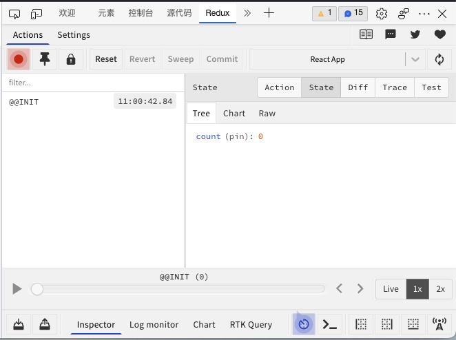
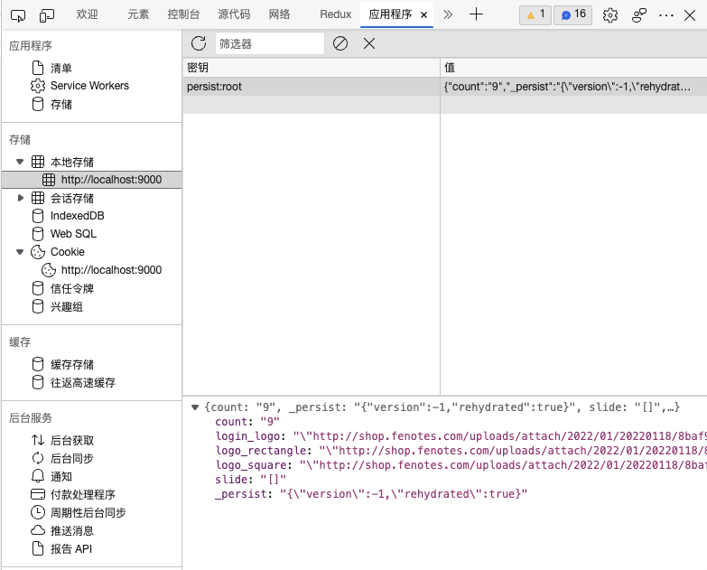

> 平安蜀黍的前端教程 > Redux 必学知识点 > 调试工具与状态持久化

### 调试工具

Redux DevTools 是基于 Chrome 和 Microsoft Edge 浏览器开发的一款调试插件，它可以用于调试 redux 中的状态更改，我们可以清晰的看到当前 store 仓库中的 state 是怎么样的，在可视化工具的左边，我们还可以看到触发的 action 的变化。

#### 1. 安装 Redux 调试工具

要使用 Redux 调试工具，我们首先需要在浏览器上安装 Redux 开发者工具，因为访问 chrome 的应用市场需要翻墙，所以这里建议大家使用 Microsoft Edge:

- 点击浏览器右上角“…”图标，在下拉列表中选择扩展；或者直接访问[Edge 外接程序](https://microsoftedge.microsoft.com/addons/Microsoft-Edge-Extensions-Home?hl=zh-CN)

- 在左上角搜索框中输入 Redux，点击安装。

#### 2. 项目安装 redux 调试工具依赖包

```bash
npm i -D redux-devtools-extension

# 或者使用yarn

yarn add -D redux-devtools-extension
```

#### 3. 配置 store.js

```javascript
// 导入creageStaore 用于创建store库
import { createStore, applyMiddleware } from 'redux';
import thunk from 'redux-thunk';
import promise from 'redux-promise';
// 导入devTools
import { composeWithDevTools } from 'redux-devtools-extension';

import reducers from './';

// 调用createStore方法创建store库
const store = createStore(
  reducers,
  composeWithDevTools(
    applyMiddleware(thunk.withExtraArgument({ num: 123, text: 'abc' }), promise)
  )
);

// 抛出store库
export default store;
```

重启项目并刷新页面后，我们就可以在浏览器控制台中找到一个“Redux”的标签：



#### 4. 条件配置

```javascript
// 中间件配置
const middleware = applyMiddleware(
  thunk.withExtraArgument({ num: 123, text: 'abc' }),
  promise
);
// 只希望在开发环境使用调试工具
const enhancers =
  process.env.NODE_ENV === 'development'
    ? composeWithDevTools(middleware)
    : middleware;
// 调用createStore方法创建store库
const store = createStore(reducers, enhancers);
```

#### 5. 常用面板工具

- filter 输入框：

当 action 比较多的时候，我们可以输入对应的 action type 来进行筛选，方便查找

- jump 与 skip

当鼠标悬浮在 action 上时，会显示两个选项，点击 jump 会将视图内容返回到 action 发生时；skip 则会跳过这个 action。

- action

查看每一个 action 发生时携带了哪些数据

- state

查看每一个 action 发生时 store 中原有的所有数据

### 状态持久化

react 项目是一个 single page app，也就是说，当用户刷新页面时会重启整个项目，从而会导致我们通过 redux 存储的所有数据都会被清空，比如登录信息等等。

为了解决这个问题，我们需要对全局数据进行持久化存储，状态持久化工具 redux-persist 就是这样的一个工具，虽然我们也可以自己使用 localStorage，但这样不仅仅增加了无谓的工作量，如果是大型项目还会因为种种人为原因而导致出错。

#### 1. 安装 redux-persist

```bash
npm i -S redux-persist

# 或

yarn add redux-persist
```

#### 2. 配置 redux-persist

redux-persist 的配置比较简单，对于 reducer 与 action 的处理不需要任何变化，我们只需要修改 store 里的代码：

```javascript
// 导入creageStaore 用于创建store库
import { createStore, applyMiddleware } from 'redux';
import thunk from 'redux-thunk';
import promise from 'redux-promise';
import { composeWithDevTools } from 'redux-devtools-extension';

// redux-persist提供了两个方法分别用于持久化我们的store和reducer
import { persistStore, persistReducer } from 'redux-persist';
// 将redux数据存储到localStorage的工具
import storage from 'redux-persist/lib/storage';

import reducers from './';

// 持久化的配置项
const persistConfig = {
  key: 'root',
  storage,
};

// 调用persistReducer工具并传入配置项和我们的reducer，它返回的是一个经过了持久化处理的reducer函数
const persistedReducer = persistReducer(persistConfig, reducers);

// 中间件配置
const middleware = applyMiddleware(
  thunk.withExtraArgument({ num: 123, text: 'abc' }),
  promise
);
// 只希望在开发环境使用调试工具

const enhancers =
  process.env.NODE_ENV === 'development'
    ? composeWithDevTools(middleware)
    : middleware;
// 调用createStore方法创建store库
const store = createStore(persistedReducer, enhancers);
// 调用persistStore持久化store并抛出结果
export const persistedStore = persistStore(store);
// 默认抛出store库
export default store;
```

然后在 index.js 文件中以 provider 的形式将原有组件包起来：

```javascript
import React from 'react'
import ReactDOM from 'react-dom/client'
import { Provider } from 'react-redux'
// 导入持久化的生产者组件
import { PersistGate } from 'redux-persist/integration/react'
// 导入store时顺便导入持久化以后的store
import Store, { persistedStore } from '@/models/store'
import Router from '@/routes/router'
import '@/assets/less/base.less'

const Root = ReactDOM.createRoot(document.getElementById('root'))

Root.render(
  <Provider store={Store}>
    {/* 以react.context生产者的方式将 */}
    <PersistGate loading={null} persistor={persistedStore}>
      <Router />
    </PersistGate>
  </Provider>
```

好了，这样的话，我们每一个写入到 store 中的数据就都被存储在了 localStorage 中了：



#### 3. redux persist Api

在简单地学会怎么配置 redux-persist 后，我们再回过头来看看 redux-persist 提供了哪些 api:

##### persistReducer(config, reducer):

persistReducer 方法用于增强我们的 reducer，它接受两个参数，第一个参数是配置项对象，第二个参数是我们的 reducer，返回经过增强的 reducer

##### persistStore(store, [config, callback]):

persistStore 方法用于增强我们通过 createStore 创建的 store 对象，它接受一个必填参数 store，以及两个可选参数，因为使用场景限制，这两个可选参数基本上可以忽略。

#### 4. persistConfig

- key:

将数据存储在 localStorage 中的 key

- storage:

将数据存储在 localStorage 中的方式，有两种：

```javascript
// 使用这个方法，数据将会被存储在localStorge中，永久有效
import storage from 'redux-persist/lib/storage';
// 使用这个方法，数据将会被存储在sessionStorage中，关闭浏览器后失效
import session from 'redux-persist/lib/storage/session';
```

- stateReconciler:

当数据发生变化时，将新数据合并到 storage 中去时的合并方式

> hardSet: 使用新的数据完全覆盖旧的数据，如果某些属性在旧数据中存在而在新数据中不存在，则最终的结果会丢弃这部分数据

```javascript
import hardSet from 'redux-persist/lib/stateReconciler/hardSet'

const persistConfig = {
  key: 'root',
  storage,
  stateReconciler: hardSet,
}

// action传入的新状态
{foo: {a: 3}}
// storage中的旧状态
{foo: {a: 1, b: 2}, bar: {a: 1, b: 2}}
// 合并后的状态
{foo: {a: 3}}
```

> autoMergeLevel1: 使用新数据与旧的数据进行一层迭代比较的合并，可以保证在合并旧数据时不会影响其它数据

```javascript
import autoMergeLevel from 'redux-persist/lib/stateReconciler/autoMergeLevel1'

const persistConfig = {
  key: 'root',
  storage,
  stateReconciler: autoMergeLevel,
}

// action传入的新状态
{foo: {a: 3}}
// storage中的旧状态
{foo: {a: 1, b: 2}, bar: {a: 1, b: 2}}
// 合并后的状态
{foo: {a: 3}, bar: {a: 1, b: 2}}
```

> autoMergeLevel2: 默认值，使用新数据与旧的数据进行两层迭代比较的合并，可以保证在合并旧数据时不会影响其它数据

```javascript
import autoMergeLevel from 'redux-persist/lib/stateReconciler/autoMergeLevel2'

const persistConfig = {
  key: 'root',
  storage,
  stateReconciler: autoMergeLevel,
}

// action传入的新状态
{foo: {a: 3}}
// storage中的旧状态
{foo: {a: 1, b: 2}, bar: {a: 1, b: 2}}
// 合并后的状态
{foo: {a: 3, b: 2}, bar: {a: 1, b: 2}}
```

- blacklist:

黑名单，出现在这个列表里的 reducer 将不会被存储到 storage 里，然后其它的 reducer 会被存储

```javascript
const reducera = function () {};
const reducerb = function () {};

const persistConfig = {
  key: 'root',
  storage: storage,
  blacklist: ['reducera'], // reducera这个状态不会被存储, reducerb会被存储
};
```

- whitelist:

白名单，出现在这个列表里的 reducer 会被存储到 storage 里，然后其它的 reducer 不会被存储

```javascript
const reducera = function () {};
const reducerb = function () {};

const persistConfig = {
  key: 'root',
  storage: storage,
  whitelist: ['reducera'], // reducera这个状态会被存储, reducerb不会被存储
};
```

#### 5. 嵌套持久化

嵌套持久化主要用于较复杂的持久化操作上，比如我们的项目中有多个 reducer 需要存储，但在这些 reducer 里又存在部分属性不能被存储。或者我们有一部分的 reducer 需要存储在 localStorage 中永久性保存，而另一部分 reducer 则需要存储在 sessionStorage 里，浏览器关闭后就失效：

```javascript
import { combineReducers } from 'redux';
import { persistReducer } from 'redux-persist';
// 使用这个方法，数据将会被存储在localStorge中，永久有效
import storage from 'redux-persist/lib/storage';
// 使用这个方法，数据将会被存储在sessionStorage中，关闭浏览器后失效
import session from 'redux-persist/lib/storage/session';

// 两个不同的reducer
import { authReducer, otherReducer } from './reducers';

// 全站的持久化配置
const rootPersistConfig = {
  key: 'root', // 存储名称为root
  storage: storage, // 数据存入localStorage中，永久有效
  blacklist: ['auth'], // auth状态不存储
};

// 授权相关的持久化配置
const authPersistConfig = {
  key: 'auth', // 存储名称为auth
  storage: session, // 数据存入sessionStorage中，浏览器关闭后失效
  blacklist: ['somethingTemporary'], // somethingTemporary不需要存储
};

// 使用combinReducers合并多个reducer
const rootReducer = combineReducers({
  // 对authReducer做单独的处理
  auth: persistReducer(authPersistConfig, authReducer),
  other: otherReducer,
});

// 正常持久化所有的reducer
export default persistReducer(rootPersistConfig, rootReducer);
```
