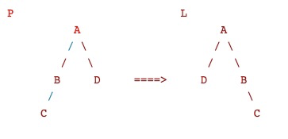
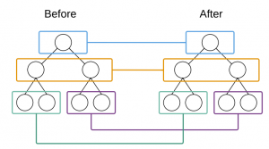
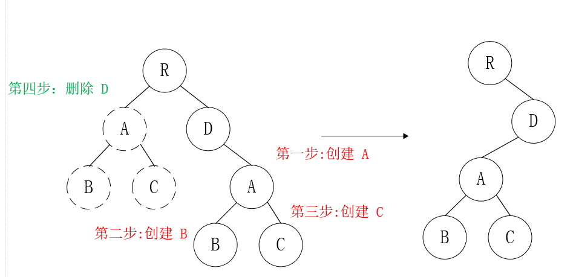
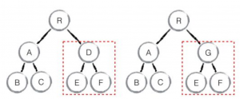
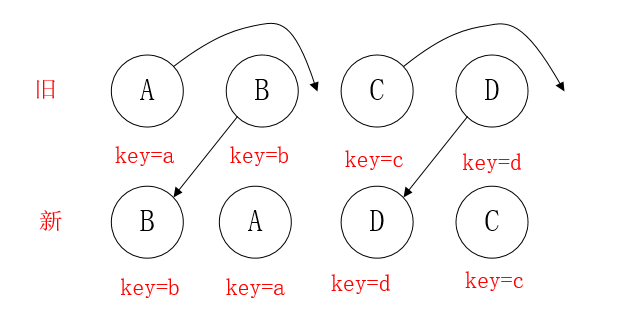
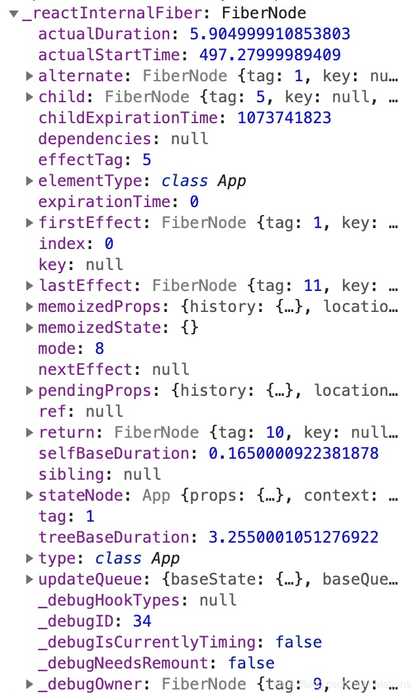

> 企业项目实战 > 关联阅读 > React15 的 Diff 与 React16 的 Fiber 算法区别

### 对于传统 Diff 和 React 的 Diff 的区别：

传统 Diff：传统 Diff 算法需要找到两个树的最小更新方式，所以需要[两两]对比每个叶子节点是否相同，对比就需要 O(n^2)次了，再加上更新（移动、创建、删除）时需要遍历一次，所以是 O(n^3)



每次都需要循环遍历，于是有以下的查找过程：

```javascript
PA->LA
PA->LB
PA->LC
PA->LD
PB->LA
...
```

Reactdiff:计算出 Virtual DOM 中真正变化的部分，并只针对该部分进行原生 DOM 操作，而非重新渲染整个页面。

React 用 三大策略 将 O(n^3)复杂度 转化为 O(n)复杂度

#### 策略一（Tree Diff）：

（1）React 通过 updateDepth 对 Virtual DOM 树进行层级控制。

如图：进行同级比较，并非循环比较。这样比较次数就降为一层一次，时间复杂度直接降为 O(n)



（2）对树分层比较，两棵树 只对同一层次节点 进行比较。如果该节点不存在时，则该节点及其子节点会被完全删除，不会再进一步比较。

如图所示，以 A 为根节点的**整棵树会被重新创建，而不是移动**



（3）只需遍历一次，就能完成整棵 DOM 树的比较。

#### 策略二（Component Diff）：

（1）同一类型的两个组件，按原策略（层级比较）继续比较 Virtual DOM 树即可
（2）同一类型的两个组件，组件 A 变化为组件 B 时，可能 Virtual DOM 没有任何变化，如果知道这点（变换的过程中，Virtual DOM 没有改变），可节省大量计算时间，所以 用户 可以通过 shouldComponentUpdate() 来判断是否需要 判断计算
（3）不同类型的组件，将一个（将被改变的）组件判断为 dirty component（脏组件），从而替换 整个组件的所有节点

如图：component diff 相当于是子树的 diff，基本方案和 tree diff 是一致的，如果如上图 D 变为 G，那么直接删除 D 这一整棵树，然后重新渲染 G 树



**注意：**如果组件 A 和组件 B 的结构相似，但是 React 判断是 不同类型的组件，则不会比较其结构，而是删除 组件 A 及其子节点，创建组件 B 及其子节点。

#### 策略三（Element Diff）：

（1）对于同一层级的一组子节点，通过唯一 id 区分。
（2）当节点处于同一层级时，diff 提供三种节点操作：删除、插入、移动



如图：看着上图的 B，React 先从新中取得 B，然后判断旧中是否存在相同节点 B，当发现存在节点 B 后，就去判断是否移动 B。
B 在旧 中的 index=1，它的 lastIndex=0，不满足 index < lastIndex 的条件，因此 B 不做移动操作。此时，一个操作是，lastIndex=(index,lastIndex)中的较大数=1，并将 B 的位置更新为新集合中的位置 prevChild.index = nextIndex，此时新集合中 B.index = 0，nextIndex++ 进入下一个节点的判断。

看 A，A 在旧的 index=0，当前的 lastIndex=1，满足 index<lastIndex，因此，对 A 进行移动操作，此时 lastIndex=max(index,lastIndex)=1，并将 A 的位置更新为新集合中的位置 prevChild.index = nextIndex，此时新集合中 A.index = 1，nextIndex++ 进入下一个节点的判断。

**注意：lastIndex 有点像浮标，或者说是一个 map 的索引，一开始默认值是 0，它会与 map 中的元素进行比较，比较完后，会改变自己的值的（取 index 和 lastIndex 的较大数）。**

如果，此时的 key 不相同，全都发生了变化，那么节点全都是要删除重新构建，将会消耗大量性能。

### React 15 的 Diff 算法和 React 16 的 Diff 算法的区别

#### 虚拟 DOM 的变化：树结构 转变成 链表结构

原来的 VDOM 是一颗由上至下的树，很普通，通过深度优先遍历，层层递归直下。然而，这个直下最大的毛病在于不可中断。因此，我们在 diff + patch 又或者是 Mount 巨大节点的时候，会造成巨大的卡顿。

React16 的 VDOM 不再是一颗由上至下那么简单的树，而是链表形式的虚拟 DOM，链表的每一个节点是 Fiber，而不是在 16 之前的虚拟 DOM 节点。每个 Fiber 节点记录着诸多信息，以便走到某个节点的时候中断。Fiber 的思路是把渲染/更新过程（递归 diff）拆分成一系列小任务，每次检查树上的一小部分，做完看是否还有时间继续下一个任务，有的话继续，没有的话把自己挂起，主线程不忙的时候再继续

#### Fiber

Fiber 在 diff 阶段，做了如下的操作：

把可中断的工作拆分成小任务。
对正在做的工作调整优先次序、重做、复用上次（做了一半的）成果。
diff 阶段任务调度优先级控制。
Fiber 相当于是，在 15 的 diff 算法阶段，做了优先级的任务调度控制，

所以，Fiber 是根据一个 fiber 节点（VDOM 节点）来拆分，以 fiber node 为一个任务单元，一 个组件实例都是一个任务单元。任务循环中，每处理完一个 fiber node，可以中断/挂起/恢复。

**Fiber 核心是实现了一个基于优先级和 requestIdleCallback 的循环任务调度算法：**

通过浏览器提供的 requestIdleCallback API 中的 Cooperative Scheduling 来进行中断/挂起/恢复，可以让浏览器在空闲时间执行回调（开发者传入的方法），在回调参数中可以获取到当前帧（16ms）剩余的时间。利用这个信息可以合理的安排当前帧需要做的事情，如果时间足够，那继续做下一个任务，如果时间不够就歇一歇，调用 requestIdleCallback 来获知主线程不忙的时候，再继续做任务

**Fiber 的关键特性：**

> 增量渲染（把渲染任务拆分成块，匀到多帧）  
> 更新时能够暂停，终止，复用渲染任务  
> 给不同类型的更新赋予优先级  
> 并发方面新的基础能力

增量渲染用来解决掉帧的问题，渲染任务拆分之后，每次只做一小段，做完一段就把时间控制权交还给主线程，而不像之前长时间占用。这种策略叫做 cooperative scheduling（合作式调度），操作系统的 3 种任务调度策略之一（Firefox 还对真实 DOM 应用了这项技术）

fiber tree 上一个节点的如图：



Alternate：一个极其重要的属性。在新的 Fiber 架构中，我们同样是有两颗 Fiber 树，一颗是旧的，一颗是新的（当调用 setState）以后。当我们的更新完毕以后，新的 Alternate 树就会变成我们的老树，以此进行新旧交替。

child：因为就像我之前说的，要解决用户态调度问题，那么就要把每一个节点的 diff patch 过程都变成可控制的，因此我们需要**将原来的递归，变成一个循环，以链表为链接，控制每一次的 diff 和 patch**。因此，一个 Fiber 都会有一个 child 、sibling、return 三大属性作为链接树前后的指针。


**return 属性是实现错误边界的极其关键的一个 Fiber 属性**，得益于它，React 实现了每一个节点的完全跟踪，你可以看到当你组件报错的时候，一个清晰的 React 组件级别的堆栈就会出现。

effectTag:一个很有意思的标记，用于记录 effect 的类型，effect 指的就是对 DOM 操作的方式，比如修改，删除等操作，用于到后面进行 Commit（类似数据库）

firstEffect 、lastEffect 等玩意是用来保存中断前后 effect 的状态，用户中断后恢复之前的操作。这个意思还是很迷糊的，因为 Fiber 使用了可中断的架构。

tag：根据 react 的源码，tag 以下的含义 ，用于标记，这个 Fiber 是什么

```javascript
export type TypeOfWork = 0 | 1 | 2 | 3 | 4 | 5 | 6 | 7 | 8 | 9 | 10;

export const IndeterminateComponent = 0; // 尚不知是类组件还是函数式组件
export const FunctionalComponent = 1; // 函数式组件
export const ClassComponent = 2; // Class类组件
export const HostRoot = 3; // 组件树根组件，可以嵌套
export const HostPortal = 4; // 子树. Could be an entry point to a different renderer.
export const HostComponent = 5; // 标准组件，如地div， span等
export const HostText = 6; // 文本
export const CallComponent = 7; // 组件调用
export const CallHandlerPhase = 8; // 调用组件方法
export const ReturnComponent = 9; // placeholder（占位符）
export const Fragment = 10; // 片段
```

**React 实现可以粗划为两部分：reconciliation（diff 阶段）和 commit(操作 DOM 阶段)**

**reconciliation 阶段：**包含的主要工作是对 current tree 和 new tree 做 diff 计算，找出变化部分。进行遍历、对比等是可以中断，歇一会儿接着再来。

**commit 阶段：**对上一阶段获取到的变化部分应用到真实的 DOM 树中，是一系列的 DOM 操作。不仅要维护更复杂的 DOM 状态，而且中断后再继续，会对用户体验造成影响。在普遍的应用场景下，此阶段的耗时比 diff 计算等耗时相对短。

所以，Fiber 选择在 reconciliation 阶段拆分

#### 如何拆分：

> 用户调用 ReactDOM.render 传入组件，React 创建 Element 树;  
> 在第一次渲染时，创建 vdom 树，用来维护组件状态和 dom 节点的信息。  
> 当后续操作如 render 或 setState 时需要更新，通过 diff 算出变化的部分。  
> 根据变化的部分更新 vdom 树、调用组件生命周期函数等，同步应用到真实的 DOM 节点中。

#### reconciliation 具体过程如下：

> 如果当前节点不需要更新，直接把子节点 clone 过来，跳到 5；要更新的话打个 tag  
> 更新当前节点状态（props, state, context 等）  
> 调用 shouldComponentUpdate()，false 的话，跳到 5  
> 调用 render()获得新的子节点，并为子节点创建 fiber（创建过程会尽量复用现有 fiber，子节点增删也发生在这里）  
> 如果没有产生 child fiber，该工作单元结束，把 effect list 归并到 return，并把当前节点的 sibling 作为下一个工作单元；否则把 child 作为下一个工作单元  
> 如果没有剩余可用时间了，等到下一次主线程空闲时才开始下一个工作单元；否则，立即开始做  
> 如果没有下一个工作单元了（回到了 workInProgress tree 的根节点），第 1 阶段结束，进入 pendingCommit 状态

实际上是 1-6 的工作循环，7 是出口，工作循环每次只做一件事，做完看要不要喘口气。工作循环结束时，workInProgress tree 的根节点身上的 effect list 就是收集到的所有 side effect（因为每做完一个都向上归并）

所以，构建 workInProgress tree 的过程就是 diff 的过程，通过 requestIdleCallback 来调度执行一组任务，每完成一个任务后回来看看有没有插队的（更紧急的），每完成一组任务，把时间控制权交还给主线程，直到下一次 requestIdleCallback 回调再继续构建 workInProgress tree

commit 具体过程如下：

处理 effect list（包括 3 种处理：更新 DOM 树、调用组件生命周期函数以及更新 ref 等内部状态）
出对结束，第 2 阶段结束，所有更新都 commit 到 DOM 树上了
这个阶段（同步执行）的实际工作量是比较大的（因为是一口气全部做完的），所以尽量不要在后 3 个生命周期函数里干重活儿

#### 优先级策略

每个工作单元运行时有 6 种优先级：

> synchronous 与之前的 Stack reconciler 操作一样，同步执行  
> task 在 next tick 之前执行  
> animation 下一帧之前执行  
> high 在不久的将来立即执行  
> low 稍微延迟（100-200ms）执行也没关系  
> offscreen 下一次 render 时或 scroll 时才执行

高优先级的比如键盘输入（希望立即得到反馈），低优先级的比如网络请求，让评论显示出来等等

缺点：

生命周期函数怎么执行（可能被频频中断）：触发顺序、次数没有保证了

starvation（低优先级饿死）：如果高优先级任务很多，那么低优先级任务根本没机会执行（就饿死了）

### 总结

React15 的虚拟 dom 是一颗由上至下深度优先遍历的树结构,每一个节点都是虚拟 DOM 节点，React16 的中是链表形式的虚拟 DOM，链表的每一个节点是 Fiber。
15 diff 阶段不可中断的递归，16 中 diff 阶段更新时是可中断的循环，通过暂停、终止、复用渲染任务（Alternate）从而使得每一个 fiber 的 diff 与 patch 变的可控。
diff 过程于 patch 的过程从之前的递归树状结构，变成一个循环遍历链表的形式。
工作循环（requestIdleCallback）、优先级策略。
