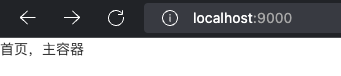
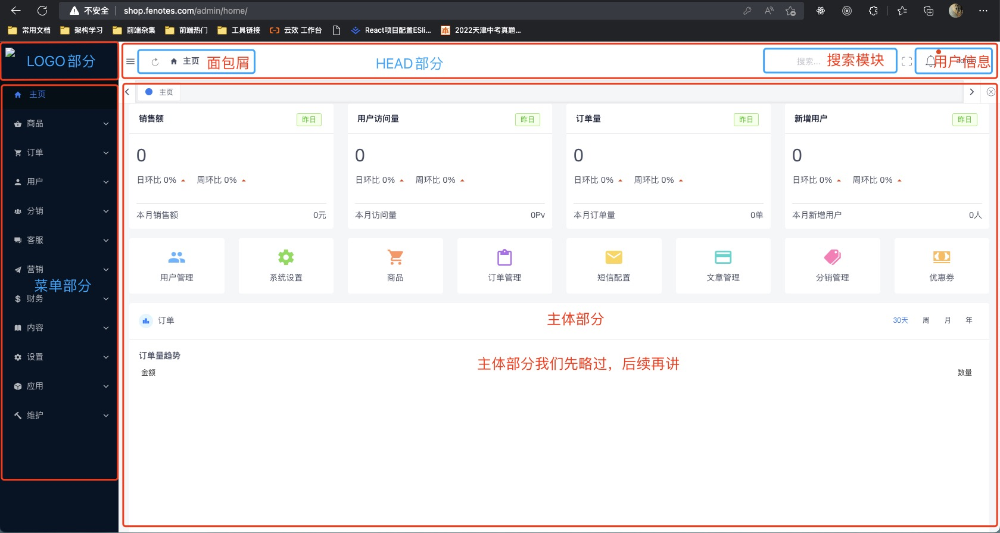
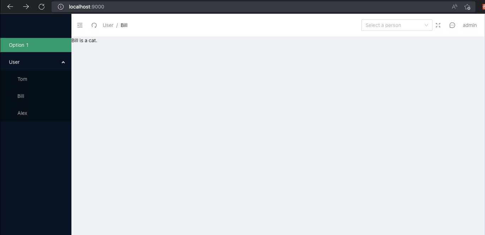

> 平安蜀黍的前端教程 > 实战教学 > 创建全局框架

### 项目结构

今天的主课我们学习了 React 路由的一些知识，学习了路由后，我们就可以开始构建我们整个项目的结构了，首先，是对整个网站根据功能进行模块划分：

```bash
├─src
  ├─ assets
    ├─ less           全局公用样式文件
    ├─ images         图片文件
    ├─ fonts          字体文件
  ├─ components       用于放置公用组件
  ├─ configs          用于放置项目配置文件，包括craco及发布环境配置文件
  ├─ layouts          网站的主框架，包括菜单、banner、nav等
  ├─ models           数据模块，如果网站比较大需要使用redux或其它状态管理工具，放在这
  ├─ pages            用于放置页面组件
  ├─ routes           路由表及路由守卫等
  ├─ apis             接口配置文件
  ├─ utils            工具管理
  ├─ index.js         索引文件，package.json里的main属性应该指向这里
├─ .env               默认的环境配置文件，简单的项目可以不需要配置configs，直接在.env中配置即可
├─ .env.development   开发环境配置文件，开发环境中会覆盖.env中的同名属性
├─ .env.production    生产环境配置文件，生产环境中会覆盖.env中的同名属性
├─ .gitignore         git忽略配置
├─ .prettierrc.json   代码规范配置文件
├─ craco.config.js    craco配置文件，与下面的config-overrides.js二选一
├─ config-overrides.js
├─ jsconfig.json     项目运行环境配置文件
```

### 路由管理

配置好整个项目结构后，在 routes 下创建全局路由表：

```javascript
// react提供的懒加载组件，可以有效地解决因主文件过大首次加载时长过长造成的白屏问题
import { lazy, Suspense } from 'react';
// react-router常用的三个组件
import { BrowserRouter, Switch, Route } from 'react-router-dom';

// spin是antd提供的一个loading动画组件
import { Spin } from 'antd';

// 导入我们开发的页面组件
// 有这里我们需要进行分析，这个页面是否需要在首次加载时渲染，如果不是，可以使用懒加载
// 首页，用户第一次进入就是这个页面，所以我们需要将它打包至主文件
import Home from '@/pages/Home';
// 登录页，用户未登录需要跳转，本身就会造成页面刷新的效果，所以我们完全可以使用懒加载
const Login = lazy(() => import('@/pages/Auth/Login'));

export default function Router() {
  return (
    // 注意这里，当我们使用懒加载时必须配置Suspense，否则路由无法正常访问
    <Suspense
      fallback={
        <Spin className="global-loading" size="large" tip="加载中, 请稍候..." />
      }
    >
      {/* 将来我们的项目可能不会放在服务的根目录里，而是后台指定一个目录，为了能正常访问，我们需要指定一个根路由 */}
      {/* 注意：basename是默认的根路由，它是无法被react的loctaion属性获取到的 */}
      <BrowserRouter basename="/admin">
        <Switch>
          {/* 这里需要注意，按我们主课内容提到的，或者给短路由加上exact属性，或者将短路由放到长路由之后，否则会造成所有访问都直接匹配短路由成功而无法匹配到我们指定的页面 */}
          <Route path="/login" component={Login} />
          {/* 短路由放后面，或者添加exact属性 */}
          <Route path="/" component={Home} />
        </Switch>
      </BrowserRouter>
    </Suspense>
  );
}
```

### 主框架

创建完路由文件后，接下来就应该创建首页，按我们上面设定的路由，首先在 pages 目录下新建一个 Home 目录，然后在 Home 目录中新建 index.jsx 文件：

```javascript
import React, { Component } from 'react';
class Index extends Component {
  // 随便返回个JSX元素，确认这个页面能正常访问
  render() {
    return <div>首页，主容器</div>;
  }
}
export default Index;
```

现在我们可以通过在地址栏输入"localhost:3000"来访问首页了



接下来我们就要开始分析整个页面的结构：



从图上我们可以看出，整个结构大致分为三块：side-bar，head 及 contents，其中左边栏又分为两个模块，logo 部分与菜单部分；head 部分则分为面包屑、搜索模块及用户信息模块；contents 这一部分我们暂时略过，我们只实现整体框架部分：

#### layout

首先我们需要新建一个页面，为了便于调试，我们先将 index.jsx 当成是我们的主框架页：

```javascript
import React, { Component } from 'react';
// 导入antd的组件
import {
  Layout,
  Breadcrumb,
  Menu,
  Input,
  Button,
  Dropdown,
  Tooltip,
  message,
  Select,
} from 'antd';
import {
  MenuFoldOutlined,
  MenuUnfoldOutlined,
  RedoOutlined,
  FullscreenOutlined,
  FullscreenExitOutlined,
  MessageOutlined,
} from '@ant-design/icons';
import ErrorBoundary from '@/components/ErrorBoundary';
import './style.less';
// 导出Layout中的子组件
const { Header, Content, Footer, Sider } = Layout;
const { SubMenu } = Menu;
const { Option } = Select;

class Index extends Component {
  constructor() {
    super();
    this.state = {
      // 菜单是否收起
      collapsed: false,
      // 是否全屏状态
      isFullScreen: false,
      // 用于强行刷新组件的状态
      forceUpdate: false,
    };
    this.fullScreenElement = React.createRef();
    // 使用bind方法来绑定this对象
    // 如果这个组件本身不是经常展示，也可以在类中使用箭头函数来避免this指针的偏移
    // 使用bind方法的好处是这个方法是被定义在原型上的，而如果使用箭头函数则代表这个方法是被定义在实例上的
    this.setCollapsed = this.setCollapsed.bind(this);
    this.forceUpdate = this.forceUpdate.bind(this);
    this.fullScreen = this.fullScreen.bind(this);
  }

  /**
   * 切换边栏显示状态
   * @param {*} collapsed
   */
  setCollapsed() {
    // 每次点击按钮将状态置反
    this.setState({
      collapsed: !this.state.collapsed,
    });
  }

  /**
   * 重新加载组件
   */
  forceUpdate() {
    // 通过改变状态的方式来强制刷新组件
    this.setState(
      {
        forceUpdate: true,
      },
      /**
       * setState方法的第二个参数，当state修改完成后会调用这个函数
       * 我们利用这种方式切换forceUpdate状态，从而实现强制卸载后重新加载组件
       */
      () => {
        this.setState({
          forceUpdate: false,
        });
      }
    );
  }

  /**
   * 全屏操作
   * @returns 如果浏览器不支持返回提示信息
   */
  fullScreen() {
    // document.fullscreenElement 用于判断当前浏览器是否支持全屏,当它为false时表示浏览器不支持，当它为null时表示支持但现在没有元素全屏，当它有返回值时表示返回值正在全屏状态中
    if (document.fullscreenElement === false) {
      return message.warning('您的浏览器不支持全屏操作');
    }
    // 没有元素在全屏状态时开启全屏，否则取消全屏操作
    if (!document.fullscreenElement) {
      // 注意全屏操作与取消全屏的操作是不一样的！！
      this.fullScreenElement.current.requestFullscreen();
      // 修改按钮状态
      this.setState({
        isFullScreen: true,
      });
    } else {
      document.exitFullscreen();
      this.setState({
        isFullScreen: false,
      });
    }
  }

  /**
   * 临时性的下拉节点生成
   * @returns
   */
  renderUserInfo() {
    return (
      <Menu>
        <Menu.Item>
          <a
            target="_blank"
            rel="noopener noreferrer"
            href="http://www.alipay.com/"
          >
            1st menu item
          </a>
        </Menu.Item>
        <Menu.Item>
          <a
            target="_blank"
            rel="noopener noreferrer"
            href="http://www.taobao.com/"
          >
            2nd menu item
          </a>
        </Menu.Item>
        <Menu.Item>
          <a
            target="_blank"
            rel="noopener noreferrer"
            href="http://www.tmall.com/"
          >
            3rd menu item
          </a>
        </Menu.Item>
      </Menu>
    );
  }

  onChange() {}
  onBlur() {}
  onFocus() {}

  render() {
    return (
      <Layout className="outer-frame" ref={this.fullScreenElement}>
        {/* 侧边栏 */}
        <Sider className="side-bar" collapsed={this.state.collapsed}>
          <div className="logo" />
          {/* 菜单，这块需要一个全局状态，所以我们暂时不用管它，明天再来学习如何渲染里面的内容 */}
          <Menu theme="dark" defaultSelectedKeys={['1']} mode="inline">
            <Menu.Item key="1">
              <span>Option 1</span>
            </Menu.Item>
            <SubMenu
              key="sub1"
              title={
                <span>
                  <span>User</span>
                </span>
              }
            >
              <Menu.Item key="3">Tom</Menu.Item>
              <Menu.Item key="4">Bill</Menu.Item>
              <Menu.Item key="5">Alex</Menu.Item>
            </SubMenu>
          </Menu>
        </Sider>
        <Layout className="site-layout">
          <Header className="frame-header site-layout-background">
            {/* 左侧内容，不限宽度，始终占满除右侧内容的剩余宽度 flex: 1 1 auto*/}
            <div className="header-left">
              {/* 调整左边栏宽度按钮 */}
              <Button
                icon={
                  this.state.collapsed ? (
                    <MenuUnfoldOutlined />
                  ) : (
                    <MenuFoldOutlined />
                  )
                }
                onClick={this.setCollapsed}
              />
              {/* 刷新页面内容 */}
              <Button icon={<RedoOutlined />} onClick={this.forceUpdate} />
              {/* 面包屑，与菜单一样，这里也需要全局状态管理 */}
              <Breadcrumb>
                <Breadcrumb.Item>User</Breadcrumb.Item>
                <Breadcrumb.Item>Bill</Breadcrumb.Item>
              </Breadcrumb>
            </div>
            {/* header右侧盒子，固定宽度不可调整flex: 0 0 320px */}
            <div className="header-right">
              {/* 下拉搜索框 */}
              <Select
                showSearch
                style={{ width: 200 }}
                placeholder="Select a person"
                optionFilterProp="children"
                onChange={this.onChange}
                onFocus={this.onFocus}
                onBlur={this.onBlur}
                filterOption={(input, option) =>
                  option.props.children
                    .toLowerCase()
                    .indexOf(input.toLowerCase()) >= 0
                }
              >
                <Option value="jack">Jack</Option>
                <Option value="lucy">Lucy</Option>
                <Option value="tom">Tom</Option>
              </Select>
              {/* 全屏按钮 */}
              <Tooltip
                placement="bottom"
                title={this.state.isFullScreen ? '取消全屏' : '全屏'}
              >
                <Button
                  icon={
                    this.state.isFullScreen ? (
                      <FullscreenExitOutlined />
                    ) : (
                      <FullscreenOutlined />
                    )
                  }
                  onClick={this.fullScreen}
                />
              </Tooltip>
              {/* 消息盒子 */}
              <Dropdown overlay={this.renderUserInfo()} placement="bottomRight">
                <Button icon={<MessageOutlined />} />
              </Dropdown>
              {/* 用户盒子 */}
              <Dropdown overlay={this.renderUserInfo()} placement="bottomRight">
                <Button>admin</Button>
              </Dropdown>
            </div>
          </Header>
          {/* 页面内容盒子 */}
          <Content className="frame-body container">
            {/* 错误边界 */}
            <ErrorBoundary>
              {/* 强制刷新组件 */}
              {this.state.forceUpdate ? (
                <div>正在重新加载组件...</div>
              ) : (
                <div className="site-layout-background">Bill is a cat.</div>
              )}
            </ErrorBoundary>
          </Content>
          {/* 页脚 */}
          <Footer className="frame-footer">
            Ant Design ©2018 Created by Ant UED
          </Footer>
        </Layout>
      </Layout>
    );
  }
}

export default Index;
```

样式文件：style.less

```css
// 导入基础配置文件以读取常量配置
@import url('@/assets/less/base.less');

// 定义当前组件样式作用域
.outer-frame {
  height: 100%;
  overflow-x: hidden;
  .header-height {
    height: 64px;
  }
  .side-bar {
    width: 218px;
    .logo {
      width: 100%;
      .header-height();
    }
  }
  .frame-header {
    .header-height();
    background: @background-color;
    display: flex;
    padding: 12px 8px;
    .ant-btn {
      border: none;
      padding: 0 6px;
      margin-right: 8px;
      color: @second-text-color;
    }
    .header-left {
      flex: 1 1 auto;
      display: flex;
      align-items: center;
    }
    .header-right {
      flex: 0 0 320px;
      display: flex;
      align-items: center;
    }
  }
}
```

然后我们试试访问首页



这样，我们的主体框架 UI 部分就算是完成了，当然，像菜单这些功能还没有完成，这些内容一部分是因为依赖状态，另一部分是我们还需要学习一些算法：[算法复杂度](./omicron.md)，这块稍后再讲。

#### 嵌入路由

前面我们完成了框架页的 UI，接下来，就需要将这个框架嵌入到项目中去，让需要使用这个框架的页面自动嵌入框架：

首先，我们需要修改路由文件：

```javascript
// 导入布局文件
import Layout from '@/layout';

// 用布局文件包裹需要使用框架的路由，这样页面就可以自动嵌入到框架里了
<Layout>
  {/* 短路由放后面，或者添加exact属性 */}
  <Route path="/" component={Home} />
</Layout>;
```

然后，我们需要修改框架文件，将 content 位置的内容替换成 props.children

```javascript
<Content className="frame-body container">
  {/* 错误边界 */}
  <ErrorBoundary>
    {/* 强制刷新组件 */}
    {this.state.forceUpdate ? (
      <div>正在重新加载组件...</div>
    ) : (
      // 本单元第一课，在讲解组件优化时有提到，所有的组件接收到的props中都会包含一个children，这个children就是我们用组件标签包裹起来的元素
      <div className="site-layout-background">{this.props.children}</div>
    )}
  </ErrorBoundary>
</Content>
```

到这里，我们的框架结构就大致实现了。剩下的，就是完善它的功能了。这个，我们留到明天的课程中继续
