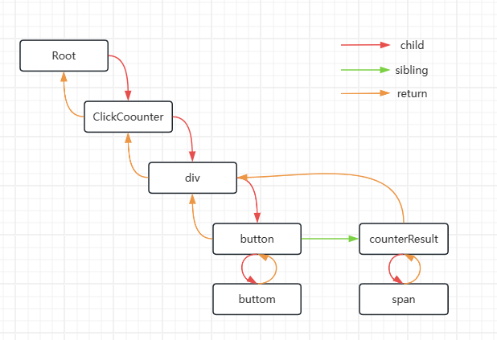

> 平安蜀黍的前端教程 > React 必学知识点 > React FIBER 架构的原理与工作模式

### Fiber 是什么？

我们之前了解过，React 会将我们写入的 JSX 代码转换成元素的对象结构，举个例子：

```javascript
const element = <div>其它元素</div>;
```

上面的代码会被 React 转换成一个 JS 对象用于创建一个内部实例来追踪这个组件的所有信息和状态：

```javascript
const element = React.createElement('div', null, '其它元素');
```

上面这个 JS 对象我们之前都是称之为**React DOM**或者**虚拟 DOM 对象**，在 Fiber 架构中，这个 JS 对象就被称之为**Fiber**。

所以，我们基本上可以说：**Fiber 是一个 JavaScript 对象**，它代表 React 的一个工作单元，它包含了与组件相关的所有信息。以上面的 JS 对象举例，我们看看一个 Fiber 对象的样子：

```javascript
{
    type: 'div',            // 组件类型
    key: null,              // key 具有唯一性的组件标识
    props: { ... },         // 组件创建时传入的状态集
    state: { ... },         // 组件自身的状态集
    child: Fiber | null,    // 子元素的Fiber
    sibling: Fiber | null,  // 兄弟元素的Fiber
    return: Fiber | null,   // 父元素的Fiber
    // ...其它属性
}
```

当 React 开始运行时，它会沿着 Fiber 的树形结构向下执行，试图完成每个 Fiber 的工作，比如：比较新旧 props 以确定是否需要更新组件等。如果这个时候主线程接到了更重要的工作，比如需要响应用户的输入，React 就可以中断当前的工作并返回执行主线程上的任务。

所以，Fiber 不仅仅是代表组件的一个内部对象，它还是 React 的调度和更新机制的核心组成部分。

### 为什么需要 Fiber

在 React 16 之前的版本里面，所有的组件树更新都是使用递归的方式处理的，React称之为堆栈调和（Stack Reconciliation），这种方法的缺点是一旦更新开始就不能中断，直到整个组件树都被遍历完。这样的话在我们需要处理大量数据或复杂视图时就极有可能导致主线程被阻塞，从而使得应用无法及时响应用户的输入或其他高优先级任务。

而 Fiber 的引入改变了这一情况。我们可以把 Fiber 理解为 React 自定义的一个带有链接关系的 DOM 树，每个 Fiber 都代表了一个工作单元，React 可以在处理任何 Fiber 之前判断是否有足够的时间完成该工作，并且在必要时中断或者恢复工作。

### Fiber 的结构

上面的说的大致都是理论，光说不看我们也无法理解，那么，接下来我们来看一下 React 源码里 FiberNode 的结构：

```javascript
function FiberNode(
  tag: WorkTag,
  pendingProps: mixed,
  key: null | string,
  mode: TypeOfMode
) {
  // 基本属性
  this.tag = tag; // 描述此Fiber的启动模式的值（LegacyRoot = 0; ConcurrentRoot = 1）
  this.key = key; // React key
  this.elementType = null; // 描述React元素的类型。例如，对于JSX<App />，elementType是App
  this.type = null; // 组件类型
  this.stateNode = null; // 对于类组件，这是类的实例；对于DOM元素，它是对应的DOM节点。

  // Fiber链接
  this.return = null; // 指向父Fiber
  this.child = null; // 指向第一个子Fiber
  this.sibling = null; // 指向其兄弟Fiber
  this.index = 0; // 子Fiber中的索引位置

  this.ref = null; // 如果组件上有ref属性，则该属性指向它

  // Props & State
  this.pendingProps = pendingProps; // 正在等待处理的新props
  this.memoizedProps = null; // 上一次渲染时的props
  this.updateQueue = null; // 一个队列，包含了该Fiber上的状态更新和副作用
  this.memoizedState = null; // 上一次渲染时的state
  this.dependencies = null; // 该Fiber订阅的上下文或其他资源的描述

  // 工作模式
  this.mode = mode; // 描述Fiber工作模式的标志（例如Concurrent模式、Blocking模式等）。

  // 副作用
  this.effectTag = NoEffect;
  this.nextEffect = null; // 链表中通往下一个具有副作用的Fiber的快速通道

  // 下面这两个变量用于标识出当前Fiber树中有副作用的第一个和最后一个Fiber, 这样当我们重复使用当前Fiber进行渲染时可以使用链表中的片断
  this.firstEffect = null;
  this.lastEffect = null;

  this.expirationTime = NoWork; // 当前组件渲染完成所需要的时间(不包括子组件中找到的)
  this.childExpirationTime = NoWork; // 子组件渲染完成所需要的时间

  this.alternate = null; // Current Tree和Work-in-progress (WIP) Tree的互相指向对方tree里的对应单元

  // 如果启用了性能分析
  if (enableProfilerTimer) {
    // ……
  }

  // 开发模式中
  if (__DEV__) {
    // ……
  }
}
```

从上面的代码逻辑来看，我们其实可以把 Fiber 理解为一个更强大的虚拟 DOM。

### Fiber 工作原理

Fiber 工作原理中最核心的点就是：可以中断和恢复，这个特性增强了 React 的并发性和响应性。

实现可中断和恢复的原因就在于：Fiber 的数据结构里提供的信息让 React 可以追踪工作进度、管理调度和同步更新到 DOM。

现在我们来聊聊 Fiber 工作原理中的几个关键点：

**单元工作：**每个 Fiber 节点代表一个单元，所有 Fiber 节点共同组成一个 Fiber 链表树（有链接属性，同时又有树的结构），这种结构让 React 可以细粒度控制节点的行为。
**链接属性：**child、sibling 和 return 字段构成了 Fiber 之间的链接关系，使 React 能够遍历组件树并知道从哪里开始、继续或停止工作。



**双缓冲技术：** React 在更新时，会根据现有的 Fiber 树（**Current Tree**）创建一个新的临时树（Work-in-progress (WIP) Tree，简称WIP-Tree），WIP-Tree 包含了当前更新受影响的最高节点直至其所有子孙节点。Current Tree 是当前显示在页面上的视图，WIP-Tree 则是在后台进行更新，WIP-Tree 更新完成后会复制其它节点，并最终替换掉 Current Tree，成为新的 Current Tree。因为 React 在更新时总是维护了两个 Fiber 树，所以可以随时进行比较、中断或恢复等操作，而且这种机制让 React 能够同时具备拥有优秀的渲染性能和 UI 的稳定性。


**State 和 Props：**memoizedProps、pendingProps 和 memoizedState 字段让 React 知道组件的上一个状态和即将应用的状态。通过比较这些值，React 可以决定组件是否需要更新，从而避免不必要的渲染，提高性能。
**副作用的追踪：**flags 和 subtreeFlags 字段标识 Fiber 及其子树中需要执行的副作用，例如 DOM 更新、生命周期方法调用等。React 会积累这些副作用，然后在 Commit 阶段一次性执行，从而提高效率。

### Fiber工作流程

了解了Fiber的工作原理后，我们可以通过阅读源码来加深对Fiber的理解。React Fiber的工作流程主要分为两个阶段：

#### 第一阶段：Reconciliation（调和）
**目标: **确定哪些部分的UI需要更新。
**原理: **这是React构建工作进度树的阶段，会比较新的props和旧的Fiber树来确定哪些部分需要更新。
调和阶段又分为三个小阶段：

##### 一 创建与标记更新节点：beginWork
###### 1. 判断Fiber节点是否要更新：

```javascript
// packages/react-reconciler/src/ReactFiberBeginWork.js
// 以下只是核心逻辑的代码，不是beginWork的完整源码
function beginWork(
  current: Fiber | null,
  workInProgress: Fiber,
  renderLanes: Lanes,
): Fiber | null {
    if (current !== null) {
        // 这是旧节点，需要检查props和context是否有变化再确认是否需要更新节点
        const oldProps = current.memoizedProps;
        const newProps = workInProgress.pendingProps;

        if(oldProps !== newProps || hasLegacyContextChanged()) {
            didReceiveUpdate = true; // props和context有变化，说明节点有更新
        } else {
            // 其它特殊情况的判断
        }
    } else {
        didReceiveUpdate = false; // 这是新节点，要创建，而不是更新
    }

    workInProgress.lanes = NoLanes; // 进入beginWork表示开始新的工作阶段，所以要把旧的workInProgress优先级清除掉

    switch (workInProgress.tag) {
        // 通过workInProgress的tag属性来确定如何处理当前的Fiber节点
        // 每一种tag对应一种不同的Fiber类型，进入不同的调和过程（reconcileChildren()）
        case IndeterminateComponent: // 尚未确定其类型的组件
        // ……
        case LazyComponent: // 懒加载组件
        // ……
        case FunctionComponent: // 函数组件
        // ……
        case ClassComponent: // 类组件
        // ……

        // 其它多种Fiber类型
        // case ……
    }
}
```
###### 2. 判断Fiber子节点是更新还是复用

```javascript
// packages/react-reconciler/src/ReactFiberBeginWork.js
export function reconcileChildren(
  current: Fiber | null,
  workInProgress: Fiber,
  nextChildren: any, // 要调和的新的子元素
  renderLanes: Lanes,
) {
  if (current === null) {
    // 如果current为空，说明这个Fiber是首次渲染，React会为nextChildren生成一组新的Fiber节点
    workInProgress.child = mountChildFibers(
      workInProgress,
      null,
      nextChildren,
      renderLanes,
    );
  } else {
    // 当current非空时，React会利用现有的Fiber节点（current.child）和新的子元素（nextChildren）进行调和
    workInProgress.child = reconcileChildFibers(
      workInProgress,
      current.child,
      nextChildren,
      renderLanes,
    );
  }
}
```

mountChildFibers和reconcileChildFibers最终会进入同一个方法createChildReconciler，执行 Fiber 节点的调和（处理诸如新的 Fiber 创建、旧 Fiber 删除或现有 Fiber 更新等操作）。而整个 beginWork 完成后，就会进入 completeWork 流程。

##### 二 收集副作用列表：completeUnitOfWork和completeWork
completeUnitOfWork 负责遍历Fiber节点，同时记录了有副作用节点的关系。下面从源码上理解它的工作：
```javascript
// packages/react-reconciler/src/ReactFiberWorkLoop.js
// 以下只是核心逻辑的代码，不是completeUnitOfWork的完整源码
function completeUnitOfWork(unitOfWork: Fiber): void {
    let completedWork: Fiber = unitOfWork; // 当前正在完成的工作单元
    do {
        const current = completedWork.alternate; // 当前Fiber节点在另一棵树上的版本
        const returnFiber = completedWork.return; // 当前Fiber节点的父节点

        let next;
        next = completeWork(current, completedWork, renderLanes); // 调用completeWork函数

        if (next !== null) {
          // 当前Fiber还有工作要完成
          workInProgress = next;
          return;
        }
        const siblingFiber = completedWork.sibling;
        if (siblingFiber !== null) {
          // 如果有兄弟节点，则进入兄弟节点的工作
          workInProgress = siblingFiber;
          return;
        }
        // 如果没有兄弟节点，回到父节点继续
        completedWork = returnFiber;
        workInProgress = completedWork;
    } while (completedWork !== null);

    // 如果处理了整个Fiber树，更新workInProgressRootExitStatus为RootCompleted，表示调和已完成
  if (workInProgressRootExitStatus === RootInProgress) {
    workInProgressRootExitStatus = RootCompleted;
  } 
}
```
completeWork在 completeUnitOfWork 中被调用，下面是 completeWork 的逻辑，主要是根据 tag 进行不同的处理，真正的核心逻辑在 bubbleProperties 里面
```javascript
// packages/react-reconciler/src/ReactFiberCompleteWork.js
// 以下只是核心逻辑的代码，不是completeWork的完整源码
function completeWork(
  current: Fiber | null,
  workInProgress: Fiber,
  renderLanes: Lanes,
): Fiber | null {
  const newProps = workInProgress.pendingProps;
    switch (workInProgress.tag) {
    // 多种tag
    case FunctionComponent:
    case ForwardRef:
    case SimpleMemoComponent:
         bubbleProperties(workInProgress)
         return null;
    case ClassComponent:
         // 省略逻辑
         // ……
         bubbleProperties(workInProgress)
         return null;
    case HostComponent:
         // 省略逻辑
         // ……
         return null;
    // 多种tag
        // ……
  }
}
```
bubbleProperties 为 completeWork 完成了两个工作：
###### 1.记录Fiber的副作用标志
###### 2.为子Fiber创建链表
从下面这段代码中看出来这两个工作：
```javascript
// packages/react-reconciler/src/ReactFiberCompleteWork.js
// 以下只是核心逻辑的代码，不是bubbleProperties的完整源码
function bubbleProperties(completedWork: Fiber) {
    const didBailout =
    completedWork.alternate !== null &&
    completedWork.alternate.child === completedWork.child; // 当前的Fiber与其alternate（备用/上一次的Fiber）有相同的子节点，则跳过更新

    let newChildLanes = NoLanes; // 合并后的子Fiber的lanes
    let subtreeFlags = NoFlags; // 子树的flags。

    if (!didBailout) {
        // 没有bailout，需要冒泡子Fiber的属性到父Fiber
        let child = completedWork.child;
        // 遍历子Fiber，并合并它们的lanes和flags
        while (child !== null) {
          newChildLanes = mergeLanes(
            newChildLanes,
            mergeLanes(child.lanes, child.childLanes),
          );

          subtreeFlags |= child.subtreeFlags;
          subtreeFlags |= child.flags;

          child.return = completedWork; // Fiber的return指向父Fiber，确保整个Fiber树的一致性
          child = child.sibling;
        }
        completedWork.subtreeFlags |= subtreeFlags; // 合并所有flags（副作用）
    } else {
        // 有bailout，只冒泡那些具有“静态”生命周期的flags
        let child = completedWork.child;
        while (child !== null) {
          newChildLanes = mergeLanes(
            newChildLanes,
            mergeLanes(child.lanes, child.childLanes),
          );

          subtreeFlags |= child.subtreeFlags & StaticMask; // 不同
          subtreeFlags |= child.flags & StaticMask; // 不同

          child.return = completedWork;
          child = child.sibling;
        }
        completedWork.subtreeFlags |= subtreeFlags;
    }
    completedWork.childLanes = newChildLanes; // 获取所有子Fiber的lanes。
    return didBailout;
}
```
##### 调和阶段知识拓展
###### 1、为什么Fiber架构更快？

在上面这段代码里，我们还可以看出来为什么Fiber架构比以前的递归DOM计算要快：flags 或 subtreeFlags 是16进制的标识，在这里进行按位或(|)运算后，可以记录当前节点本身和子树的副作用类型，通过这个运算结果可以减少节点的遍历，举一个简单的例子说明：

```javascript
假设有两种标识符：
Placement (表示新插入的子节点)：0b001
Update (表示子节点已更新)：0b010

A
├─ B (Update)
│   └─ D (Placement)
└─ C
   └─ E

这个例子里，计算逻辑是这样：
1、检查到A的flags没有副作用，直接复用，但subtreeFlags有副作用，那么递归检查B和C
2、检查到B的flags有复用，更新B，subtreeFlags也有副作用，则继续检查D
3、检查到C的flags没有副作用，subtreeFlags也没有副作用，那么直接复用C和E
如果节点更多，则以此类推。
这样的计算方式可以减少递归那些没有副作用的子树或节点，所以比以前的版本全部递归的算法要高效
```

###### 2、调和过程可中断

前面我们提到，调和过程可以被中断，现在我们就看看源码里是怎么进行中断和恢复的。首先，我们要明确可中断的能力是React并发模式（Concurrent Mode）的核心，这种能力使得React可以优先处理高优先级的更新，而推迟低优先级的更新。

可以从下面这段代码理解中断与恢复的处理逻辑：

```javascript
// packages/react-reconciler/src/ReactFiberWorkLoop.js
// 以下只是核心逻辑的代码，不是renderRootConcurrent的完整源码
function renderRootConcurrent(root: FiberRoot, lanes: Lanes) {
    // 保存当前的执行上下文和 dispatcher
    const prevExecutionContext = executionContext;
  executionContext |= RenderContext;
  const prevDispatcher = pushDispatcher(root.containerInfo);
  const prevCacheDispatcher = pushCacheDispatcher();

    if (workInProgressRoot !== root || workInProgressRootRenderLanes !== lanes) {
        // 如果当前的工作进度树与传入的 root 或 lanes 不匹配，我们需要为新的渲染任务准备一个新的堆栈。
        // ……
    }

    // 持续的工作循环，除非中断发生，否则会一直尝试完成渲染工作
    outer: do {
    try {
      if (
        workInProgressSuspendedReason !== NotSuspended &&
        workInProgress !== null
      ) {
        // 如果当前的工作进度是由于某种原因而被挂起的，并且仍然有工作待处理，那么会处理它
        const unitOfWork = workInProgress;
        const thrownValue = workInProgressThrownValue;

         // 根据不同挂起原因，进行中断、恢复等计算
        resumeOrUnwind: switch (workInProgressSuspendedReason) {
          case SuspendedOnError: {
            // 如果工作因错误被挂起，那么工作会被中断，并从最后一个已知的稳定点继续
            // ……省略逻辑
            break;
          }
          case SuspendedOnData: {
            // 工作因等待数据（通常是一个异步请求的结果）而被挂起，
            // ……省略逻辑
            break outer;
          }
         case SuspendedOnInstance: {
             // 将挂起的原因更新为SuspendedOnInstanceAndReadyToContinue并中断工作循环，标记为稍后准备好继续执行
            workInProgressSuspendedReason = SuspendedOnInstanceAndReadyToContinue;
            break outer;
          }
          case SuspendedAndReadyToContinue: {
             // 表示之前的挂起工作现在已经准备好继续执行
             if (isThenableResolved(thenable)) {
              // 如果已解析，这意味着需要的数据现在已经可用
              workInProgressSuspendedReason = NotSuspended;
              workInProgressThrownValue = null;
              replaySuspendedUnitOfWork(unitOfWork); // 恢复执行被挂起的工作
            } else {
              workInProgressSuspendedReason = NotSuspended;
              workInProgressThrownValue = null;
              throwAndUnwindWorkLoop(unitOfWork, thrownValue); // 继续循环
            }
            break;
          }
         case SuspendedOnInstanceAndReadyToContinue: {
             // ……省略部分逻辑
             const isReady = preloadInstance(type, props);
             if (isReady) {
              // 实例已经准备好
              workInProgressSuspendedReason = NotSuspended; // 该fiber已完成，不需要再挂起
              workInProgressThrownValue = null;
              const sibling = hostFiber.sibling;
              if (sibling !== null) {
                workInProgress = sibling; // 有兄弟节点，开始处理兄弟节点
              } else {
                // 没有兄弟节点，回到父节点
                const returnFiber = hostFiber.return;
                if (returnFiber !== null) {
                  workInProgress = returnFiber;
                  completeUnitOfWork(returnFiber); // 收集副作用，前面有详细介绍
                } else {
                  workInProgress = null;
                }
              }
              break resumeOrUnwind;
            }
         }
         // 还有其它case
        }
      }

      workLoopConcurrent(); // 如果没有任何工作被挂起，那么就会继续处理工作循环。
      break;
    } catch (thrownValue) {
      handleThrow(root, thrownValue);
    }
  } while (true);

    // 重置了之前保存的执行上下文和dispatcher，确保后续的代码不会受到这个函数的影响
  resetContextDependencies();
  popDispatcher(prevDispatcher);
  popCacheDispatcher(prevCacheDispatcher);
  executionContext = prevExecutionContext;

  // 检查调和是否已完成
  if (workInProgress !== null) {
    // 未完成
    return RootInProgress; // 返回一个状态值，表示还有未完成
  } else {
    // 已完成
    workInProgressRoot = null; // 重置root
    workInProgressRootRenderLanes = NoLanes; // 重置Lane
    finishQueueingConcurrentUpdates(); // 处理队列中的并发更新
    return workInProgressRootExitStatus; // 返回当前渲染root的最终退出状态
  }
}
```
#### 第二阶段：Commit（提交）
**目标:** 更新DOM并执行任何副作用。
**原理:** 遍历在Reconciliation阶段创建的副作用列表进行更新。
源码里 commitRoot 和 commitRootImpl 是提交阶段的入口方法，在两个方法中，可以看出来提交阶段也有三个核心小阶段，我们一一讲解：

###### 1、遍历副作用列表：BeforeMutation

```javascript
// packages/react-reconciler/src/ReactFiberCommitWork.js
// 以下只是核心逻辑的代码，不是commitBeforeMutationEffects的完整源码
export function commitBeforeMutationEffects(
  root: FiberRoot,
  firstChild: Fiber,
): boolean {
  nextEffect = firstChild; // nextEffect是遍历此链表时的当前fiber
  commitBeforeMutationEffects_begin(); // 遍历fiber，处理节点删除和确认节点在before mutation阶段是否有要处理的副作用

  const shouldFire = shouldFireAfterActiveInstanceBlur; // 当一个焦点元素被删除或隐藏时，它会被设置为 true
  shouldFireAfterActiveInstanceBlur = false;
  focusedInstanceHandle = null;

  return shouldFire;
}
```

###### 2、正式提交： CommitMutation
```javascript
// packages/react-reconciler/src/ReactFiberCommitWork.js
// 以下只是核心逻辑的代码，不是commitMutationEffects的完整源码
export function commitMutationEffects(
  root: FiberRoot,
  finishedWork: Fiber,
  committedLanes: Lanes,
) {
    // lanes和root被设置为"in progress"状态，表示它们正在被处理
  inProgressLanes = committedLanes;
  inProgressRoot = root;

    // 递归遍历Fiber，更新副作用节点
  commitMutationEffectsOnFiber(finishedWork, root, committedLanes);

    // 重置进行中的lanes和root
  inProgressLanes = null;
  inProgressRoot = null;
}
```
###### 3、处理layout effects: commitLayout
```javascript
// packages/react-reconciler/src/ReactFiberCommitWork.js
export function commitLayoutEffects(
  finishedWork: Fiber,
  root: FiberRoot,
  committedLanes: Lanes,
): void {
  inProgressLanes = committedLanes;
  inProgressRoot = root;

  // 创建一个current指向就Fiber树的alternate
  const current = finishedWork.alternate;
  // 处理那些由useLayoutEffect创建的layout effects
  commitLayoutEffectOnFiber(root, current, finishedWork, committedLanes);

  inProgressLanes = null;
  inProgressRoot = null;
}
```
从源码里我们可以看到，一旦进入提交阶段后，React是无法中断的。

---

以上关于 Fiber 的解释是我阅读了 React 原码及结合网络上的一些文章做的一个相对简单的描述。因为课时的限制，我们无法在这里对 Fiber 进行更深入的研究，只能确保你们在学习完这一课后对 Fiber 会有一个整体上的认知，并且以后阅读到网上其它关于 Fiber 架构的文章时，不再会因为基础知识而困惑，可以根据已有的思路轻松地拓展你们脑子里关于 Fiber 架构的知识体系。

相关阅读推荐：
[ReactFiber.js(React16.12.0 原码)](https://github.com/facebook/react/blob/v16.12.0/packages/react-reconciler/src/ReactFiber.js)
[从 React16 生命周期到 React fiber 架构](https://zhuanlan.zhihu.com/p/87363431)
[React Fiber 架构原理：关于 Fiber 树的一切](https://zhuanlan.zhihu.com/p/525244896)
[React Fiber 架构原理 —— 自底向上盘一盘 Scheduler](https://zhuanlan.zhihu.com/p/538378360)
