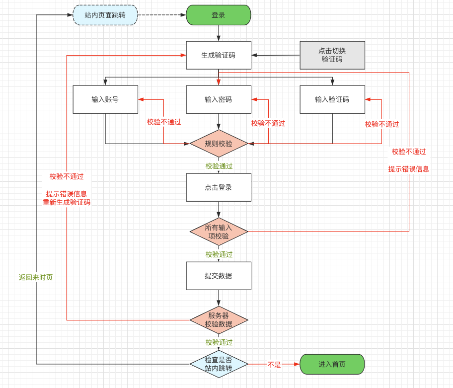

> 平安蜀黍的前端教程 > 实战教学 > 实现一个登录页

一般来说，我们需要访问某个网站时都需要登录，以方便系统记录你的个人信息。目前常见的登录方式有以下几种：

- 账号/密码登录
- 手机号/短信登录
- 第三方账号登录

因为手上资源有限，我们在这里暂时只实现一个账号密码登录，后面的两种等什么时候有条件了再实现吧

### 页面原型

[商城后台管理入口](http://shop.fenotes.com/admin)

### 账号/密码登录交互流程



### 创建页面

首先在我们在上周的创建 vite 项目里 pages 目录下创建 Login.js 文件，然后编辑这个文件

```javascript
import React, { Component } from 'react';
// 为了减少麻烦，我们在业务中要尽量使用已有的UI库而不是自己去写
// Form组件
import { Form, Input, Button, Checkbox } from 'antd';

import './login.less';

export default class Login extends Component {
  render() {
    return (
      // 所有的页面容器都需要docwrap这个样式名，便于设定一些整站的的页面样式
      // 每个页面都需要一个自己的样式名，便于设定自己私有的页面样式且用于区分样式作用域
      <div className="docwrap login">
        <div className="container">
          {/* 所有的样式名不应该包含大写，如果是多个单词线成，应使用“-”号来连接，不要用大写，也不要用下划线 */}
          <div className="form-wrap">
            {/* Form是由阿里推出的适用于react的第三方UI库ant design中的一个组件，它对html的form表单进行了比较全面的功能和样式封装，让我们可以在构建表单时更加容易 */}
            <Form
              labelCol={{ span: 7 }}
              wrapperCol={{ span: 16 }}
              {/*禁用自动完成*/}
              autoComplete="off"
            >
              {/* form组件中所有元素都需要使用form.item包起来 */}
              <Form.Item
                name="account"
                label="账号"
                rules={[{ required: true, message: '请输入账号' }]}
                hasFeedback={false}
              >
                <Input size="large" placeholder="用户名" />
              </Form.Item>
              <Form.Item
                name="pwd"
                label="密码"
                rules={[{ required: true, message: '请输入密码' }]}
                hasFeedback={false}
              >
                <Input.Password
                  // 禁用自动填充
                  autoComplete="new-password"
                  size="large"
                  placeholder="登录密码"
                />
              </Form.Item>
              <Form.Item
                name="imgcode"
                label="验证码"
                rules={[{ required: true, message: '请输入验证码!' }]}
              >
                <div className="captcha">
                  <Input placeholder="验证码" size="large" />
                  
                </div>
              </Form.Item>
              <Form.Item>
                <Button type="primary" htmlType="submit" block>
                  登录
                </Button>
              </Form.Item>
              <Form.Item name="remember" valuePropName="checked">
                <Checkbox>记住我</Checkbox>
              </Form.Item>
            </Form>
          </div>
        </div>
      </div>
    );
  }
}
```

样式代码

```less
// less最常用的
.docwrap {
  // 定义变量（这里只是为了演示功能）
  .size13 {
    font-size: 13px;
  }
  // 定义方法
  // 可以指定默认参数
  .background(@color, @size, @repeat:no-repeat) {
    background-color: @color;
    background-size: @size;
    background-repeat: @repeat;
  }
  // &号在这里表示并且，意思就是某个元素既有docwrap这个样式名也有login这个样式名
  // <div class="docwrap login" />
  &.login {
    width: 100%;
    height: 100%;

    display: flex;
    align-items: center;
    justify-content: center;
    // 调用方法并传参
    .background(#ccc, cover);
    transition: all;

    .container {
      width: 1024px;
      min-width: 424px;
      padding-left: 600px;
      // 调用方法
      .background(#f60, contain, no-repeat);
      background-position: left center;
      border-radius: 10px;
      overflow: hidden;
    }

    .form-wrap {
      background: #f5f5f5;
      form {
        padding: 22px 22px 16px;
        .ant-form-item {
          justify-content: center;
        }
        .ant-input {
          // 读取变量
          .size13;
        }
        // 占位文字的大小
        .ant-input:placeholder-shown {
          // 读取变量
          .size13;
        }
      }
      .captcha {
        display: flex;
        img {
          height: 40px;
          // 1px的透明边框可以让图片与input结合部看起来更平滑
          border: transparent 1px solid;
        }
      }
    }
    // 当可显示区域宽度小于1024时怎么改变
    @media (max-width: 1024px) {
      .container {
        width: 424px !important;
        padding-left: 0 !important;
        background-image: none !important;
      }
    }
  }
}
```
