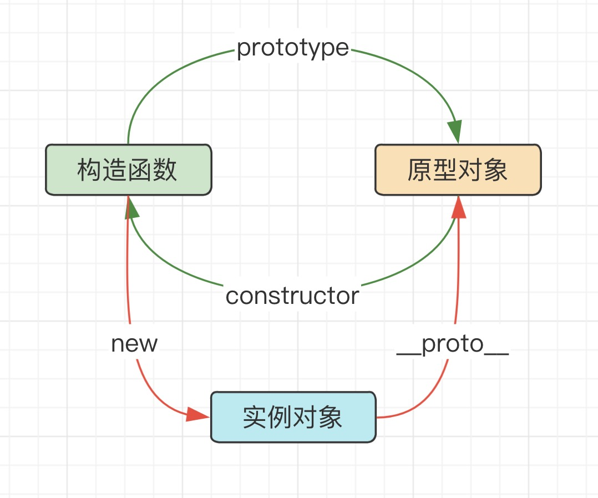
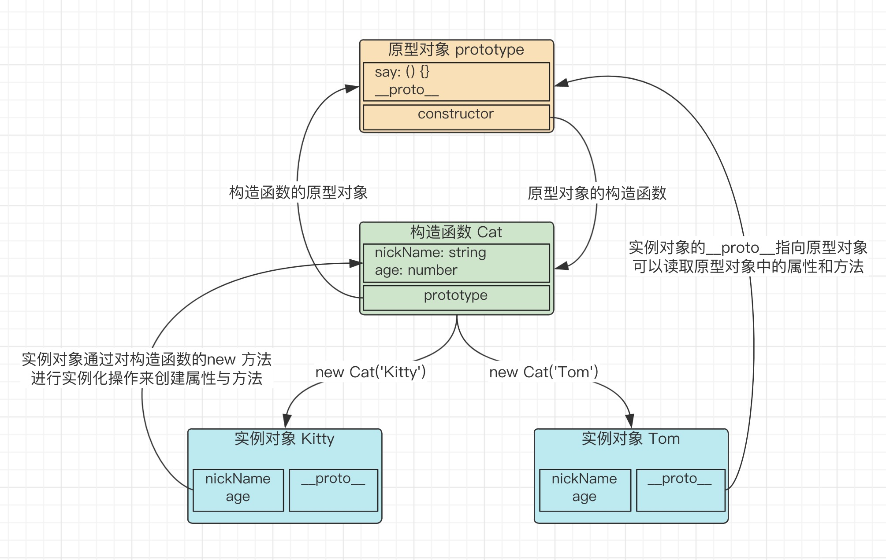

> Marion 的 react 实战课程 > 第六部分 > 原型（prototype）原型链与继承

## 原型(prototype)与\_\_proto\_\_

#### 什么是原型

在 javascript 中，所有的对象都会有一个属性叫\_\_proto\_\_，比如说我们有一个对象 a，它会有一个属性\_\_proto\_\_指向一个用于描述对象 a 长什么样子的另一个对象，我们称它为对象 b，然后对象 b 中包含所有对象 a 能使用的方法和一个叫 constructor 的构造函数，这个 constructor 描述了对象 a 中的其它属性。我们将对象 a 称之为对象 b 中 constructor 函数的实例对象，将对象 b 称之为对象 a 的原型。

- 每个对象都有一个\_\_proto\_\_属性，并且指向它的 prototype 原型对象
- 每个构造函数都有一个 prototype 原型对象
- prototype 原型对象里的 constructor 指向构造函数本身



那么，prototype 与\_\_proto\_\_具体有什么用呢？

- 实例对象的\_\_proto\_\_指向构造函数的 prototype，从而实现继承。
- prototype 对象相当于所有实例对象都可以访问的公共容器

先看图：


再看代码：

```javascript
// 构造函数
function Cat(nickName, age) {
  // 构造函数定义实例对象的属性
  this.nickName = nickName;
  this.age = age;
}
// 为构造函数的原型对象添加方法
Cat.prototype.say = function () {
  console.log(`hi, my Name is ${this.nickName}`);
};
// 实例对象
var tom = new Cat('Tom', 3);
var kitty = new Cat('Kitty', 2.5);

// 实例对象具有原型对象的方法和构造函数中的属性
tom.say();
kitty.say();

// 同一个构造函数实例化对象的原型是相等的
console.log(tom.__proto__ === kitty.__proto__);
// 实例对象的原型与构造函数的原型是相等的
console.log(tom.__proto__ === Cat.prototype);
// 构造函数的原型对象的构造函数等于它自己
console.log(Cat.prototype.constructor === Cat);
```

> 注意

> 1. 虽然现在 Object.prototype.\_\_proto\_\_ 已被大多数浏览器厂商所支持，而且它的存在和确切行为在 ECMAScript 2015 规范中已经被标准化为传统功能来确保 Web 浏览器的兼容性。但时为了更好的支持，正式的代码中仍然建议只使用 Object.getPrototypeOf()，主要是可以提升你的代码 B 格^!^，牵强的理由是不怕一万只怕万一。

> 2. Object.create(null) 新建的对象是没有\_\_proto\_\_属性的。

## 原型链

```javascript
var arr = [1, 2, 3];
arr.valueOf();
```

当我们试图访问一个对象的属性时，当解析器在对象自有的属性上找不到这个属性时，就会搜寻该对象的原型，以及该对象的原型的原型，依次层层向上搜索，直到找到一个名字匹配的属性或到达原型链的末尾。

- 查找 valueOf 大致流程

> 当前实例对象 arr，查找 arr 的属性或方法，找到后返回

> 没有找到，通过 arr.\_\_proto\_\_，找到 arr 构造函数的 prototype 并且查找上面的属性和方法，找到后返回

> 没有找到，把 Array.prototype 当做 arr，重复以上步骤

```javascript
console.log(arr.__proto__ === Array.prototype);
console.log(Array.prototype.__proto__ === Object.prototype);
// 上面这行，如果是在正式代码中，最好是用Object.getPrototypeOf()
console.log(arr.__proto__.__proto__ === Object.prototype);
```

比如我们常用的判断数组的方法 instanceOf，它的实现就是不断地向上寻找当前对象的原型与指定原型比较，直到找到 null 为止

```javascript
function myInstanceOf(left, right) {
  // 取出当前对象的原型对象
  var proto = Object.getPrototypeOf(left);
  // 默认不匹配
  var result = false;
  // while先判断后循环，dowhile是先执行后判断
  while (!result) {
    // 比较当前原型与待比较对象的原型是否一致
    result = proto === right.prototype;
    // 匹配到了就结束遍历
    if (result) break;
    proto = Object.getPrototypeOf(proto);
    // 没找到proto了，表示已经到顶部了，也结束遍历
    if (!proto) break;
  }
  return result;
}
```

当然解析器不会一直找下去，原型链是有终点的，最后查找到 Object.prototype 时 Object.prototype.**proto** === null，就意味着这次查找结束了

```javascript
// 原型链的终点
console.log(Object.prototype.__proto__ === null);
// Object.getPrototypeOf()
```

## 继承

#### 什么是继承？

> js 中所谓的继承就是让一个对象可以使用另一个对象中的方法和属性

由此可见只要实现属性和方法的传递，就达到了继承的效果

- 得到一个对象的属性

- 得到一个对象的方法

#### 属性的继承

```javascript
function Animal(nickName, age) {
  this.nickName = nickName;
  this.age = age;
}

// 方法定义在构造函数的原型上
Animal.prototype.say = function () {
  console.log(this.nickName);
};
```

然后，我们想要去创建一个猫类，我希望它可以继承动物类的全部属性并添加自己的技能属性

```javascript
function Cat(nickName, age, skill) {
  Animal.call(this, nickName, age);
  this.skill = skill;
}
```

**属性的继承是通过在一个类内执行另外一个类的构造函数，通过 call 指定 this 为当前执行环境，这样就可以得到另外一个类的所有属性**

> Amimal.call(this, nickName, age)

我们去实例化一下，看看是否成功继承

```javascript
var tom = new Cat('Tom', 3, '捉老鼠');
console.log(tom.nickName);
console.log(tom.age);
console.log(tom.skill);
```

#### 方法的继承

```javascript
tom.say(); // 报错，tom.say is not a function
```

say 方法定义在 Animal 方法的 prototype 上，通过上面的第二张图，我们可以知道，prototype 对象相当于所有实例对象都可以访问的公共容器，那么，我们只要重新创建一个 Animal.prototype 指向到 Cat.prototype 就可以通过原型链查找的方式找到了。

```javascript
Cat.prototype = Object.create(Animal.prototype);
```

- 注意：
  > 1. 这里为什么要使用 Object.create? 因为如果直接将 Animal.prototype 赋值给 Cat.prototype，就只是一个赋值操作，而 Animal.prototype 是一个对象，所以只能是建立引用关系，这样的话，一旦修改 Cat.prototype 就会同时修改 Animal.prototype，这样是不合理的！

```javascript
Cat.prototype = Animal.prototype;
Cat.prototype.test = () => console.log('测试一下');
new Animal().test();
//
```

> 2. 另外还需要注意的是，给 Cat 类添加方法时，应该要在修改 prototype 以后，否则就需要再进行一次合并操作，因为修改指向后原有的 prototype 对象会被新创建的 prototype 对象覆盖。

```javascript
Cat.prototype = {
  test1() {
    console.log('测试一下');
  },
};
Cat.prototype = Object.create(Animal.prototype);
new Cat().test1();
// test1 is not a function
```

> 3. 在修改 prototype 指向后，我们还需要修改 prototype 中的 constructor 的指向，否则会导致类型判断出错

```javascript
Cat.prototype.constructor = Cat;
```

所以，我们的继承的最终方案如下：

```javascript
function Animal(nickName, age) {
  this.nickName = nickName;
  this.age = age;
}

// 方法定义在构造函数的原型上
Animal.prototype.say = function () {
  console.log(`hi, my Name is ${this.nickName}`);
};

function Cat(nickName, age, skill) {
  // 继承父类的属性
  Animal.call(this, nickName, age);
  // 定义自身的属性
  this.skill = skill;
}
// 继承父类的方法
Cat.prototype = Object.create(Animal.prototype);
// 修正自身原型对象的constructor
Cat.prototype.constructor = Cat;
// 定义自身的原型方法
Cat.prototype.test = () => console.log('测试一下');
var tom = new Cat('Tom', 3, '捉老鼠');
tom.say();
tom.test();
console.log(tom.nickName);
console.log(tom.age);
console.log(tom.skill);
```

## 总结

**prototype 与\_\_proto\_\_**

> 在 javascript 中，所有的对象都会有一个属性叫\_\_proto\_\_，比如说我们有一个对象 a，它会有一个属性\_\_proto\_\_指向一个用于描述对象 a 长什么样子的另一个对象，我们称它为对象 b，然后对象 b 中包含所有对象 a 能使用的方法和一个叫 constructor 的构造函数，这个 constructor 描述了对象 a 中的其它属性。我们将对象 a 称之为对象 b 中 constructor 函数的实例对象，将对象 b 称之为对象 a 的原型。

**原型链**

> 每个对象都有一个\_\_proto\_\_，它指向它的 prototype 原型对象，而 prototype 原型对象又具有一个自己的 prototype 原型对象，就这样层层往上直到一个对象的原型 prototype 为 null，这个查询的路径就是所谓的原型链

**继承**

属性继承

```javascript
function Animal(nickName, age) {
  this.nickName = nickName;
  this.age = age;
}
function Cat(nickName, age, skill) {
  Animal.call(this, nickName, age);
}
```

方法继承

```javascript
Cat.prototype = Object.create(Animal.prototype);
Cat.prototype.constructor = Cat;
```

```javascript
// 消息接口
http://47.93.101.203/adminapi/jnotice
// 商品列表
http://47.93.101.203/adminapi/product/product?page=1&limit=15&cate_id=&type=1&store_name=&excel=0
// 商品分类列表
http://47.93.101.203/adminapi/product/category/tree/1
// 商品状态列表
http://47.93.101.203/adminapi/product/product/type_header
// 运费接口模板
http://47.93.101.203/adminapi/product/product/get_template
// 新增商品
http://47.93.101.203/adminapi/product/product/0
```
