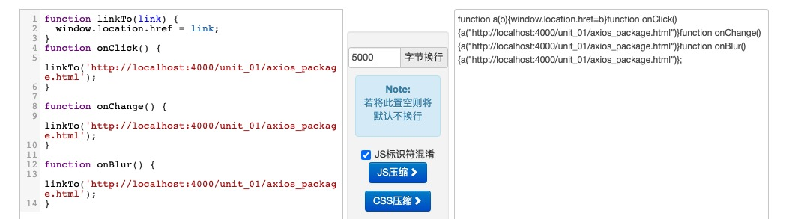
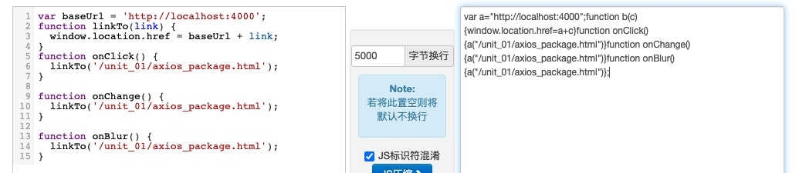

> Marion 的 react 实战课程 > 第一部分 > axios 封装

### 什么是封装？为什么要封装？

在开始今天的课程之前，我们先来看一段代码：

```javascript
function onClick() {
  window.location.href = 'http://localhost:4000/unit_01/axios_package.html';
}

function onChange() {
  window.location.href = 'http://localhost:4000/unit_01/axios_package.html';
}

function onBlur() {
  window.location.href = 'http://localhost:4000/unit_01/axios_package.html';
}
```

当我们使用压缩工具对它进行压缩后它长成这样子：


从上面这段代码中我们可以看到，当我们引用一个嵌套较深的对象属性或方法时，因为它的名字不可省略不可重构，导致在对文件进行压缩后其体积并没有太大的变化。那么我们应该怎样解决这个问题呢？看下面的代码：

```javascript
function linkTo(link) {
  window.location.href = link;
}
function onClick() {
  linkTo('http://localhost:4000/unit_01/axios_package.html');
}

function onChange() {
  linkTo('http://localhost:4000/unit_01/axios_package.html');
}

function onBlur() {
  linkTo('http://localhost:4000/unit_01/axios_package.html');
}
```

然后我们再对它执行压缩：



这一次我们可以看到，它的长度短了很多，因为函数名可以被代码工具定义一个别名，这样我们的函数名和调用都变短了，但还有一些可以优化的空间，比如 baseUrl

```javascript
var baseUrl = 'http://localhost:4000';
function linkTo(link) {
  window.location.href = baseUrl + link;
}
function onClick() {
  linkTo('/unit_01/axios_package.html');
}

function onChange() {
  linkTo('/unit_01/axios_package.html');
}

function onBlur() {
  linkTo('/unit_01/axios_package.html');
}
```

这次压缩后代码体积就更小了：



通过上面的一些封装操作，我们将一段 280 个字节的代码成功压缩到了 220 个字节，而这仅仅只是极小的一个代码片段，由此可见，当我们对整个项目中用到的方法进行规范化的封装以后能节约多少资源。

再来解释一下什么是封装，在软件编程中，封装这个概念的意思就是**将一些相关的数据和方法组合起来，将它们合并成一个对象**，实现细节隐藏，然后向外暴露出一个或多个接口，让使用者只需要关心这个模块或系统怎么使用，而不用关心这个模块或系统是怎么实现的。

像我们上面这种，将大量重复性的操作封装成一个函数，然后对这个函数进行调用以尽量减少冗余代码和无效逻辑；也可以将更多的方法和属性封装成一个构造函数或者类，然后通过实例化的方式来继承它的属性和方法。

### axios 与 fetch 的优缺点比较

#### fetch 的基本用法

```javascript
fetch('http://example.com/movies.json')
  .then(function (response) {
    return response.json();
  })
  .then(function (myJson) {
    console.log(myJson);
  });
```

#### fetch 优势：

语法简洁，更加语义化

基于标准 Promise 实现，支持 async/await

同构方便，使用 isomorphic-fetch

更加底层，提供的 API 丰富（request, response）

脱离了 XHR，是 ES 规范里新的实现方式

#### fetch 问题

fetch 是一个低层次的 API，你可以把它考虑成原生的 XHR，所以使用起来并不是那么舒服，还需要进行封装。

fetch 只对网络请求报错，对 400，500 都当做成功的请求，服务器返回 400，500 错误码时并不会 reject，只有网络错误这些导致请求不能完成时，fetch 才会被 reject。

fetch 默认不会带 cookie，需要添加配置项： fetch(url, {credentials: 'include'})

fetch 不支持 abort，不支持超时控制，使用 setTimeout 及 Promise.reject 的实现的超时控制并不能阻止请求过程继续在后台运行，造成了流量的浪费

fetch 没有办法原生监测请求的进度，而 XHR 可以

#### axios 的基本用法

```javascript
axios({
  method: 'post',
  url: '/user/12345',
  data: {
    firstName: 'Fred',
    lastName: 'Flintstone',
  },
})
  .then(function (response) {
    console.log(response);
  })
  .catch(function (error) {
    console.log(error);
  });
```

#### axios 特性

axios 是一个基于 Promise 用于浏览器和 nodejs 的 HTTP 客户端，本质上也是对原生 XHR 的封装，只不过它是 Promise 的实现版本，符合最新的 ES 规范，它本身具有以下特征：

从浏览器中创建 XMLHttpRequest

支持 Promise API

客户端支持防止 CSRF

提供了一些并发请求的接口（重要，方便了很多的操作）

从 node.js 创建 http 请求

拦截请求和响应

转换请求和响应数据

取消请求

自动转换 JSON 数据

### axios 的封装

##### 为什么要封装 axios?

一般来说，我们在使用 axios 请求 api 处理数据时，需要经过很多的前期和后期工作，比如请求前需要修改 request 请求头，需要展示 loading 或其它提示信息，需要对参数进行合并和计算；比如请求后需要判断服务器是否正常，数据是否正确返回，统一的错误处理，脱离 axios 或 fetch 请求的状态信息等等。如果这些代码每个调用者都去写一遍，先不说代码规范和容易出现的 BUG 等，就从代码的冗余量来说也是不合适的。

##### 怎样封装 axios?

封装之前，我们需要先捋清楚自己的需求，也不提更多的需求了，暂时就按上面说的为什么要封装的来吧

- 修改 request 请求头
- 展示 loading 或其它提示信息
- 参数的合并与计算
- 服务器状态的判断与错误处理
- 接口返回的数据信息处理
- 数据脱壳

- 第一步：新建一个 axios 实例

在做所有事情之前，我们必须先创建一个 axios 实例，然后再通过这个实例提供的接口去访问它的方法：

```javascript
import axios from 'axios';

// 创建一个默认配置项
const defalutConfig = {
  // 响应超时时长，当接口响应时间超过这个时间时，axiox会放弃请求并返回接口超时的错误
  timeout: 30000,
};

// 创建一个axios实例
const instance = axios.create(defalutConfig);

// 请求拦截器
instance.interceptors.request.use(
  config => {
    // 请求拦截，我们可以在这里拦截到请求并对config进行配置，比如header
    console.log('这是请求发起之前', config);
  },
  error => {
    // 请求出错了，可以在这里打印error看看是什么问题
    console.log('发起请求时报错了', error);
  }
);
// 响应拦截器
instance.interceptors.response.use(
  response => {
    // 响应拦截，我们可以在这里拦截到服务器响应
    console.log('服务器正确响应了', response);
  },
  error => {
    // 服务器返回错误，可以在这打印错误是什么
    console.log('服务器返回错误了', error);
  }
);
// 请求转换器
instance.defaults.transformRequest = function (data) {
  console.log(data);
};
// 响应转换器
instance.defaults.transformResponse = function (data) {
  console.log(data);
};
```

注：转换器和拦截器都可以实现转换请求和响应数据的需求，请求时，拦截器主要负责修改 config 配置项，而转换器更多用来转换请求体，比如转换对象为字符串。在请求响应后，拦截器可以拿到 response，转换器主要负责处理响应体，比如转换字符串为对象。

请求转换器（transformRequest）主要用来根据 data 格式，设置 http 请求头；响应转换器（transformResponse）可以根据实际业务中服务端返回的数据格式，统一设置转换方法。而拦截器是被包装成了 Promise，显然主要是用它来处理异步的。

转换器是处理数据和请求头(config.headers)的，不能处理异步，不会阻断请求和响应流程；而拦截器可以处理异步需求，可以使用拦截器阻断请求或响应流程。

#### 请求拦截常见配置

```javascript
function getToken() {
  // 从redux或storage或cookie里获取token
  return 'xxxxxxxxx';
}
// 请求拦截
instance.interceptors.request.use(
  config => {
    // 请求拦截，我们可以在这里拦截到请求并对config进行配置，比如header
    console.log('这是请求发起之前', config);

    // 判断是否有全局的loading设置
    if (config.showLoading) {
      // 调用antd的loading
    }

    // 返回设定的一些配置
    return {
      // 保持原来的配置不受影响
      ...config,
      ...{
        headers: {
          // token,一般用来发送给接口判断用户是否已获取相关权限
          // 广义来说，webapp有两种用户，一种为游客，一种为注册用户
          // 注册用户会再根据他的权限细分为拥有各种权限的用户组
          'access-token': getToken(),
          // content-type 一般用于告知接口，我们需要用什么样的方式来获取数据，如果这个属性不正确可能会出现一些意想不到的结果
          // 比如明明是获取一段数据，接口可能会返回一个文件地址让你下载
          // 如果是下载文件，这里我们需要改成：application/octet-stream
          // 如果是上传文件，这里我们需要改成：multipart/form-data
          // 更多配置类型可以参考 https://www.runoob.com/http/http-content-type.html
          // 默认格式：以key:value格式发送数据到服务器（也是表单的默认提交格式）
          'Content-Type': 'application/x-www-form-urlencoded',
        },
      },
    };
  },
  error => {
    // 请求出错了，可以在这里打印error看看是什么问题
    console.log('发起请求时报错了', error);
    // 返回错误信息给调用者
    return Promise.reject(error);
  }
);
```

#### 响应拦截常见配置

相对于请求拦截，响应拦截就要复杂很多了，我们需要通过 reponse 中的 code 来判断服务器是否正确返回，如果正确返回还可以对接口的一些常见错误进行统一处理

```javascript
// 响应拦截器
instance.interceptors.response.use(
  response => {
    // 响应拦截，我们可以在这里拦截到服务器响应
    console.log('服务器正确响应了', response);
    // 判断是否有全局的loading设置
    if (response.config.showLoading) {
      // 隐藏antd的loading
    }
    // 如果返回的状态码为200，说明接口请求成功，可以正常拿到数据，为了减少调用方的代码，
    // 我们在这里只返回reaponse中的data部分，也就是我们的api返回的内容
    // 甚至我们还可以通过传入一些配置参数，在这里对一些特定的api状态码进行统一处理，更进一步地减少调用方的代码
    if (response.status === 200) {
      return response.data;
      // return checkAPIMessage(response)
    }
    // 检查错误
    // return Promise.reject(checkErrorMessage(response))
  },
  // 服务器返回非2开头状态码的情况
  error => {
    // 服务器返回错误，可以在这打印错误是什么
    console.log('服务器返回错误了', error);
    //
  }
);
```

#### 封装一些固定的请求减少调用时代码量

```javascript
/**
 * 向外抛出的简易方法，可以有效减少固定格式的请求参数传递
 * @param {*} url
 * @param {*} data
 * @returns
 */
export function post(url, data) {
  // axios的返回本来就是一个Promise，这里为什么还要返回一个新的promise?
  return new Promise((resolve, reject) => {
    instance
      // 如果data是对象，将其转换为key=value字符串
      .post(url, isObject(data) ? qs.stringify(data) : data)
      .then(res => {
        resolve(res);
      });
  });
}
```

#### 最后的完整代码

```javascript
//
```

---

### 课后练习

- 我们为什么要封装 axios
- 你在封装 axios 时做了哪些事情
- 怎样配置全局拦截器
- axios 拦截器与转换器有什么不同
- 常见的服务器错误码有哪些
