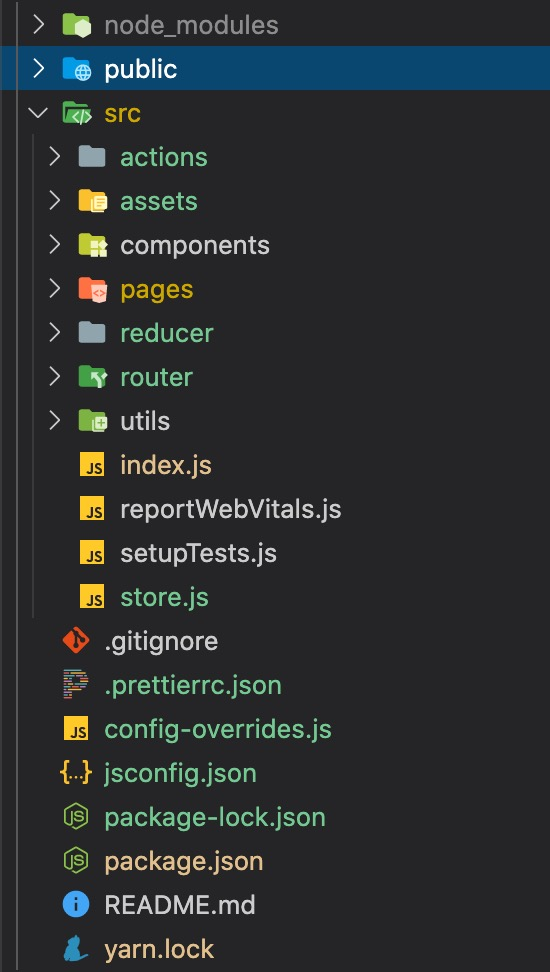

> Marion 前端教程 > 前端开发应知应会 > 第一部分 > customize-cra 与 react-app-rewired

### 使用 create-react-app 来创建一个 react 项目

Create React App 是 FaceBook 的 React 团队官方出的一个**构建 React 单页面应用的脚手架**工具。它本身**集成了 Webpack**，并配置了一系列**内置的 loader**和**默认的 npm**脚本，可以很轻松的实现**零配置**就可以快速开发 React 的应用。

```javascript
// 全局安装一个create-react-app的脚手架工具
npm install -g create-react-app

// 使用脚手架创建你的项目
create-react-app 你的项目名

// 也可以这样创建，注意这里用的是npx而不是npm
npx create-react-app 你的项目名
```

官方推荐使用 npx create-react-app 来创建项目。因为它**不会在本地保留 create-react-app 的副本**，而是在使用完成后立刻删除。要注意的是，前面三个字母是 npx 而不是 npm;

(npx 是 npm 的一个新工具，它可以将远程 Node 项目拉回到本地临时文件里运行，完成后再删除掉这个临时文件。它最大的好处是减少了我们全局安装某些脚手架的操作)，实例如下：

```javascript
// 创建项目, 注意你的项目名，必须是英文字母开头可以包含数字和下划线，不允许出现其它字符
npx create-react-app 你的项目名

// 如果你要建的是一个ts项目, 在后面加上--template typescript 后缀
npx create-react-app 你的项目名 --template typescript

// 项目创建完成后, 通过终端进入你的项目文件夹
cd 你的项目名

// 或者将你的命令用&&号连接起来也行
npx create-react-app 你的项目名 && cd 你的项目名
```

---

### 使用 create-react-app 创建的项目怎样配置 webpack?

一种是在终端**运行 npm run eject 即可将脚手架创建的项目中的 webpack 配置释放**出来，不过，这个**过程是不可逆的**，所以，我们一般不会进行这种操作，因为 **react 的 webpack 配置相对来说比较繁琐**。更好的方案是使用社区提供的一些插件来进行 webpack 的设置，比如：[customize-cra](https://github.com/arackaf/customize-cra)或者[craco](https://github.com/gsoft-inc/craco)来对 webpack 进行配置，今天，我们主要讲一讲 customize-cra 的实现方式：

#### 第一步：安装依赖

在安装之前我们大致了解一下 react-app-rewired 与 customize-cra 这两个插件。

> react-app-rewired，rewired(**ruiwaerde 重装，重构的意思**)。功能用于拦截 webpack 启动配置，拥有修改 create-react-app 的配置权限

> customize-cra，customize(**kasitemaisi 订制的意思**)。一款相对比较成熟的 react 项目实用工具集，结合 react-app-rewired 使用，我们可以方便地对 create-react-app 脚手架创建的项目进行深度定制。

```javascript
// reactAppRewired与customize-cra是比较重要的插件, 一定要安装
// react-app-rewired是让你在不执行"npm run eject"指令也能改变内置的webpack中的配置的一个插件；
// customize-cra 是依赖于 react-app-rewired 的库, 通过 config-overrides.js 来修改底层的 webpack, babel配置
npm i -D react-app-rewired customize-cra
// 或者使用yarn
yarn add -D react-app-rewired customize-cra
```

我们刚刚安装了"react-app-rewired"与"customize-cra"这两个依赖, 也说到了, customize-cra 是能通过一个叫 config-overrides.js(**oweiruierde 重叠、覆盖的意思**) 的文件来修改你的 webpack 的配置而不再需要运行 npm run eject 来暴露 webpack 配置文件。

所以, 现在我们要在你的根目录增加 config-overrides.js 文件, 尝试着让我们的项目可以编译 less 文件。

#### 第二步：增加配置文件

```javascript
const path = require('path');

const {
  override,
  addLessLoader, // 用于加载less文件
} = require('customize-cra');

module.exports = {
  webpack: override(
    // 加载less文件
    addLessLoader({
      lessOptions: {
        javascriptEnabled: true,
      },
      sourceMap: true,
    })
  ),
};
```

因为在 config 里增加了 less 的读取，所以我们需要安装 less 依赖。这里需要注意的是，因为 create-react-app 与 react-app-rewired 是基于 webpack4 来开发的，而 less-loader 的最新版本是基于 webpack5 来开发的，所以最新版的 less-loader 是不支持我们的脚手架项目的，所以这里需要指定 less 和 less-loader 版本号

```javascript
yarn add -D less@4.1.1 less-loader@7.3.0
// 或者
npm i -D less@4.1.1 less-loader@7.3.0
```

#### 第三步：修改 package.json

安装完成依赖后，我们需要改变一下 package 中的配置项来使用 react-app-rewired 来启动项目

```javascript
// 原来的npm脚本命令
"scripts": {
  "start": "react-scripts start", // start 使用编译并启动本地服务器进行调试
  "build": "react-scripts build", // build 编译并打包
  "test": "react-scripts test",   // test  编译并执行test脚本
  "eject": "react-scripts eject"  // eject 释放webpack配置文件
},
// 修改后
"scripts": {
  "start": "react-app-rewired start",
  "build": "react-app-rewired build",
  "test": "react-app-rewired test"
},
```

#### 第四步：启动项目

```javascript
npm run start
// 也可以使用yarn
yarn run start

// start命令可以省略run，直接使用npm 执行
npm start
// 但其它命令不行，必须使用run
npm build // 会报错
```

---

### customize-cra 的更多配置

#### 配置代理服务器

正常来说，我们的开发环境如果没有配置 node 服务，那么在请求接口时必然是会发生[跨域](../enclusore/cross-domin.md)的，也就是说我们无法向远程服务器获取数据。那怎么解决呢？customize-cra 提供了在开发环境配置开发服务器的接口：overrideDevServer，我们可以在这里配置跨域代理

```javascript
const {
  override,
  overrideDevServer, // 开发服务器
} = require('customize-cra');

// 配置跨域服务
/**
 * 代理配置
 * 这是一个闭包，返回一个回调函数，customize-cra在执行这个回调的时候，会将当前的开发服务器的配置项以参数的形式传给我们
 * 我们对这个config进行一个简单的处理后返回给customize-cra
 */
function addProxy() {
  return config => {
    // 将配置好的config返回给customize-cra
    return {
      // 保证原有的config不受影响
      ...config,
      // 配置代理
      proxy: {
        // 拦截器（拦截所有以"/api"开头的http请求）
        '/api': {
          // 配置一个base url
          target: 'http://data.fenotes.com',
          // 是否修改源，它决定我们是否跨域
          changeOrigin: true,
          // 是否重写我们的拦截关键字
          // 以下面这行为例，表示将请求url中的/api替换成空字符串
          pathRewrite: {
            '^/api': '',
          },
        },
      },
    };
  };
}

// 将配置的代理插入到服务器配置
module.exports = {
  // 配置devServer属性
  devServer: overrideDevServer(addProxy()),
};
```

#### antd 与 antd 按需加载

react 项目中，antd 是一个常用的 UI 库，但有时我们可能只用到其中的一小部分组件，如果不使用按需加载功能的话，我们的包文件可能会比较庞大。所以，每次配置新项目时，一定要配置 antd 的按需加载：

**注：在 antd4 版本中这个已经不需要了，antd4 默认使用了 es6 的 import&exports 规范，只要我们在使用时是以解构的方式导入就只会导入我们需要的组件代码**

我们先安装 antd，antd 是运行时依赖，所以需要安装到生产环境，使用 yarn add 或 npm i -S

```javascript
yarn add antd babel-plugin-import // 按需加载工具需要用到这个依赖
// 或者
npm i -S antd babel-plugin-import
```

然后在 config-overrides.js 中添加相关配置，customize-cra 内部提供了按需加载的插件（依赖 babel-plugin-import），我们只需要导出即可

```javascript
// 导出插件
const {
  fixBabelImports, // antd的按需加载插件
} = require('customize-cra');
```

调用插件方法

```javascript
// antd按需加载工具, 具体用法参考以下链接
// https://github.com/ant-design/babel-plugin-import
fixBabelImports('import', {
  libraryName: 'antd', // ui库的名字 可选antd-mobile
  libraryDirectory: 'es',
  style: true, // 表示将import回来的代码以style方式写入到html的head里
});
```

在 index.js 中配置 antdUI 库

```javascript
// antd的生产者组件
import { ConfigProvider } from 'antd';
// antd中文化
import zhCN from 'antd/lib/locale/zh_CN';
// antd的样式文件
import 'antd/dist/antd.less';
```

#### px 自动转 rem

在之前的项目里，我们写移动端的时候，可能需要单独去加载一个 pxtorem 的工具插件，然后写样式文件时还需要对 css 进行计算后转换成 rem，webpack 社区提供了一些在编译时自动转 rem 的工具，比如 postcss-px2rem-exclude(**aikesiloude 应该是排除的意思，感觉跟这里的语义不一致**)，postcss-px2rem 等等，我们在这里学习一下如何使用 postcss-px2rem-exclude。首先仍然是安装依赖：

```javascript
// 使用postcss-px2rem-exclude还依赖lib-fiexible（faikesibo 灵活的）这个工具
// lib-fiexible用于在html标签上生成根字体的大小
yarn add -D postcss-px2rem-exclude lib-flexible
```

配置使用

```javascript
// index.js
import 'lib-flexible';

// config-overrides.js
// 顶部导入addPostcssPlugins，用于将postcss-px2rem-exclude导入到webpack的loader规则里
const {
  addPostcssPlugins, // 转换css文件的工具
} = require('customize-cra');

// remUnit设为75，12px的文字大小需要写成24px
// remUnit设为37.5，12px的文字大小就是12px
addPostcssPlugins([
  require('postcss-px2rem-exclude')({
    remUnit: 75,
    exclude: /node_modules/i, // 表示忽略node_modules下的所有文件，避免影响第三方的设置比如antd
  }),
]),
```

lib-flexible 的功能是在当前页面的根节点上添加一个 font-size, font-size 的大小基本上是当前屏幕宽度/10, 也就是说，1rem === 1/10 的屏幕宽度。如果设计稿是 750 (iphone6 手机的像素宽度: 1334\*750)的宽度，那么 1rem 差不多就是 75px。

在 postcss-px2rem-exclude 里，remUnit 需要参考设计图的原始尺寸。移动端的设计图一般来说都是参考 iphone6 这种 dpi 密度的手机，也就是说在相对于显示器同样大小的空间宽度里放入了 4 个像素点（不理解的同学可以去查询关于 dpi 的解释），所以，我们看到的设计图上写的大小可能会比较大，比如我们认为是 12px 的设计图上会写成 24px，不是设计师的问题，而是他们参考的点阵宽度不同。

##### css 中各种 size 的区别：

px: pixel，像素，绝对长度单位，显示器晶体管的大小，比如显示器分辨率 1920*1080，这个尺寸就是像素数量的描述;
pt: point，点，绝对长度单位，印刷行业常用的单位，1pt 约等于 1/72 英寸，这个单位主要用于打印，在不需要考虑打印样式时，我们可以忽略，如果需要，我们可以使用像素值*3/4 来进行换算，比如 16px \* 3/4 = 12pt;
em: 相对单位，父元素的字体大小，当父元素的 font-size 设定为 16px 时，子元素的 1em===16px;
rem: 相对单位，根元素的字体大小，当根元素的 font-size 设定为 16px 时，子元素的 1em===16px;

#### 自定义配置

customize-cra 提供了比较丰富的接口来让我们更好地完善 webpack，但这些仍然远远不够，有很多我们需要的功能它可能也无法提供，怎么办呢？customize-cra 提供了一个自定义的接口方法，只要我们在参数中传入一个回调函数，customize-cra 会自动调用它，并将当前的 webpack.config 传给我们，我们要做的就是将我们需要的一些配置添加到这个 config 中并返回给 customize-cra 即可生效

```javascript
override(config => {
  // 增加plugin
  config.plugins.push();
  // 增加loader
  config.module.rules[1].oneOf.push();
  // 返回修改过的config
  return config;
});
```

#### 完整配置

```javascript
const path = require('path');

const {
  override,
  addWebpackAlias, // 用于配置别名的
  addLessLoader, // 用于加载less文件
  addDecoratorsLegacy, // 用于使用ES的装饰器
  fixBabelImports, // antd 按需加载
  overrideDevServer, // 开发服务器
  addPostcssPlugins, // 转换css文件的工具
} = require('customize-cra');

// 雪碧图生成的插件
const SpritesmithPlugin = require('webpack-spritesmith');
/**
 * 代理配置
 * 这是一个闭包，返回一个回调函数，customize-cra在执行这个回调的时候，会将当前的开发服务器的配置项以参数的形式传给我们
 * 我们对这个config进行一个简单的处理后返回给customize-cra
 */
function addProxy() {
  return config => {
    // 将配置好的config返回给customize-cra
    return {
      ...config,
      // 代理
      proxy: {
        // 拦截器（拦截所有以"/api"开头的http请求）
        '/api': {
          // 配置一个base url
          target: 'http://data.fenotes.com/mock/608e03fd4025392aa6750b8f',
          // 是否修改源，它决定我们是否跨域
          changeOrigin: true,
          // 是否重写我们的拦截关键字
          pathRewrite: {
            '^/api': '/api',
          },
        },
      },
    };
  };
}

module.exports = {
  webpack: override(
    // 使用装饰器
    addDecoratorsLegacy(),
    addLessLoader({
      lessOptions: {
        javascriptEnabled: true,
      },
      sourceMap: true,
    }),
    addPostcssPlugins([
      require('postcss-px2rem-exclude')({
        remUnit: 37.5,
        exclude: /node_modules/i,
      }),
    ]),
    // antd 4已经不需要这个功能了，但我们需要了解，以便维护antd 4以下版本的项目
    fixBabelImports('import', {
      libraryName: 'antd', // ui库的名字 可选antd-mobile
      libraryDirectory: 'es',
      style: true, // true表示将文件以style方式写入到html head中
    }),
    // 别名
    addWebpackAlias({
      '@': path.resolve(__dirname, 'src'),
    }),
    // 更多的配置
    config => {
      config.plugins.push(
        new SpritesmithPlugin({
          src: {
            cwd: path.resolve(__dirname, 'src/assets/icons'),
            glob: '*.png',
          },
          target: {
            image: path.resolve(__dirname, 'src/assets/sprite.png'),
            css: path.resolve(__dirname, 'src/assets/sprite.less'),
          },
          apiOptions: {
            cssImageRef: 'sprite.png',
          },
        })
      );

      return config;
    }
  ),
  // 开发环境服务器代理, 一般情况下不需要我们自己配
  devServer: overrideDevServer(addProxy()),
};
```

---

### 其他配置

#### 代码格式

在项目根目录下新建一个.prettierrc.json 文件，这个文件是配给 prettierrc 插件使用的, 主要是对于一些其它同事 coding 时未遵循规范, 代码可读性较差时, 可以顺手帮忙右键格式一下。内容如下：

```javascript
{
  "bracketSpacing": true,  // 在对象中属性冒号的右侧添加空格
  "printWidth": 100,       // 超过最大值换行
  "useTabs": false,        // 缩进不使用tab, 使用空格
  "tabWidth": 2,           // 缩进字节数
  "semi": true,            // 句尾添加分号
  "singleQuote": true,     // 使用单引号代替双引号
  "arrowParens": "avoid",  // (x) => {} 箭头函数参数只有一个时是否要有小括号。avoid：省略括号
}
```

#### js 环境配置

- 在项目的根目录, 新建一个 jsconfig.json 文件, 以修正因为使用别名导致编辑器无法自动完成路径的问题。内容如下：

```javascript
{
  "compilerOptions": {
    "experimentalDecorators": true,
    "baseUrl": "./",
    "paths": {
      "@/*": ["src/*"]
    }
  },
  "exclude": ["node_modules", "dist"]
}
```

#### 目录与文件管理



需要配置在根目录的文件基本配置完成，然后我们再来对 src 目录下的文件与目录做一些调整, 除了 index.js 文件外，其它文件全部删除。

然后新建五个文件夹:

1. assets, 用于放置你将来的公共 css 和图片等媒体文件;

2. components, 用来放置你所有的功能组件;

3. pages, 用来放置你所有的页面文件(业务组件);

4. reducer, 用于管理我们所有与 redux 有关的文件;

5. router, 用于管理主路由，路由守卫等文件;

6. utils, 用来放置你的 axios 配置文件与其它的业务功能插件等。

#### 添加路由管理

```javascript
// router/index.js
import React from 'react';
import { BrowserRouter, Route, Switch } from 'react-router-dom';
// 为什么要用index.jsx? index在Js, Html中, 代表了索引页, 也是当前目录的默认首页。所以, 在这里我们不需要指定文件名就能直接将目录中的index导入, 可以减少文件名称的输入以减少因为文件名输入错误造成的一些问题
import Homepage from '@pages/Homepage';

function Router() {
  return (
    <BrowserRouter>
      <Switch>
        <Route exact path="/" component={Homepage} />
      </Switch>
    </BrowserRouter>
  );
}

export default Router;
```

---

### 课后问题

- 参考教程，使用 webpack 新建一个项目，要求正确配置并正常使用图片压缩、icon 合并等插件并展示

- 参考教程，使用 create-react-app 新建一个项目，要求配置代理服务，使用图片压缩，合并 icon
