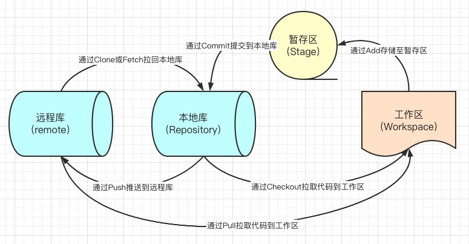
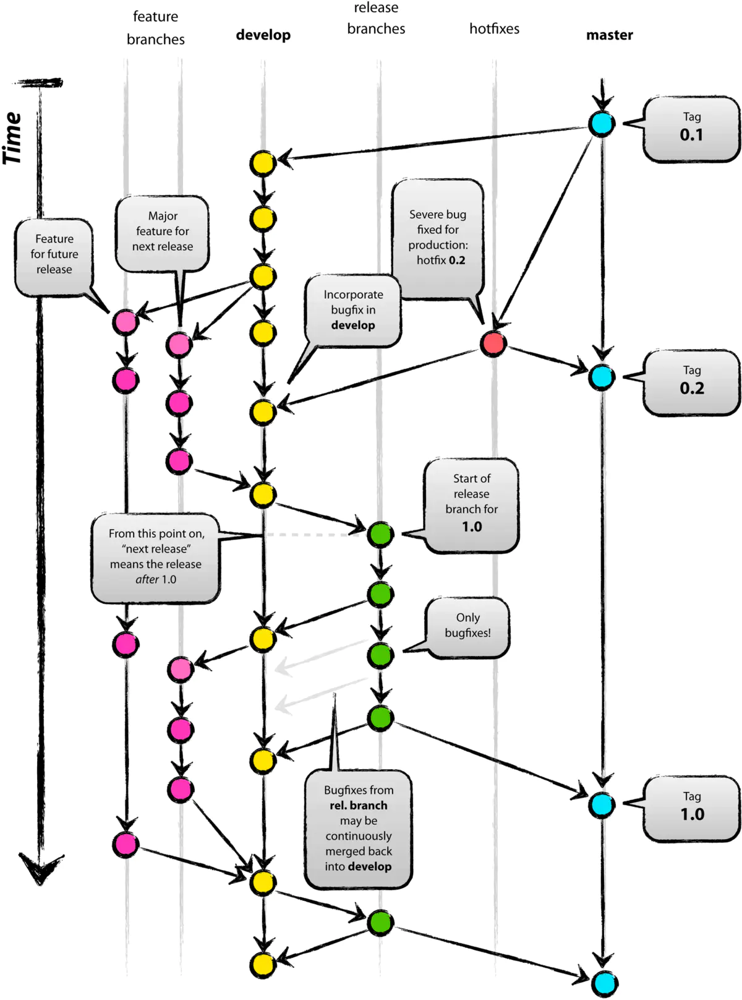

> Marion 前端教程 > 前端开发应知应会 > 第一部分 > GIT 版本管理工具的应用

### 什么是版本管理工具？

版本管理工具是一种通过一个版本号来记录一个或多个文件内容变化，便于将来查阅特定版本修订情况以及回溯的系统。

有了它我们就可以将某个文件回溯到之前的状态，甚至将整个项目都回退到过去某个时间点的状态，可以比较文件的变化细节，查出最后是谁修改了哪个地方，从而找出导致怪异问题出现的原因，又是谁在何时报告了某个功能缺陷等等。

使用版本控制系统通常还意味着，就算你乱来一气把整个项目中的文件改的改删的删，你也照样可以轻松恢复到原先的样子。 但额外增加的工作量却微乎其微。

### 常见的版本管理工具

VSS Visual Source Safe， 微软提供的一个版本工具，没有用过

CVS Concurrent Versions System，与 SVN 是同一家公司出品的，早期用的是这个，后来改用了 SVN

SVN CollabNet Subversion SVN 是在 CVS 的基础上，由 CollabNet 提供开发的，也是开源工具，应用比较广泛。他修正了 cvs 的一些局限性，适用范围同 cvs，目前有一些基于 SVN 的第三方工具，如 TortoiseSVN，是其客户端程序，使用的也相当广泛.在权限管理，分支合并等方面做的很出色，他可以与 Apache 集成在一起进行用户认证。

不过在权限管理方面目前还没有个很好用的界面化工具，SVNManger 对于已经使用 SVN 进行配置的项目来说，基本上是无法应用的，但对于从头开始的项目是可以的，功能比较强大，但是搭建 svnManger 比较麻烦。是一个跨平台的软件，支持大多数常见的操作系统。作为一个开源的版本控制系统，Subversion 管理着随时间改变的数据。这些数据放置在一个中央资料档案库中。这个档案库很像一个普通的文件服务器，不过它会记住每一次文件的变动。这样你就可以把档案恢复到旧的版本，或是浏览文件的变动历史。Subversion 是一个通用的系统，可用来管理任何类型的文件，其中包括了程序源码。

GIT Git 是一个开源的分布式版本控制系统，用以有效、高速的处理从很小到非常大的项目版本管理。Git 是 Linus Torvalds 为了帮助管理 Linux 内核开发而开发的一个开放源码的版本控制软件。Torvalds 开始着手开发 Git 是为了作为一种过渡方案来替代 BitKeeper，后者之前一直是 Linux 内核开发人员在全球使用的主要源代码工具。开放源码社区中的有些人觉得 BitKeeper 的许可证并不适合开放源码社区的工作，因此 Torvalds 决定着手研究许可证更为灵活的版本控制系统。尽管最初 Git 的开发是为了辅助 Linux 内核开发的过程，但是我们已经发现在很多其他自由软件项目中也使用了 Git。例如，最近就迁移到 Git 上来了，很多 Freedesktop 的项目也迁移到了 Git 上。

### Git 的安装

##### windows 客户端：

直接官网下载，下一步到底，不需要什么配置

```javascript
https://github.com/git-for-windows/git/releases/download/v2.33.0.windows.2/Git-2.33.0.2-64-bit.exe
```

##### mac 客户端：

```javascript
brew install git
```

**一般来说，我们使用 mac 的电脑时都会有一个 xcode，而 xcode 都是自带 git 的，所以你打算安装 git 之前，先在你的终端打印一下 git 的版本号试试是否已经有了 git?**

如果你的系统没有 brew，就需要先安装 brew

```javascript
//
```

### 账号的申请与配置(以码云为例的申请)

这里需要注意的是，企业一般都会有自己的 gitlab(gitlab 是一个 git 库管理软件)，git 账号是不需要你自己申请的，一般进入公司后会给你一个公司的邮箱和密码，你的 leader 会给你的邮箱分配权限。如果在需要登陆 git 库的时候，出现没有账号或无法登陆或报权限错误，那么都可能是你的 leader 忘记给你申请权限，找他询问一下就行了。

### 注册你的电脑信息到线上仓库

#### 1. 生成公钥

进入公司，拿到 git 项目的第一步就是生成公钥，有了公钥你才有上传代码的权限。

```javascript
ssh-keygen -t rsa -C '你在码云注册的邮箱地址'
```

#### 2. 生成的公钥在哪里？

找你的用户目录下，.ssh 文件夹，id_rsa.pub 文件，复制里面的内容

#### 3. 保存公钥

鼠标移至码云右上角头像位置，在下拉列表中选择设置，在新打开的页面中右侧菜单项里寻找 SSH 公钥，点击后将复制的公钥粘贴至公钥输入框中并点击确定

### 多仓库信息管理

以码云与 github 同时存在为例：

##### 1. ssh-keygen -t rsa -C '你的邮箱地址' -f ~/.ssh/gitee_id_rsa // 码云的

##### 2. ssh-keygen -t rsa -C '你的邮箱地址' -f ~/.ssh/github_id_rsa // github 的

##### 3. 按照上面单个仓库的方式分别在码云和 github 上注册你的电脑信息

##### 4. 在你的.ssh 文件夹下，新建一个 config 文件，注意文件没有任何后缀，复制以下代码到你的 config 文件里

```bash
# gitee
Host gitee.com
HostName gitee.com
PreferredAuthentications publickey
IdentityFile ~/.ssh/gitee_id_rsa

# github
Host github.com
HostName github.com
PreferredAuthentications publickey
IdentityFile ~/.ssh/github_id_rsa
```

### 关联项目

一般来说，我们刚进入企业时，项目都是由 leader 在 git 上建好后，提供给我们地址下载，但也不排除我们的新 leader 比较信任你，所以，你还是得学会新建项目。新建项目有两种方式：

### 第一种比较简单：

##### 1. 直接在 git 网页上建立仓库，然后使用 clone 的方式将项目拉回本地

```javascript
git clone <你的项目地址>
```

##### 2. 将本地项目中的所有文件以 copy 的方式复制到刚拉回来的文件夹

##### 3. 经过 add 和 commit 后 push 到远程仓库；

```javascript
git add .

git commit -m '项目创建'

git push
```

### 另一种方式是强行合并两个仓库：

##### 1. 参考上月的第一课，从新建一个项目开始，我们新建一个项目

```javascript
npx create-react-app
```

##### 2. 在你的远程仓库里新建项目并记住项目地址例如我的项目地址

```javascript
git@gitee.com:marion-lau/traina_1806.git
```

##### 3. 将本地仓库与远端仓库关联起来(使用 create react app 命令建立的项目已经包含有 git 配置信息了，所以不需要 git init)

```javascript
git remote add origin <你的项目地址>
```

##### 4. 此步骤为非正常步骤，如果发现因为版本问题有无法 push 也无法 pull，那么极有可能是你新建的仓库版本与线上版本不一致，因为是初始化的项目，所以我一般都是直接清空远程仓库来解决这种问题。但不排除有时候远程项目中存在大量的代码不能清除，所以我们就必须强行合并（此步慎重，不排除有丢代码的可能，曾遇到过，但的确不记得是误操作还是怎么回事，导致线上其他同事的代码被我扔掉了）：

```javascript
git pull origin master --allow-unrelated-histories // 这里的意思是强行合并不相关的版本历史， 用这种方式合并的代码，需要自行寻找并解决冲突
```

##### 5. 如果有任何冲突，在解除所有冲突以后执行

```javascript
git push -u origin master
```

到这我们的项目就成功与远程仓库建立了关联。

### git 工作流程

学习 git 工作流程之前需要理解并记住这张图



git 的版本管理有很多种流程，在未来，如果有面试官问到了你上家公司的版本管理用的是什么样的流程，你应该心里有数。

首先，我们来学习一个比较繁琐的版本管理流程：Git Flow，它的项目存在两个长期分支及多个功能分支与补丁分支及预发布分支，它的优点是版本清晰且能应对绝大部分的突发情况，但因为存在事实上的两个主分支，导致每次上线发布完成后需要同时维护两个分支，非常繁琐，所以后来我们把它与主分支彻底合并了，感觉也没有太大的问题，不过你们都是初学者，应该要从最完整的流程去理解 git 的规则。

#### 长期分支

###### 主分支 master

主分支用于存放对外发布的版本历史，它并不参与实际的开发过程。我们需要保证无论什么时候获取这个分支的版本都是绝对稳定的，所以，除了特定的版本管理人员，其他人是无权对这个分支做任何操作的；

###### 开发分支 dev 或者 develop

开发分支是我们用于日常开发的主分支，所有的功能分支都是以它为父分支来创建的。

#### 临时分支

###### 补丁分支 hotfix

补丁分支，这是用来解决紧急线上问题的特殊分支，它的存在周期短，且无视其它所有功能分支与上线分支，因为它的特殊性，每一次创建与提交，都必须慎之又慎。

###### 功能分支 feature

功能分支，这是我们常用的分支，一般来说，我们都是基于需求去建立功能分支，然后根据上线时间来判断需要将哪几个需求来合并成一个新的 release。

###### 发布分支 release

发布分支，这个分支是用来存储已开发完成待上线的分支的。在大型项目中，可能会每天都会有新的功能上线，同时有新的功能分支被建立，这个时候为了避免开发分支的代码合并导致待上线版本无法正常使用，我们需要建立一个临时分支用来存储已经与主分支代码合并完成并经过测试确认没有问题的上线版本。

---

上面的分支管理主要用来管理大型项目，适合多个团队并发操作且公司有完善的项目管理机制。那如果是小项目呢？也许就一两个 team 在维护项目，整个项目周期也不存在版本交叉的情况，上面这种情况就显得太繁琐了，所以，我们在不影响版本维护的情况下对整个流程做了些精简：

长期分支去除了开发分支，临时分支去除了发布分支和补丁分支。这样，每次新开项目，直接从主分支上新建功能分支，上线部署完毕后则直接将功能分支合并到主分支。如果偶尔有紧急上线需求造成版本交叉的情况，因为分支的复杂度极低，所以解决冲突也比较容易。

### gitflow 流程图



**注意：GIT 的管理流程有很多种，而且也不是固定模式的，你们将来可能需要面对一种完全不同的版本管理流程，所以需要理解的是上面提到的这些分支存在的意义，这样无论你以后需要面对什么样的版本流程都能做到游刃有余。**

---

### git 常用命令

以下按萌新接触代码顺序排序

```javascript
git clone <项目地址>                   // 从指定仓库获取项目
git status                            // 列出当前开发区中修改的所有文件
git diff                              // 比较开发区代码与暂存区代码的不同
git add .                             // 将开发区内所有修改提交到暂存区
git add <路径/文件名>                   // 将指定文件提交到暂存区
git add <目录名>                       // 将指定目录提交到暂存区
git pull                              // 将远程库中所有的更新都拉回到本地开发区
git commmit -m <你修改了什么或添加了什么> // 将当前暂存区的代码提交到本地库并简单描述修改内容
                                      // 有的公司会有相前提交规范如下：
                                      // git commit -m 'add:表示增加了新的功能或模块'
                                      // git commit -m 'fix:表示有问题被解除了'
                                      // git commit -m 'modify:表示有功能或模块被修改'
                                      // git commit -m 'del:表示删除了某些功能或模块'
git push                              // 将本地库中的内容提交到远程库
git stash                             // 将当前开发区中已修改且未提交到暂存区的代码保存到暂存区中的一个用于存放临时文件的区域
git stash apply                       // 将当前暂存区中最近一个提交的临时代码应用到当前开发区
git checkout <分支名>                  // 切换当前开发环境代码到指定分支
git checkout -b <分支名>               // 创建一个新分支并切换到这个新分支
git branch                            // 列出本地库中所有的分支名称
git branch -a                         // 列出本地库和远程库中所有的分支名称
git log                               // 查看当前项目版本历史
git log --pretty=format:"%h %s" --graph // 以ascii图片展示的方式展开版本历史
```

## git 快捷命令配置

快捷命令，也可以理解为对一些常用命令配置别名，要注意的是，这种方式可能会影响你对整个 git 命令的记忆，如下：

> - mac 系统：
>   vi ~/.gitconifg

> - windows 系统：
>   vim c:\users\$user\.gitconfig

我个人常用全局配置项

```bash
[user]
  name = marion.lau.z
  email = marion.lau.z@gmail.com
[alias]
  co = checkout                             # checkout， 切换分支
  st = status                               # status， 查看是否有新的更改
  ci = commit                               # commit， 将暂存区中的版本提交到本地库中
  br = branch                               # branch， 查看本地库分支情况
  ba = branch -a                            # branch -a， 查看远程库分支情况
  df = diff                                 # diff， 查看代码修改内容
  pr = pull --rebase                        # pull --rebase， 从远程库中同步并检查冲突情况
  acm = !git add . && git commit -m         # add && commit， 将本地所有更改发布到暂存区，然后提交到本地库中
  cox = !git checkout . && git clean -xdf   # checkout && clean -xdf， 放弃所有本地修改，返回到上一次commit之前的状态
  clg = reflog                              # reflog， 查看所有分支的所有操作记录，包括被删除的commit和reset操作
  rh = reset --hard HEAD^                   # 回退至上一个版本
  rs = reset --hard                         # 回退至指定版本号

  ls = log --graph --pretty=format:'%Cred%h%Creset -%C(yellow)%d%Creset %s %Cgreen(%cr)%Creset | %C(bold)%an' --abbrev-commit --date=relative
  lg = log --color --graph --pretty=format:'%Cred%h%Creset -%C(yellow)%d%Creset %s %Cgreen(%cr) %C(bold blue)<%an>%Creset' --abbrev-commit
  last = log -1 HEAD
[http]
        postBuffer = 524288000
[https]
        postBuffer = 524288000
```

## 常见的版本管理事件处理

### 萌新进公司后的第一个任务开展流程

你刚进入公司，电脑环境可能刚刚装好一些常用软件，代码什么的都还没有，也许产品或你的 leader 会丢给你一个任务，要你去熟悉一下项目甚至解决某个问题：

> **step 1**: cd workspace // 进入你的工作目录！很重要，你将来可能会经手上百个项目，一定要有一个工作目录来管理而不是将代码四处乱放

> **step 2:** git clone <项目地址> // 这个项目地址可能是需要你自己去找的，组长会告诉你公司的 gitlab 库的地址，然后你要去找到对应的项目

> **step 3:** cd <项目目录> // clone 完成后，会在当前目录下生成一个新的目录，这个目录与你的项目同名，你需要进入这个项目才能操作

> **step 4:** 将当前项目加入到你的 vscode 中，如果你的项目都在同一个工作目录，你可以将这个工作目录加入到 vscode，这样每次添加项目都会直接在工作目录中展示出来

> **step 5:** 打开 package.json，仔细查阅 dependencies 和 devDependencies 这两项，看看是否有公司内部的依赖，如果有，找你的组长，要一下公司 npm 仓库镜像地址

> **step 6:** 切换你的 npm 镜像地址到公司地址：npm config set registry <你的组长给你的地址> 或 yarn config set registry <你的组长给你的地址>

> **step 7:** yarn 或 npm i // 安装项目依赖

> **step 8:** 安装项目依赖可能需要一些时间，这个时间可以看看
>
> - 8.1 package.json 中的 scripts 部分，了解项目的运行方式有哪些
>
> - 8.2 检查 router 与 store，了解项目的基本文件构成与相关的状态管理工具
>
> - 8.3 检查项目根目录下的其它文件，很多项目独有的配置都在这里，记一下有好处
>
> - 8.4 浏览 pages 或 components 中的文件，了解其他同事的编程规范和代码性格

> **step 9:** git checkout -b <分支名称> 或 git checkout <分支名称> // 基本没有问题后，新建或切换到你组长给你开的分支开始编辑或修改代码

> **step 10:** git status // 代码修改完成后，执行这个命令检查修改了哪些文件

> **step 11:** git diff // 比较开发区与暂存区的代码差异，确认修改无误，如果有问题先解决问题

> **step 12:** git add . 或 git add <文件路径/文件名> // 确认修改无误后，将开发区所有修改或指定修改添加到暂存库

> **step 13:** git pull // 将远端的代码拉回到开发区，解决可能存在的冲突，解决后重新提交代码到暂存库

> **step 14:** git commit -m '你的修改内容描述' // 将暂存库中的内容提交到本地库，注意，这里的描述可能会有相关的规范，可以询问你的同事或组长

> **step 15:** git push // 提交你的代码到远程库，整个代码修改流程到此结束，你可以跟你的 leader 说一下。

### 正在开发中，无法提交暂存区，但线上出 BUG 了，需要临时切换分支，怎么办？

> git stash // 保存当前代码到暂存区的临时区

> git checkout <分支名称> // 切换当前分支到指定分支

> ... 其它分支工作完成，需要切回刚才的分支了

> git checkout <分支名称> // 切换回当前分支

> git stash apply // 将刚刚保存到暂存区的代码取回并应用到开发区

### GIT 遇上太多冲突无法正常处理时的解决办法

> - 第一种方案：放弃本地更改，覆盖更新  
>   git fetch --all  
>   git reset --hard origin/<分支名称>
>
> git fetch 只是下载远程库中的内容，不会做任何的合并工作，所以我们需要使用 git reset 命令将 head 指向刚刚下载的最新的版本

> - 第二种方案：保留本地修改且更新到最新内容  
>   git stash  
>   git pull  
>   git stash pop stash@{0}
>
> 首先将本地更改缓存起来，然后获取远程库中最新的版本，最后合并本地缓存中的内容到刚刚下载的最新版本中，需要注意的是，必须要逐个解决提示 auto-merging 的文件中的冲突

### 项目上线出现问题，需要回滚，怎么处理

> 怎样回滚？

> git reset --hard <指定版本号> // 回滚到指定版本

> git reset --hard HEAD^ // 回滚到上次提交

> 怎样获取版本号呢？

> git log // 打印日志，并复制你想要回滚到的版本号的前 8 位

> 回滚后的代码版本号低于远程库中的版本号，怎么提交？

> git push origin HEAD --force // 因为开发区版本低于库中的版本，所以需要强制提交

## git 命令及用法完整版

下面这些命令，可能不会常用，大家可以保存一下，以备万一，当然，找度娘也可以。

#### 查看、添加、提交、删除、找回，重置修改文件

```bash
git help <command>                # 显示 command 的 help
git show                          # 显示某次提交的内容 git show $id
git co -- <file>                  # 抛弃工作区修改
git co .                          # 抛弃工作区修改
git add <file>                    # 将工作文件修改提交到本地暂存区
git add .                         # 将所有修改过的工作文件提交暂存区
git rm <file>                     # 从版本库中删除文件
git rm <file> --cached            # 从版本库中删除文件，但不删除文件
git reset <file>                  # 从暂存区恢复指定文件到工作文件
git reset -- .                    # 从暂存区恢复所有文件到工作文件
git reset --hard                  # 恢复最近一次提交过的状态，即放弃上次提交后的所有本次修改
git ci --amend                    # 修改最后一次提交记录
git revert <$id>                  # 恢复某次提交的状态，恢复动作本身也创建次提交对象
git revert HEAD                   # 恢复最后一次提交的状态
```

#### 查看文件 diff

```bash
git diff <file>                   # 比较当前文件和暂存区文件差异 git diff
git diff <id1><id2>               # 比较两次提交之间的差异
git diff <branch1>..<branch2>     # 在两个分支之间比较
git diff --staged                 # 比较暂存区和版本库差异
git diff --cached                 # 比较暂存区和版本库差异
git diff --stat                   # 仅仅比较统计信息
```

#### 查看提交记录

```bash
git log git log <file>            # 查看该文件每次提交记录
git log -p <file>                 # 查看每次详细修改内容的 diff
git log -p -2                     # 查看最近两次详细修改内容的 diff
git log --stat                    # 查看提交统计信息
```

#### 查看、切换、创建和删除分支

```bash
git br -r                         # 查看远程分支
git br <new_branch>               # 创建新的分支
git br -v                         # 查看各个分支最后提交信息
git br --merged                   # 查看已经被合并到当前分支的分支
git br --no-merged                # 查看尚未被合并到当前分支的分支
git co <branch>                   # 切换到某个分支
git co -b <new_branch>            # 创建新的分支，并且切换过去
git co -b <new_branch> <branch>   # 基于 branch 创建新的 new_branch
git co $id                        # 把某次历史提交记录 checkout 出来，但无分支信息，切换到其他分支会自动删除
git co $id -b <new_branch>        # 把某次历史提交记录 checkout 出来，创建成一个分支
git br -d <branch>                # 删除某个分支
git br -D <branch>                # 强制删除某个分支 (未被合并的分支被删除的时候需要强制)
```

#### 分支合并和 rebase

```bash
git merge <branch>                # 将 branch 分支合并到当前分支
git merge origin/master --no-ff   # 不要 Fast-Foward 合并，这样可以生成 merge 提交
git rebase master <branch>        # 将 master rebase 到 branch，相当于下面这行命令集：
git co <branch> && git rebase master && git co master && git merge <branch>
```

#### 补丁管理(方便在多台机器上开发同步时用)

```bash
git diff > ../sync.patch          # 生成补丁
git apply ../sync.patch           # 打补丁
git apply --check ../sync.patch   # 测试补丁能否成功
```

#### 暂存区管理

```bash
git stash                         # 暂存
git stash list                    # 列所有 stash
git stash apply                   # 恢复暂存的内容
git stash drop                    # 删除暂存区
```

#### 远程分支管理

```bash
git pull                          # 抓取远程仓库所有分支更新并合并到本地
git pull --no-ff                  # 抓取远程仓库所有分支更新并合并到本地，不要快进合并
git fetch origin                  # 抓取远程仓库更新
git merge origin/master           # 将远程主分支合并到本地当前分支
git co --track origin/branch      # 跟踪某个远程分支创建相应的本地分支
git push                          # push 所有分支
git push origin master            # 将本地主分支推到远程主分支
git push -u origin master         # 将本地主分支推到远程(如无远程主分支则创建，用于初始化远程仓库)
git push origin <local_branch>    # 创建远程分支， origin 是远程仓库名
git push origin <local_branch>:<remote_branch>        # 创建远程分支
git push origin :<remote_branch>  # 先删除本地分支(git br -d <branch>)，然后再 push 删除远程分支
```

#### 远程仓库管理

```bash
git remote -v                     # 查看远程服务器地址和仓库名称
git remote show origin            # 查看远程服务器仓库状态
git remote add origin git@ github:robbin/robbin_site.git          # 添加远程仓库地址
git remote set-url origin git@ github.com:robbin/robbin_site.git  # 设置远程仓库地址(用于修改远程仓库地址)
git remote rm <repository>        # 删除远程仓库
```

#### 创建远程仓库

```bash
git clone --bare robbin_site robbin_site.git                      # 用带版本的项目创建纯版本仓库
scp -r my_project.git git@ git.csdn.net:~                         # 将纯仓库上传到服务器上
mkdir robbin_site.git && cd robbin_site.git && git --bare init    # 在服务器创建纯仓库
git remote add origin git@ github.com:robbin/robbin_site.git      # 设置远程仓库地址
git push -u origin master                                         # 客户端首次提交
git push -u origin develop                                        # 首次将本地 develop 分支提交到远程 develop 分支，并且 track
git remote set-head origin master                                 # 设置远程仓库的 HEAD 指向 master 分支
# 设置关联远程库和本地库
git branch --set-upstream master origin/master                    # 将远程仓库的master关联到本地库
git branch --set-upstream develop origin/develop                  # 将远程仓库的develop关联到本地库
```
