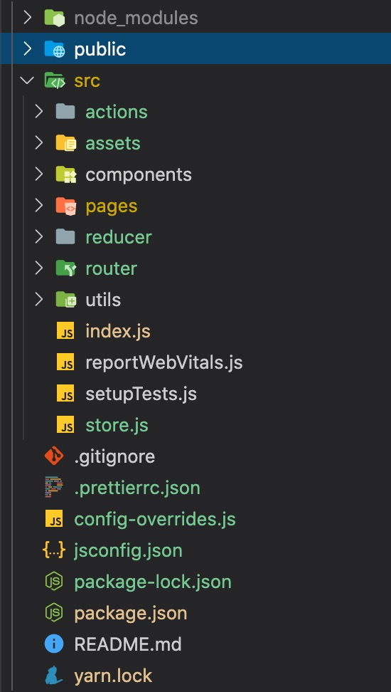

> Marion 的 react 实战课程 > 第一部分 > React 项目从零开始

## 从创建一个全新的 react 项目开始

#### 准备：开发环境的检查

- 在开始一切操作之前, 请检查你的 vscode 工作路径是否有包含中文, 如果有, 请修改它们至你硬盘的某个分区的根目录下，并将其命名为 example 或 workspace。以避免我们在开发的过程中会遇上一些奇怪且棘手的错误。

- 检查你的 nodejs 的版本号
- 检查你的 npm 的镜像地址
- 检查你的 yarn 的镜像地址

```javascript
node -v

npm config list

// 如果显示 metrics-registry = "http://registry.npmjs.org/"
// 执行 npm config set registry https://registry.npm.taobao.org

yarn config list

// 同样的, 如果发现镜像不在taobao的, 修改它
// 执行 yarn config set registry https://registry.npm.taobao.org

```

#### 使用 react 脚手架创建项目

- 使用 npx create-react-app 来创建项目. 请注意，这里是 npx 而不是 npm; npx 是 npm 的一个新工具，它可以将远程 node 项目拉回到本地临时文件里运行，完成后再删除掉这个临时文件。它最大的好处是减少了我们全局安装某些脚手架的操作。
- 例如 npx create-react-app 这个命令与你之前通过全局安装 create-react-app 然后再创建项目是一样的概念, 只是 npx 是执行了下面这三个步骤, 这样我们的硬盘里就不需要一直保留着 create-react-app 这个脚手架。

> npm install -g create-react-app  
> create-react-app 你的项目名  
> npm uninstall -g create-react-app

```javascript
// 创建项目, 注意你的项目名，必须是英文字母开头可以包含数字和下划线，不允许出现其它字符
npx create-react-app 你的项目名

// 如果你要建的是一个ts项目, 在后面加上--typescript
// react中文文档这块有点小问题, ts项目需要 --template typescript 后缀而不是
npx create-react-app 你的项目名 --template typescript
//

// 项目创建完成后, 通过终端进入你的项目文件夹

cd 你的项目名
```

#### 安装依赖之前

- npm 是我们平常开发时用来管理项目依赖的一个工具，它有很多的命令，我们在这里只需要记一些常用命令就行：
- npm 常用命令与参数

```javascript
npm -v                        // 查看 npm 版本号
npm config list               // 查看 npm 配置
npm init                      // 在当前目录下创建一个 package.json 文件

npm install <依赖名> || npm i  // 安装依赖，以下都以别名i为准
npm i <依赖名>[@版本号]         // 安装指定版本号的依赖，注意，这种方式会安装当前大版本的最高版本
npm i <依赖名> -S              // 安装依赖到项目生产环境
npm i <依赖名> -D              // 安装依赖到项目开发环境
npm i <依赖名> -g              // 安装依赖到本地代码库

npm uninstall <依赖名>         // 卸载依赖
npm cache clean               // 清除项目依赖缓存
```

- npm 因为国内的网络问题，可能需要切换代码仓库

```javascript
npm get registry                                         // 获取代码仓库的镜像地址
npm config set registry                                  // 切换代码仓库的镜像地址
npm config set registry https://registry.npm.taobao.org  // 切换仓库到 taobao
npm config set registry https://registry.npmjs.org       // 切换仓库到 npm
```

- 也可以使用 nrm 来进行仓库管理

```javascript
npm i -g nrm                                              // 全局安装 npm 镜像管理工具
nrm ls                                                    // 获取代码仓库的镜像
nrm test                                                  // 测试代码仓库的响应时间
nrm use npm                                               // 切换仓库到 npm
nrm use taobao                                            // 切换仓库到 taobao
```

- 我们也可以使用 yarn 管理工具，它是为了弥补 npm 的一些缺陷而开发出来的新的 js 包管理工具，它使用了并行安装的方式所以比 npm 更快；它有离线下载模式，也就是说当某个依赖曾经被安装过，再次安装时会从本地缓存库中下载等很多的优点。

```javascript
npm i -g yarn
yarn add <依赖名>           // 安装依赖到生产环境
yarn add <依赖名> -D        // 安装依赖到开发环境

yarn remove <依赖名>        // 卸载依赖
yarn cache clean           // 清除缓存
```

#### 常用依赖安装

- 每一次新建项目, 第一件事不是 start, 而是 install。所以不要急着运行你的项目, 你需要做的第一件事是安装一些必要的依赖

```javascript

// react-router-dom是react-router的扩展版，增加了一些对于dom操作的扩展
npm i -S react-router-dom
// redux 看你项目的情况决定是否要安装, 这里我们先安装, 因为它是我们专高6课程的核心部分
npm i -S redux react-redux redux-promise redux-thunk redux-persist
// decorators 因为我们的项目需要使用装饰器，所以这个必须安装
npm i -S @babel/plugin-proposal-decorators
// axios 目前用的比较多的http库, 基于promise, 可以同时运行在node和浏览器中, 有极其丰富的配置项
npm i -S axios moment
// 看你项目的情况, 安装antd或者antd-mobile, 专高6的核心是antd, 所以这里我们安装antd
npm i -S antd
// antd-mobile与它的依赖
// npm i -S antd-mobile postcss-px2rem-exclude rc-form

// 以下的内容只在开发环境依赖, 所以我们通过-D指令将它们安装在devDependencies里面
// reactAppRewired与customize-cra是比较重要的插件, 一定要安装
// react-app-rewired是让你在不执行"npm run eject"指令也能改变内置的webpack中的配置的一个插件；
// customize-cra 是依赖于 react-app-rewired 的库, 通过 config-overrides.js 来修改底层的 webpack, babel配置
npm i -D react-app-rewired customize-cra
// antd的按需加载, 无论你是使用antd还是antd-mobile, 都需要安装
npm i -D babel-plugin-import
// 安装对于less的支持
npm i -D less less-loader
// 我们还需要很多依赖, 其它的依赖会在后续的课程中根据需要来安装

```

---

#### 增加配置文件

- 我们刚刚安装了"react-app-rewired"与"customize-cra"这两个依赖, 也说到了, customize-cra 是能通过一个叫 config-overrides.js 的文件来修改你的 webpack 的配置而不再需要运行 npm run eject 来暴露 webpack 配置文件。
  所以, 现在我们要在你的根目录增加 config-overrides.js 文件, 增加装饰器、less、antd 与路径别名的相关配置。

```javascript
const path = require("path");

const {
  override,
  addWebpackAlias, // 用于配置别名的
  addLessLoader, // 用于加载less文件
  addDecoratorsLegacy, // 用于使用ES的装饰器
  fixBabelImports, // antd 按需加载
  overrideDevServer, // 开发服务器
} = require("customize-cra");

/**
 * 代理配置
 *
 * add proxy 本置代理
 * 返回一个回调函数，customize-cra在执行这个回调的时候，会将当前的开发服务器的配置项以参数的形式传给我们
 * 我们对这个config进行一个简单的处理后返回给customize-cra
 */
const addProxy = () => (config) => {
  // 返回配置好的config
  return {
    ...config,
    // 代理
    proxy: {
      // 拦截器（拦截所有以"/api"开头的http请求）
      "/api": {
        // 配置一个base url
        target: "https://www.sina.com.cn",
        // 是否修改源，
        changeOrigin: true,
        // 是否重写我们的拦截关键字
        pathRewrite: {
          "^/api": "/api",
        },
      },
    },
  };
};

module.exports = {
  webpack: override(
    // 使用修饰器
    addDecoratorsLegacy(),
    // 加载less文件
    addLessLoader({
      lessOptions: {
        javascriptEnabled: true,
      },
      sourceMap: true,
    }),
    // antd按需加载工具, 具体用法参考以下链接
    // https://github.com/ant-design/babel-plugin-import
    fixBabelImports("import", {
      libraryName: "antd-mobile",
      style: "css",
    }),
    // 路径别名
    addWebpackAlias({
      "@": path.resolve(__dirname, "src"),
    })
  ),
  // 开发环境服务器代理, 一般情况下不需要我们自己配
  devServer: overrideDevServer(addProxy()),
};
```

#### 修改配置文件

- 因为使用了"react-app-rewired", 所以, 我们需要修改 package.json 中的 scripts 属性中的值, 将其中的"react-scripts"统一修改成"react-app-rewired"。

#### 运行项目

- 运行项目, 确认以上的修改正确无误。

以后我们在业务中修改/增加依赖的时候也要记得, 一次只修改几个相关的依赖, 不要把所有的依赖一次性改完, 出现错误的时候都不知道从哪里查起

#### 修正因为别名造成的自动完成路径功能丢失

- 在项目的根目录, 新建一个 jsconfig.json 文件, 内容如下

```javascript
{
  "compilerOptions": {
    "experimentalDecorators": true,
    "baseUrl": "./",
    "paths": {
      "@/*": ["src/*"]
    }
  },
  "exclude": ["node_modules", "dist"]
}
```

#### 配置代码格式

在项目根目录下新建一个.prettierrc.json 文件，这个文件是配给 prettierrc 插件使用的, 主要是对于一些其它同事 coding 时未遵循规范, 代码可读性较差时, 可以顺手帮忙右键格式一下。内容如下：

```javascript
{
  "bracketSpacing": true,  // 在对象中属性冒号的右侧添加空格
  "printWidth": 100,       // 超过最大值换行
  "useTabs": false,        // 缩进不使用tab, 使用空格
  "tabWidth": 2,           // 缩进字节数
  "semi": true,            // 句尾添加分号
  "singleQuote": true,     // 使用单引号代替双引号
  "arrowParens": "avoid",  // (x) => {} 箭头函数参数只有一个时是否要有小括号。avoid：省略括号
}
```

#### 调整你的项目文件夹

- 当上面的内容修改完成, 调整你的文档结构如下图所示



需要配置在根目录的文件基本配置完成，然后我们再来对 src 目录下的文件与目录做一些调整, 除了 index.js 文件外，其它文件全部删除。

然后新建五个文件夹:

1. assets, 用于放置你将来的 css 和图片等媒体文件;
2. components, 用来放置你所有的功能组件;
3. pages, 用来放置你所有的页面文件(业务组件);
4. reducer, 这个文件夹用于管理我们所有与 redux 有关的文件;
5. utils, 用来放置你的 axios 配置文件与其它的业务功能插件等。

这就是我们一个 react 项目初始化时需要的文件夹了, 后续会有更多的文件夹, 我们先不用着急, 到用的时候再一个个建立。

#### 新建我们的首页

- 在 pages 文件夹中, 新建一个 HomePage 的文件夹, 文件夹名称以帕斯卡形式（大驼峰）命名, 在这个文件夹下, 新建 index.jsx, style.less 两个文件，为什么 style.less 不放在；

这里需要注意的是, 在我们的 components 与 pages 两个文件夹下, 所有的子文件夹都需要以帕斯卡形式命名, 而其内部至少有一个 index.jsx 与一个 style.less 的文件。

为什么要这样？因为我们要保证文件名与导出的模块名一致, 而我们的 pages 与 components 中每一个文件夹下的内容都是一个或多个独立的组件, 而组件名只能以帕斯卡方式命名：

```javascript
// Homepage/index.jsx
import React, { Component } from 'react';
import './style.less';
export default class HomePage extends Component {
  constructor(props) {
    super(props);
    this.state = {
      msg: '这是我的首页',
    };
  }
  render() {
    const { msg } = this.state;
    return <div className="homepage">{msg}</div>;
  }
}

// router/index.js
import React from 'react';
import { BrowserRouter, Route, Switch } from 'react-router-dom';
// 为什么要用index.jsx? index在Js, Html中, 代表了索引页, 也是当前目录的默认首页。所以, 在这里我们不需要指定文件名就能直接将目录中的index导入, 可以减少文件名称的输入以减少因为文件名输入错误造成的一些问题
import Homepage from '@pages/Homepage';

function Router() {
  return (
    <BrowserRouter>
      <Switch>
        <Route exact path="/" component={Homepage} />
        <Route exact path="/homepage" component={Homepage} />
      </Switch>
    </BrowserRouter>
  );
}

export default Router;
```

将上面两个文件保存后, 我们再来修改根目录的 index.jsx 文件

```javascript
// react项目的核心文件, 每一个文件都需要引入它
import React from "react";
// 核心文件也包括ReactDOM, 但它不需要在其它文件中引用
import ReactDOM from "react-dom";
// 路由配置, 我们刚刚写的
import Router from "./router";

// 全局的样式文件
import "@/assets/style.less";

ReactDOM.render(
  // 对每一个模块都执行严格模式检查
  <React.StrictMode>
    <Router />
  </React.StrictMode>,
  document.getElementById("docwrap")
);
```

#### 运行你的项目

好了, 现在我们的第一个最简单的页面实现了, 通过这个过程我们学习了什么？第一是环境的检查和配置, 第二是 react 项目的创建, 然后是 react 运行环境的一些小配置, 最后是整个目录和文件的梳理。好了, 今天的课程内容就到这里了, 大家一会自习的时候, 可以多建几个项目, 熟悉这一整个流程和相关的配置项。

关于本小节中所有的配置内容, 大家可以先死记, 并且保存一份在你的笔记当中, 以便随时复制, 后期在真正需要的时候再去查询相关文档学习。
