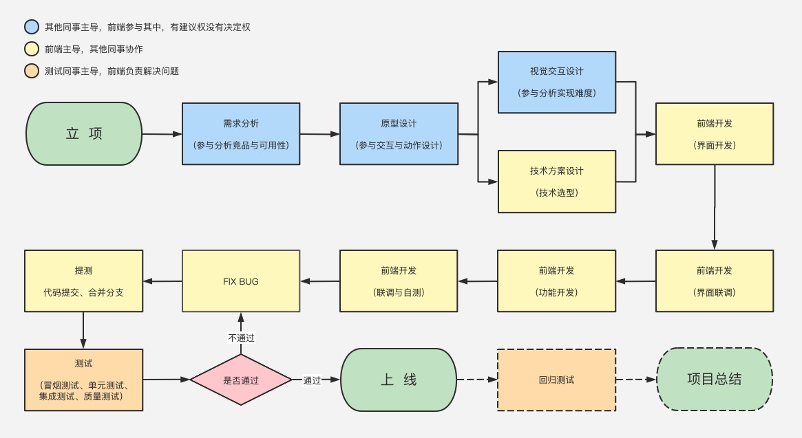
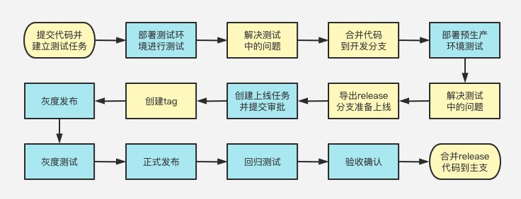

> 平安蜀黍的 react 实战课程 > 第一部分 > 前端项目工作流程

### 正常企业中建立一个项目的流程

#### 项目中各种角色

- **PM**：产品经理，也是一个项目的推动者，在有的公司会兼职项目经理的角色或兼职 UE 的角色；

- **UE**：交互设计师，负责页面布局、交互的设计，不负责视图的细节，大部分公司可能是产品经理兼任；

- **UI**：视觉设计师，交互确定之后，设计页面样式（需要注意的是，在很多情况下，UE 和 UI 是同一个人）；

- **RD**：后端开发人员，包括但不限于后端开发、接口开发；

- **CRD**：客户端开发人员，安卓和 ios 都是；

- **FE**：前端开发人员，包括但不限于界面开发、中台开发；

- **QA**：测试人员。

- **OP**：服务器运维人员，负责各项目环境的正常运行并审批项目上线流程。

#### 项目管理工具

项目管理工具是用来统筹项目进度、任务分配及人员考核用的一种工具，正常来说，在企业中项目一旦确认立项后就会在项目管理工具中创建各种任务，比如初期的项目经理编写需求文档、技术负责人编写技术方案到后期的项目测试中的 BUG 解决等，都需要一个方便易用的工具来进行管理。比较常见的项目管理工具有 Jira、禅道等。

[禅道 demo](https://demo.zentao.net/project-bug-12.html)

#### 编写技术方案

技术方案到底写什么——技术方案就是写你计划如何实现需求中的功能。拿一个常见的订单评论项目来说，发布功能如何实现？要调用什么接口，输入输出时什么？要不要考虑 xss 攻击？再如点赞，是先执行动画再调用接口，还是先调用接口再执行动画？还有，你的代码如何拆解，分几个模块，有哪些核心的方法。这些都要写。技术方案没有一个固定的格式可供参考，因此是否能把技术方案写的清晰且使用，是判断一个人技术能力的标准之一。

#### 评审

技术方案编写完成之后，需要把项目经理、架构师（或者技术负责人）、其他对接的角色（RD CRD）来评审技术方案。由内部人员评审这个方案是不是符合设计原则，有扩展性，以及是否有其他坑（如性能问题，安全漏洞等）。外部对接的角色主要评审接口是否全面，输入输出设计是否合理。

技术方案评审通过之后，就得给 PM 反馈排期了。注意，估算工期一定要留有 buffer ，给自己留好余地。有工作经验的人都知道，一个人在一个公司里，一般会同时担任很多的工作，你不能保证接下来不会有其他功能耽误你的时间。例如，这个项目你本来预估是 10 人/天工作量，那你最好反馈 12-13 人/天。当然，评审之前反馈排期也可以，只是评审之后反馈，更加靠谱一些。

#### 开发

正常的情况下，我们的开发工作会在评审通过后立刻开始，UI 绘制界面效果图，接口制定接口文档，前端参考原型图来创建项目框架和路由管理等，这些工作都是需要同步进行的。

这个时候的前端开发具体可分为两种情况，第一种情况是整个项目从零开始，我们需要搭建和配置各种环境，搭建项目框架及定制各种工具和组件，创建 Git 远程仓库，然后才是真正的进入界面和功能的开发；另一种情况是在原有的工程中新增或优化的项目，这种情况不需要进行各种配置，直接从 Git 仓库中新建一个分支就可以进入界面和功能的开发；

上面无论哪一种情况，我们最开始的界面设计都是没有可用的 UI 效果图的，所以，我们最初的时候，一般都是参考产品或 UE 提供的原型图来进行界面开发，在开发完成后如果 UI 的效果图仍然未设计完成，我们就需要开始参考接口提供的 Api 文档设计 mock 数据，开发交互与功能。如果有客户端(h5 内嵌至 app 中)的对接，我们还需要用到一些与 native 交互的插件比如 WebViewJavascriptBridge；

为了避免编写开发文档，我们还要尽量提供丰富的代码注释。很多未经历过规范性产品设计研发过程的程序员，往往以为一个软件项目最关键的就是代码开发，但是真实的项目管理流程中，代码开发只占软件生命周期的 1/6 。所以，作为程序员你要想自己值钱、有不可替代性，就要从整个软件项目的阶段入手，而不仅仅是提高开发能力。

#### 联调

代码开发完成后，需要经过联调和自测这两个阶段。前面我们说过，在初期开发时，往往会因为多线并行，造成我们在开发界面时使用的是产品的原型图，而开发功能时则是参考接口提供的文档写的 mock 数据，所以，在我们的代码开发完成后，就需要参考 UI 提供的页面效果图对页面元素的布局和细节进行微调，参考真实接口返回的数据对功能和交互进行微调。

#### 自测

当所有的开发工作完成，而且经过了仔细的联调后，我们还需要对项目进行自测：对于界面，我们要在多种浏览器、显示器和移动终端去测试它的显示效果；对于功能和数据，我们要测试各种网络情况、各种用户误操作和非法操作的情况下是否可正常交互。

#### 提测

项目经过自测后就可以进行测试了。我们需要将本地完成后的代码提交到远端仓库，然后通知测试同事应该测试哪个分支，部署到哪个环境，对应的接口环境是否需要重新部署等等，然后等待测试同事返回测试结果并解决各种问题（BUG）。然后第一次测试完成后还需要合并代码到指定分支（一般都是 dev 分支），再次进行测试。直到测试同事确认没有任何问题且 PM 与 UE 都确认通过。

#### 上线

测试完成后进入上线流程，上线流程相对于之前的流程来说稍复杂一点，在上线前我们需要从当前测试通过的代码分支中打出来一个 release 分支，创建 tag，建立上线任务，提交审批，审批通过后在指定的时间执行上线脚本或执行

#### 从提测到上线的大致流程

### 前端工程化相关概念

就目前来说，Web 业务日益复杂化和多元化，前端开发已经由以 WebPage 模式为主转变为以 WebApp 模式为主了。现在随便找个前端项目，都已经不是过去的拼个页面+搞几个 JQuery 插件就能完成的了。而工程一旦复杂了就会产生许多问题: 比如，**如何进行高效的多人协作？如何保证项目的可维护性？如何提高项目的开发质量？**

我们希望能在日常开发中制订一个规范化的前端工作流，很好地规范统一项目的模块化开发和前端资源，让代码的维护和互相协作更加容易更加方便，令前端开发自动化成为一种习惯。同时，让大家能够**释放生产力，提高开发效率，更好更快地完成团队开发以及项目后期维护和扩展**。于是就有了所谓的前端工程化的概念。

#### 一、技术栈选型

所谓前端工程建设的第一项任务就是根据项目特征进行技术选型，基本上现在所有的网站都是使用了某种前端库或者框架，比如 React、Vue、Angular 等，解放了不少生产力，**合理的技术选型**可以为项目节省许多工程量。我们来了解一下为什么要选用 React：

- **1、React 速度很快**

  它并不直接对 DOM 进行操作，引入了一个叫做虚拟 DOM 的概念，安插在 Javascript 逻辑和实际的 DOM 之间，性能好

- **2、跨浏览器兼容**

  虚拟 DOM 帮助我们解决了跨浏览器问题，它为我们提供了标准化的 API，甚至在 IE8 中都是没问题的。

- **3、一切都是 component**

  代码更加模块化，重用代码更容易，可维护性高。

- **4、单向数据流**

  Flux 是一个用于在 JavaScript 应用中创建单向数据层的架构，它随着 React 视图库的开发而被 Facebook 概念化。

- **5、同构、纯粹的 javascript**

  因为搜索引擎的爬虫程序依赖的是服务端响应而不是 JavaScript 的执行，预渲染你的应用有助于搜索引擎优化。

- **6、兼容性好**

  比如使用 RequireJS 来加载和打包，而 Browserify 和 Webpack 适用于构建大型应用。它们使得那些艰难的任务不再让人望而生畏。

  > Browserify，一个基于 Nodejs 的工具，可以让你使用类似于 Node 的 Require 的方式来组织浏览器端的 Javascript 代码，通过预编译让前端 Javascript 可以直接使用 Node NPM 安装的一些库。

###### 竞品的比较

其实上面的都是网上流传的一些说法，用于对付投资人或老板的说法，其实，在很多项目里，Vue 是要比 React 更快更容易上手的。那么我们真正的理由是什么呢？

因为 **react 编程体现的是函数式编程的思想，把组件设计成为纯函数，状态和逻辑通过参数传入，所以，在 React 中是单向数据流**。React 推崇的是**结合 Immutable 来实现数据不可变性**。React 在 setState 后会重新开始新一轮渲染流程，如果 ShouldComponentUpdate 返回的是 true，就继续渲染，否则就不渲染。而 PureComponent 就是重写了 shouldComponentUpdate，然后在里面对 Props 和 State 做了个浅比较。

而 vue 的思想是响应式的，也就是说，是基于数据可变的，通过对每一个属性建立 Watcher 来监听，当属性发生变化时，响应式地更新对应的虚拟 Dom。

到这里我们应该就能理解，为什么在大企业里的大项目都会使用 React，因为 Vue 的响应机制天生对于大型项目不友好，**当 State 特别多的时候，会生成特别多的 Watcher，导致大量的计算资源用于响应属性变化而造成卡顿**。

#### 二、代码构建工具

选型之后基本上就可以开始敲代码了，不过光解决开发效率还不够，必须要兼顾运行性能。前端工程进行到第二阶段会选型一种或多种构建工具，**对代码进行压缩、校验、管理，之后再以页面为单位进行简单的资源合并**。那么，什么是构建工具呢？

构建工具就是我们在上面说的前端工程化的核心思想的体现，将一系列流程用代码去实现，让代码自动化地执行这一系列复杂的流程。通过构建工具，我们可以很容易地实现下面这些工作：

- **代码转换**：将 TypeScript/es6 编译成 JavaScript、将 scss 编译成 css 等。
- **文件优化**：压缩 JavaScript、css、html 代码，压缩合并图片等。
- **代码分割**：提取多个页面的公共代码，提取首屏不需要执行部分代码让其异步记在。
- **模块合并**：在采用模块化的项目里会有很多个模块和文件，需要通过构建功能将模块分类合并成一个文件。
- **自动刷新**：监听本地源代码变化，自动重新构建、刷新浏览器。
- **代码校验**：在代码被提交到仓库前需要校验代码是否符合规范，以及单元测试是否通过。
- **自动发布**：更新代码后，自动构建出线上发布代码并传输给发布系统。

构建工具有很多种，比如 Npm Scripts, Grunt, Gulp, Webpack 等等，因为 create-react-app 使用了 Webpack 作为它的构建工具，所以我们在稍后的课程里会讲一讲 Webpack，今天就先了解一下为什么要使用构建工具就行。

#### 三、了解多页应用与单页应用

- 1、多页应用，指的是我们的网站由多个 html 页面构成，每一次页面跳转都需要服务器响应并生成新的内容

- 2、单页应用(Single Page App)，指项目中只有一个 html 页面，每一次页面跳转只是将路由对应的模块读入到当前页面

- 3、Vue、React 等前端框架都是使用的单页开发模式，因为相对于多页应用，单页应用的页面跳转会更流畅，同时还可以添加各种过场动画

| 多页应用                                                    | 单页应用                                                         |
| ----------------------------------------------------------- | ---------------------------------------------------------------- |
| 项目由多个 html 文件组成                                    | 一个项目只有一个 html 页面                                       |
| 首页加载内容单一相对速度较快，白屏时间很短                  | 首页加载需加载页面文件、工程文件等，白屏时间较长                 |
| 页面跳转需要服务器生成静态文件                              | 页面跳转只需要在客户端载入不同模块                               |
| 每次页面跳转都会删除当前的 dom 树，新页面加载之前会显示空白 | 模块加载完成之前显示之前的模块，加载完成后重新渲染，不会显示空白 |

单页面应用最大的好处就是前后端全部分离，后端不再需要管理前端界面的路由了；其次就是提供了更加快速高效的页面访问速度(当然，它的首页加载变慢了)，使得我们的项目具有了桌面应用的实时性，不再出现页面跳转时的白屏或闪烁的现象；然后就是减少了服务器压力，服务器只需要提供数据而不再需要管理逻辑与页面合成，吞吐能力增加了好几倍。

单页应用的缺陷：

1、 首次加载耗时较长：因为项目文件过大，导致首页因为加载时间较长而造成白屏，影响用户体验。这个问题大方向我们可以采用路由懒加载的方式或使用 Webpack 的按需加载来解决，而对于页面的小方向来说，通过渐进式首页数据加载的方式，比如图片懒加载，比如向下滚动时才加载数据等手段来减少首屏的渲染时间。

2、 单页应用对 Seo 的不友好：单页应用因为页面都是在客户端构建的，是动态的，而机器爬虫只能爬取静态的内容，所以对于各大搜索引擎来说是极不友好的，它们无法读取到你的页面内容。解决这个问题的办法就是使用 ssr，也被称之为同构，思路就是在服务端创建一个 js 引擎并运行这个 html，就像在浏览器里一样，当内容读取完成后再广播一个事件告诉爬虫们，内容已经好了，你可以拿走了。这样爬虫们就拿到了一份完整的 html，跟浏览器中渲染的完全一样，比如 Next.js。

3、 css 命名冲突：使用 sass、less 或 stylus 等 css 预处理器，在一定程度上可以解决这些问题

#### 课后问题

- 什么是前端工程化？为什么要实现前端工程化？
- 为什么要使用 react 作为项目的主技术栈？
- 什么是构建工具？你知道哪些？
- 什么是单页应用，它的优缺点是什么，怎样解决？
