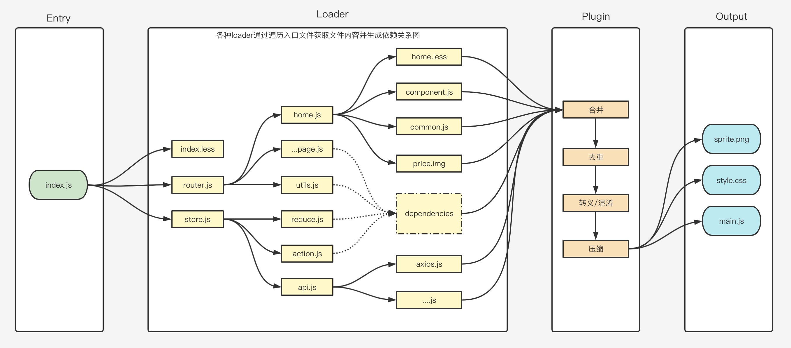

> Marion 前端教程 > 前端开发应知应会 > 第一部分 > 代码构建工具 Webpack

### 模块化相关规范

前面说过，前端工程化的主要概念就是使用模块化开发，将一个页面根据其规则拆分成多个模块，然后使用向外暴露接口的方式与外部其它模块进行通信。而当这种模块化开发的项目越来越多，代码量越来越多时，维护人员的工作量也在不断增加。JavaScript 模块化规范就是为了解决维护问题而推出的一些标准，让大家在想要实现某个功能时能方便地加载指定模块的一个标准。

目前比较热门的模块化规范有 CommonJs, AMD, CMD 以及 Es6

#### CommonJs

commonjs 是通过 model.exports 来定义的，所以它在前端浏览器中是不支持的。commonjs 的表现是每个文件就是一个模块，有自己的作用域。在一个文件里面定义的变量、函数、类，都是私有的，对其他文件不可见。

commonjs 定义的模块分别为：模块引用--require，模块定义--exports，模块标识--module

##### commonjs 特性：

- 对于基本数据类型，属于复制。即会被模块缓存。同时，在另一个模块可以对该模块输出的变量重新赋值；
- 对于复杂数据类型，属于浅拷贝。由于两个模块引用的对象指向同一个内存空间，因此对该模块的值做修改时会影响另一个模块；
- 当使用 require 命令加载某个模块时，就会运行整个模块的代码；此时如果再次使用 require 命令加载同一个模块时，不会再执行该模块，而是取缓存之中的值。也就是说，CommonJS 模块无论加载多少次，都只会在第一次加载时运行一次，以后再加载，就返回第一次运行的结果，除非手动清除系统缓存；
- 循环加载时，属于加载时执行。即脚本代码在 require 的时候，就会全部执行。一旦出现某个模块被“循环加载”，就只输出已经执行的部分，还未执行的部分不会输出。

##### 示例：

```javascript
// a.js
exports.done = false
let b = require('./b.js')
console.log('a.js-1', b.done)
exports.done = true
console.log('a.js-2', '执行完毕')

// b.js
exports.done = false
let a = require('./a.js')
console.log('b.js-1', a.done)
exports.done = true
console.log('b.js-2', '执行完毕')

// c.js
let a = require('./a.js')
let b = require('./b.js')

console.log('c.js-1', '执行完毕', a.done, b.done)

// 运行node c.js
b.js-1 false
b.js-2 执行完毕
a.js-1 true
a.js-2 执行完毕
c.js-1 执行完毕 true true
```

阅读理解：

注意，要理解上面的这段代码必须要知道的一个常识：js 代码是从上到下依次执行的！！这块涉及到调用栈的概念。对这块没有概念的同学可以看看这篇：[JS 事件循环](http://blog.fenotes.com/unit_06/lessons_09.html)

1. 在 node.js 中执行 c 文件，逐行执行，发现依赖了 a 文件，于是加载 a 文件
2. 执行 a 文件，逐行执行，发现依赖了 b 文件，于是加载 b 文件
3. 扫行 b 文件，逐行执行，发现再次依赖了 a 文件，参考我们上面描述的特性，反复依赖的只执行缓存中的执行结果，所以，我们这时的 a.js 只抛出了一个 done 的定义为 false
4. 缓存中的 a.js 执行完成，返回继续执行 b 文件，第三行，输出日志，上面已经说了，这里的 done 目前只有一个 false，所以这里打印的是“b.js-1 false”
5. 修改 b.done 的值为 true，并输出日志：“b.js-2 执行完毕”
6. b 文件执行完成，返回继续执行 a 文件，输出日志，因为 b 文件已经全部执行完成，所以这里输出“a.js-1 true”
7. 重定义 a.done 的值为 true，并输出日志：“a.js-2 执行完毕”
8. 返回 c 文件，逐行执行，发现再次依赖了 b 文件，仍然是反复依赖，所以只取返回结果
9. 输出日志“c.js-1 执行完毕 true true”

[课后浏览](http://javascript.ruanyifeng.com/nodejs/module.html)

#### AMD

AMD 是 CommonJS 规范的客户端版本，英文名 Asynchronous Module Definition，意思就是“异步模块定义”。它解决了 require 同步加载在客户端环境无法顺利加载的问题。

##### AMD 特性

- 模块本身和模块之间的引用可以被异步的加载
- 它实现了解耦，模块在代码中也可通过识别号进行查找
- 先引入的模块，后使用的引用模块的方法，所以 AMD 模式被称之为依赖前置

##### 示例：

```javascript
define(['./package/lib.js'], function (lib) {
  function say() {
    lib.log('this is fn');
  }
  return {
    say: say,
  };
});
```

阅读理解：

1. 第一个参数是一个数组，数组中每一个成员都是我们依赖的模块地址
2. 第二个参数是一个回调函数，这个回调函数的参数是导入我们第一个参数中数组成员后返回的可用模块
3. 开始使用

#### CMD

CMD 与 AMD 一样，也是为了解决客户端的异步加载模块而实现的技术方案，它的英文名是 Common Module Definition，意思是“通用模块定义”。他改变了 AMD 的模块必须在函数调用前进行声明的设定，而是使用了一种同步的概念：只在需要使用模块时才去引用，引用完成后即可实现模块中方法的调用。

##### CMD 特性

- 依赖就近原则，在哪里使用，在哪里引入，就是同步的概念，即用即返回

##### CMD 示例

```javascript
define(function (require, exports, module) {
  var $ = require('jquery');
  exports.sayHello = function () {
    $('#hello').toggle('slow');
  };
});
```

阅读理解：

1. 通过调用 define 方法来获取 require、exports 与 module 方法
2. 引入 jQuery 库
3. 导出 sayHello 方法，并在这个方法中调用 jQuery 库中的方法捕获 Dom 元素

确切地说，CMD 并不能被称之为一个规范，它只是将 CommonJS 规范和 AMD 规范综合了一下，然后将它们的好的特性体现了出来，所以这是一个极具争议的模块管理规范。

#### ES6

自从 2015 年推出了 Es6 规范后，CMD 与 AMD 就慢慢地淡出了，因为它们的实现的确是有些繁琐，而 Es6 则简洁了很多。

ES6 模块的设计思想是尽量的静态化，使得编译时就能确定模块的依赖关系，以及输入和输出的变量。而 CommonJS 和 AMD 模块，都只能在运行时确定这些东西。比如，CommonJS 模块就是对象，输入时必须查找对象属性。

```javascript
// CommonJS模块
let { stat, exists, readfile } = require('fs');

// 等同于
let _fs = require('fs');
let stat = _fs.stat;
let exists = _fs.exists;
let readfile = _fs.readfile;
```

上面代码的实质是整体加载 fs 模块（即加载 fs 的所有方法），生成一个对象（\_fs），然后再从这个对象上面读取 3 个方法。这种加载称为“运行时加载”，因为只有运行时才能得到这个对象，导致完全没办法在编译时做“静态优化”。

ES6 模块不是对象，而是通过 export 命令显式指定输出的代码，再通过 import 命令输入。

```javascript
// Es6模块
import { stat, exists, readFile } from 'fs';
```

上面代码的实质是从 fs 模块加载 3 个方法，其他方法不加载。这种加载称为“编译时加载”或者静态加载，即 ES6 可以在编译时就完成模块加载，效率要比 CommonJS 模块的加载方式高。当然，这也导致了没法引用 ES6 模块本身，因为它不是对象。

由于 ES6 模块是编译时加载，使得静态分析成为可能。有了它，就能进一步拓宽 JavaScript 的语法，比如引入宏（macro）和类型检验（type system）这些只能靠静态分析实现的功能。

除了静态加载带来的各种好处，ES6 模块还有以下好处。

- 不再需要 UMD 模块格式了，将来服务器和浏览器都会支持 ES6 模块格式。目前，通过各种工具库，其实已经做到了这一点。

- 将来浏览器的新 API 就能用模块格式提供，不再必须做成全局变量或者 navigator 对象的属性。

- 不再需要对象作为命名空间（比如 Math 对象），未来这些功能可以通过模块提供。

### 什么是 webpack

学习完模块化规范后，我们再来学习如何通过构建工具来将各个模块进行代码合并与项目构建。**前端工程化**中很重要的一个步骤就是对**项目的构建合并**。Webpack 是当下最热门的**前端资源模块化管理和打包工具**。它可以将许多松散的模块按照**依赖和规则**打包成符合生产环境部署的前端资源。还可以**将按需加载的模块进行代码分隔**，等到实际**需要的时候再异步加载**。通过 loader 的转换，任何形式的**资源都可以视作模块**，比如 CommonJs 模块、AMD 模块、ES6 模块、CSS、图片、JSON、LESS 等。相对于 gulp、grunt 等，它的工作重心更偏重于模块打包处理。

### webpack 的特点

- 可以解析 JSX 语法

- 可以解析 ES6 语法新特性

- 支持 LESS、SCSS 预处理器

- 编译完成自动打开浏览器

- 单独分离 CSS 样式文件

- 支持文件 MD5 戳，解决文件缓存问题

- 支持图片、图标字体等资源的编译

- 支持浏览器源码调试

- 实现组件级热更新

- 实现代码的热替换，浏览器实时刷新查看效果

- 区分开发环境和生产环境

- 分离业务功能代码和公共依赖代码

Webpack 的工作方式是：把你的项目当做一个整体，通过一个或多个给定的主文件（如：index.js），Webpack 将从这个文件开始找到你的项目的所有依赖文件，使用 loaders 处理它们的关系并根据关系生成依赖图，最后通过各种 plugin 打包为一个浏览器可识别的 JavaScript 文件并输出到 output 文件夹中。



---

### webpack 的四大核心概念

#### entry 入口

entry 属性主要用于指示 webpack 应该使用哪个文件来作为构建其内部**依赖图(dependency graph) **的开始。进入入口起点后，webpack 会找出有哪些模块和库是入口起点（直接和间接）依赖的。

webpack 默认的入口文件为**./src/index.js**。不过我们可以在 config 文件中进行指定，比如：

```javascript
module.exports = {
  entry: './bin/main.js',
};
```

webpack 同时也支持多个入口文件

```javascript
module.exports = {
  entry: {
    app: './src/app.js',
    adminApp: './src/adminApp.js',
  },
};
```

#### output 出口

output 属性告诉 webpack 在哪里输出它所创建的 bundle，以及如何命名这些文件。主要输出文件的默认值是 ./dist/main.js，其他生成文件默认放置在 ./dist 文件夹中。同样的，我们可以在 config 中自定义一个输出文件夹：

```javascript
// path是nodejs核心模块提供的一个用于处理文件路径的小工具，不需要安装，直接require
const path = require('path');

module.exports = {
  entry: './bin/main.js',
  output: {
    path: path.resolve(__dirname, 'build'),
  },
};

// 题外的部分知识
// 1. require来自于commondjs规范，在webpack中不可以使用es6规范中的import。因为nodejs使用的是commondJS规范，如果需要使用es6规范就必须使用babel来进行编译
// 2. ，常见方法有resolve，用于将相对路径解析成绝对路径；relative用于将绝对路径解析成相对路径；具体可以在课后关注https://www.runoob.com/nodejs/nodejs-path-module.html
```

#### loader

webpack 只能理解 JavaScript 和 JSON 文件，这是 webpack 开箱可用的自带能力。对于其它文件 webpack 就无法读取了，所以我们需要使用 loader 来让 webpack 能够去处理其他类型的文件，并将它们转换为有效**模块**，以供应用程序使用，以及被添加到依赖图中。

loader 有两个常用属性：test 和 use，我们通过 test 属性来告诉 webpack 需要匹配的文件后缀是什么，然后再通过 use 属性来告诉 webpack 使用什么 loader 来加载文件，比如：

```javascript
module.exports = {
  module: {
    rules: [
      { test: /\.css$/, use: 'css-loader' },
      { test: /\.ts$/, use: 'ts-loader' },
    ],
  },
};
```

use 属性也可以是一个依赖的集合，比如这样：

```javascript
module.exports = {
  module: {
    rules: [
      {
        test: /\.css$/,
        // 注意，这里的解析规则，与css一样，是从右到左解析的，先使用postcss-loader编译，然后使用css-loader编译，最后使用style-loader编译；最终将编译后的结果返回给webpack
        use: ['style-loader', 'css-loader', 'postcss-loader'],
      },
    ],
  },
};
```

#### pluging 插件

当我们使用 loader 读取完成文件以后，接来来还要对文件做一些操作比如合并，比如转义和压缩。这个时候就需要用到插件了。插件是 webpack 的支柱功能，它的目的在于解决 loader 无法实现的其它问题。

webpack 插件是一个具有 apply 方法的 JavaScript 对象。apply 方法会被 webpack compiler 调用，并且在整个的编译生命周期中都可以访问这个 compiler 对象。

```javascript
// 用来生成html文件的依赖
// https://webpack.docschina.org/plugins/html-webpack-plugin/
const HtmlWebpackPlugin = require('html-webpack-plugin');
// 引入webpack中的内置文件
const webpack = require('webpack');
//
const path = require('path');

module.exports = {
  // 指定入口
  entry: './src/index.js',
  // 出口配置
  output: {
    // 输出文件的名称
    filename: 'index.bundle.js',
    // 文件输出的位置
    path: path.resolve(__dirname, 'build'),
  },
  // 所有的loader需要放置在module属性中
  module: {
    rules: [
      {
        // 匹配所有的后缀为js和jsx的文件
        test: /\.(js|jsx)$/,
        // 使用babel-loader来加载这个文件
        use: 'babel-loader',
      },
    ],
  },
  plugins: [
    // webpack构建进度展示
    new webpack.ProgressPlugin(),
    // 生成编译好的html文件，我们打包成功后的js文件都需要通过这个文件来导入
    new HtmlWebpackPlugin({ template: './src/index.html' }),
  ],
};
```

---

### 使用 webpack 构建一个项目

#### 第一步，新建项目

```javascript
mkdir react-test // 创建项目
cd react-test // 进入目录
npm init -y // 初始化项目
```

#### 第二步，创建容器文件

在项目根目录创建 public 文件夹，然后在 public 文件夹下创建 index.html 文件，这个文件用来提供给 webpack 编译成我们未来的项目入口文件。

```html
<!DOCTYPE html>
<html lang="en">
  <head>
    <meta charset="UTF-8" />
    <meta name="viewport" content="width=device-width, initial-scale=1.0" />
    <title>webpack练习</title>
  </head>
  <body>
    <div id="root"></div>
  </body>
</html>
```

#### 第三步，创建项目主文件

在项目根目录创建 src 文件夹，然后在 src 文件夹下创建 index.jsx 文件，这个文件是 webpack 的入口文件，文件中 import 进来的文件都会被加入依赖图，然后这些文件中 import 进来的文件也会被加入依赖图

```javascript
import React from 'react';
import ReactDOM from 'react-dom';

// 这里这个root对应的是html文件中的容器div的id
ReactDOM.render(<div>hello webpack !!!</div>, document.getElementById('root'));
```

#### 第四步，创建 webpack 主配置文件

在项目的根目录，创建 webpack.config.js 文件

```javascript
const HtmlWebPackPlugin = require('html-webpack-plugin');

module.exports = {
  // 入口
  entry: './src/index.js',
  // loader
  module: {
    // 所有的loader都需要写在这里面
    rules: [
      {
        test: /\.jsx?$/, // jsx/js文件的正则
        exclude: /node_modules/, // 排除 node_modules 文件夹
        use: {
          // loader 是 babel
          loader: 'babel-loader',
          options: {
            // babel 转义的配置选项
            babelrc: false,
            presets: [
              // 添加 preset-react
              require.resolve('@babel/preset-react'),
              [require.resolve('@babel/preset-env'), { modules: false }],
            ],
            cacheDirectory: true,
          },
        },
      },
    ],
  },
  plugins: [
    // 根据public目录下的index.html来生成项目的首页
    new HtmlWebPackPlugin({
      template: 'public/index.html',
      filename: 'index.html',
      inject: true,
    }),
  ],
};
```

#### 第五步，安装依赖

我们刚刚创建的三个文件，里面引用了大量的依赖，比如 react，比如 webpack 等等，所以，需要在项目中安装它们才能正常使用。安装的时候我们需要区分哪些是生产环境使用的，哪些是开发环境使用的。

生产环境用的，表示是项目本身运行时的依赖，比如 react 以及相关的依赖。开发环境使用，表示是项目打包时的依赖，比如 webpack 等相关依赖。生产环境我们在 install 时使用-S 后缀，开发环境我们使用-D 后缀

```javascript
// webpack主依赖，安装到开发环境
npm i -D webpack webpack-cli
// react项目主依赖，安装到生产环境
npm i -S react react-dom
// webpack打包等依赖，安装到开发环境
// babel-loader 核心插件，所有的代码需要使用它来处理一遍然后再分配给其它的loader
// @babel/core 核心插件，用于将代码转换成语法树结构的插件，所有代码需要调用babel语言转换插件时都需要这个包
npm i -D babel-loader @babel/core
// @babel/preset-env 用于解析环境的预设，它的功能是根据我们的env配置来按需加载插件，所谓env配置就是环境配置
// @babel/preset-react 用于解析JSX语法的预设
npm i -D @babel/preset-env @babel/preset-react
// html-webpack-plugin 可以在我们public中的index.html文件中写入打包后的js文件并输出到output目录下
npm i -D html-webpack-plugin

// 也可以使用yarn来安装，这里为了省事，我一次将所有的依赖安装进去
yarn add -D webpack webpack-cli babel-loader @babel/core @babel/preset-env @babel/preset-react html-webpack-plugin
//
yarn add react react-dom
```

#### 第六步，添加打包命令并进行打包

打开根目录下的 package.json 文件，找到 scripts 属性，新增一行代码：

```javascript
"build": "webpack --mode production",
```

保存后，在终端执行 npm run build。我们应该可以看到在生成了一个 dist 目录，目录中有 main.js 和 index.html 文件；双击 index.html，界面应该能显示 hello webpack !!!字样。

#### 第七步，配置本地开发环境

现在我们的项目已经可以在打包后运行起来了，但这样开发起来会很不方便，我们每改动一部分内容就需要执行打包命令，然后在浏览器中检查是否显示或功能正确。怎么解决这个问题呢？
webpack 提供了一个开发服务器，我们只需要配置好就行了。

先安装 webpack 开发服务器

```javascript
yarn add -D webpack-dev-server
// 或者
npm i -D webpack-dev-server
```

在 webpack.config.js 中添加如下代码：

```javascript
module.exports = {
  ...
  // 配置开发服务器
  devServer: {
    port: 3000, // 指定端口即可
  },
}
```

再在 package.json 中添加启动本地开发服务器的命令：

```javascript
"start": "webpack-dev-server --mode development --open",
```

好了，现在执行我们熟悉的 npm start 命令，熟悉的页面将在你面前打开

很复杂是不是？比起 npx create-react-app 麻烦太多太多了，但是在企业里有很多独特的需求必须要使用 webpack 来配置项目，比如图片压缩，比如按需加载。所以，webpack 的相关配置是我们必须要学会且熟记的，这也是我们将来获取高薪的一个必备技能点！

### 常用 loader

#### 样式加载：cssload & lessload & styleload

安装用于读取编译 less 文件的 loader

```javascript
npm i -D style-loader css-loader less-loader less
```

配置 loader

```javascript
// 前面说过，loader的执行是倒序的，所以这里你们应该要能看懂
{
  test: /\.css$/,
  use: [
    {
      loader: 'style-loader', // 在页面中创建style标签
    },
    {
      loader: 'css-loader', // css文件编译
    },
  ],
},
{
  test: /\.less$/,
  use: [
    {
      loader: 'style-loader', // 在页面中创建style标签
    },
    {
      loader: 'css-loader', // css文件编译
    },
    {
      loader: 'less-loader', // 将less读取完成后编译成css
    },
  ],
},
```

#### 文件加载与图片加载：file-loader & url-loader

file-loader 与 url-loader 一般用来处理图片

```javascript
npm i -D file-loader url-loader

// 配置
{
  test: /\.(png|jpg|gif|jpeg)$/i,
  type:'asset',
  parser: {
    dataUrlCondition: {
      maxSize: 5120
    }
  }
}
```

### 项目优化

所有文件加载完成后，还需要输出到我们指定的文件目录，而在这个输出的过程中，我们就需要考虑怎样对项目进行优化了。项目优化的主要目的就是减少 http 请求与减少文件下载量，另外还需要考虑到在一个较短的时间段内能否将文件顺利下载完成，是否会因为文件下载过慢造成白屏和闪烁问题，而 webpack 为了实现这个目的提供了非常多的插件(plugins)。

#### 为什么要减少 http 请求？

1、因为 http 请求建立和释放需要时间和资源：客户端连接到 Web 服务器->发送 http 请求->服务器接受请求并返回 HTTP 响应->释放连接 TCP 链接，如果 http 请求很多，不减少 http 请求就会耗费大量时间和资源在建立连接和释放连接上面。[关于 http 请求]()

2、浏览器对同一个域名的并发数量有限制：如果页面的并发资源非常多，那后续的资源请求只能等到前面的资源下载完后才开始。

#### 输出文件指纹

上面讲到了文件指纹，那我们就先把所有的文件都加上指纹再输出吧，文件指纹主要用来解决项目更新后一些文件的内容发生了变化但文件名未发生变化，导致 cdn 缓存或浏览器缓存因为无法识别出文件变化以致于仍然会使用缓存中图片的问题。

```javascript
module.exports = {
  output: {
    // 加指纹
    filename: '[name].bundle.[hash:8].js',
    // 输出路径，默认就是dist
    path: path.resolve(__dirname, 'dist'),
  },
};
```

#### 清除打包文件中的内容：clean-webpack-plugin

在每次打包之前，清除掉打包目录中的旧文件

```javascript
npm i -D clean-webpack-plugin

// 导入
const { CleanWebpackPlugin } = require('clean-webpack-plugin')

// 使用
plugins: [
  // 输出文件之前，先清除目标目录中所有的文件
  new CleanWebpackPlugin()
]
```

#### 生成雪碧图：webpack-spritesmith

雪碧图的功能主要是减少 http 请求，将多个小型图标合成一个较大的图片文件，以前我们需要手动合成，现在使用 webpack 就可以通过 webpack-spritesmit 这个 plugin 来合成，同时它会自动生成 less 文件，我们只需要简单地引用即可。

```javascript
// 安装依赖
npm i -D webpack-spritesmith

// 导入
const SpritesmithPlugin = require('webpack-spritesmith');

// 使用
new SpritesmithPlugin({
  // 用于构建源图像的列表
  src: {
    // 指定需要转换的icon文件路径
    cwd: path.resolve(__dirname, 'src/assets/icons'),
    // 需要转换的文件后缀
    glob: '*.png',
  },
  // 文件生成到哪
  target: {
    image: path.resolve(__dirname, 'src/assets/sprite/sprite.png'),
    css: path.resolve(__dirname, 'src/assets/sprite/sprite.less'),
  },
  // 生成css引用图片的地址
  apiOptions: {
    cssImageRef: 'sprite.png',
  },
})
```

#### 图片压缩

在实现页面布局时，我们总是或多或少地会使用一些图片，这些图片有的可能是一些高精度的图片，但我们在 web app 中可能用不上这么高精度的图片，这样我们就可以通过一些图片压缩的 plugin 来对图片进行压缩处理以减少图像的 size 以获得更快的下载速度。

```javascript
// 安装
npm i -D imagemin-webpack-plugin
// npm 可能有点慢，可以试试yarn
yarn add -D imagemin-webpack-plugin

// 导入
const ImageminPlugin = require('imagemin-webpack-plugin').default

// 使用
new ImageminPlugin({
  // 图片压缩比较费时，所以我们在这里加多一个判断，只有在生产环境才会压缩
  disable: process.env.NODE_ENV !== 'production',
  pngquant: {
    // 调节图片质量，最高100
    quality: '60-80',
  },
})
```

#### 代码分割

当我们的工程越来越完善的时候，也就表示着代码量越来越庞大。我们可以通过 webpack 的 splitChunk 来将公共代码抽取出来，以避免重复。这种方式有几个好处：

1. 公用文件抽取出来后，减少了主文件包的大小，加快主文件包的下载速度，减少了首页渲染白屏时间；

2. 项目更新后，因为公共文件内的代码不会发生变化，所以，下次用户访问时请求的文件就可以直接访问缓存中的文件，直接省掉了一个文件的下载；

3. 公用文件可以被多个项目复用，我们在执行完成 build 命令后，可以通过脚本文件修改生成的 html 页面中公共文件的地址，达到缓存代码的目的。

```javascript
optimization: {
  minimizer: [
    new UglifyJsPlugin({
      exclude: /\.min\.js$/, // 过滤掉以".min.js"结尾的文件，这个后缀本身就是已经压缩好的代码，没必要进行二次压缩
      cache: true,
      parallel: true,
      sourceMap: true,
      extractComments: false,
      uglifyOptions: {
        output: {
          // 移除注释
          comments: false,
        },
      },
    }),
    new OptimizeCSSAssetsPlugin({
      assetNameRegExp: /\.css$/g,
      cssProcessorOptions: {
        parser: safeParser,
        autoprefixer: {
          disable: true,
        },
        discardComments: {
          removeAll: true, // 移除注释
        },
      },
      canPrint: true,
    }),
  ],
  splitChunks: {
    minChunks: 3,
    cacheGroups: {
      commons: {
        test: /[\\/]node_modules[\\/]/,
        name: 'vendor',
        chunks: 'all',
      },
    },
  },
  // 可取'single', 'multiple', default 为false
  // 此处等于 runtime的chunkname 即为'runtime'
  runtimeChunk: 'single',
}
```

---

### 课后问题

- 模块化规范中 CommonJS 与 AMD 与 ES6 分别有哪些特点？它们的区别在哪？
- 为什么要使用 webpack 构建项目？
- webpack 主要提供了哪几个 api？详细说明它们的用法与功能。
- 项目优化的主要手段是什么？webpack 提供了哪些插件用于项目优化？
- react 项目中哪些 loader 是必须要安装的？你还知道哪些 loader?
- 使用 webpack 创建项目的主要步骤有哪些？详细说明。
- webpack 的 loader 写在哪？plugin 写在哪？
