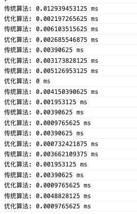
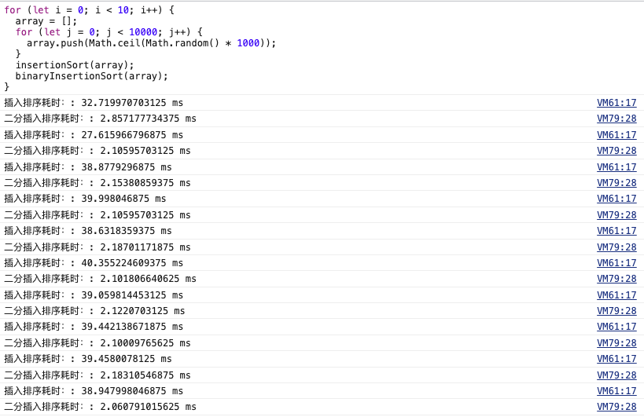
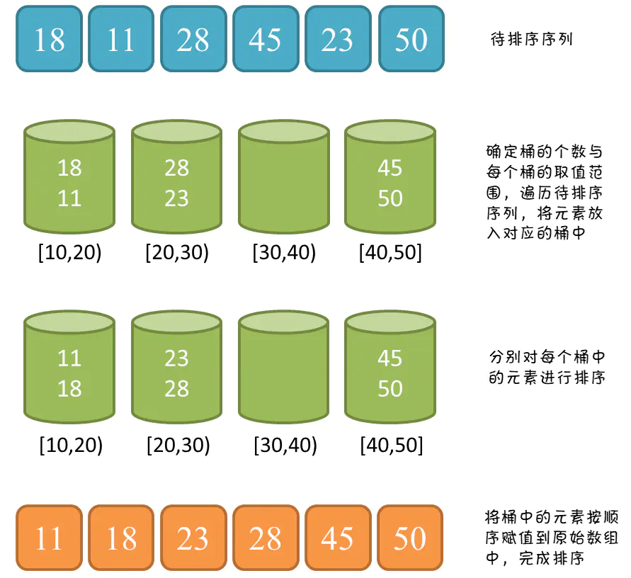

> 平安蜀黍的前端教程 > JS 必学知识点 > 十大经典排序算法

#### 本文中的图片均来自网络，

排序算法是《数据结构与算法》中最基本的算法之一。

排序算法可以分为内部排序和外部排序，内部排序是数据记录在内存中进行排序，而外部排序是因排序的数据很大，一次不能容纳全部的排序记录，在排序过程中需要访问外存。常见的内部排序算法有：插入排序、希尔排序、选择排序、冒泡排序、归并排序、快速排序、堆排序、基数排序等。用一张图概括：


- 表中的名词解释：

  > n: 数据规模  
  > k: "桶"的个数  
  > 桶: 用于临时存储数组或链表成员的容器  
  > In-place: 占用常数内存，不占用额外内存  
  > Out-place: 占用额外内存  
  > 稳定: 如果 a 原本在 b 前面，而 a=b，排序之后 a 仍然在 b 的前面  
  > 不稳定: 如果 a 原本在 b 的前面，而 a=b，排序之后 a 可能会出现在 b 的后面


### 一、冒泡排序 Bubble Sort

冒泡排序是一种简单的排序算法。它重复地走访过要排序的数列，一次比较两个元素，如果它们的顺序错误就把它们交换过来。走访数列的工作是重复地进行直到没有再需要交换，也就是说该数列已经排序完成。这个算法的名字由来是因为越小的元素会经由交换慢慢“浮”到数列的顶端。

#### 算法的描述与实现

1. 比较相邻的元素，如果前面的元素比后面的大，就交换它们的位置

2. 对每一对相邻元素作同样的工作，从开始第一对到结尾的最后一对，这样在最后的元素就成了最大的数

3. 针对所有元素重复以上操作

4. 重复上面三步，直到排序完成


#### 传统算法实现

```javascript
function bubbleSort(arr) {
  console.time('传统算法');
  const len = arr.length;
  for (let i = 0; i < len; i++) {
    // 为什么要len-1-i? 可以看看步骤2的描述
    for (let j = 0, l = len - 1 - i; j < l; j++) {
      //相邻元素两两对比，条件达成后交换位置
      if (arr[j] > arr[j + 1]) {
        // 临时存储
        const tmp = arr[j + 1];
        arr[j + 1] = arr[j];
        arr[j] = tmp;
      }
    }
  }
  console.timeEnd('传统算法');
  return arr;
}
const arr = [3, 44, 38, 5, 47, 15, 36, 26, 27, 2, 46, 4, 19, 50, 48];
console.log(bubbleSort(arr)); //[2, 3, 4, 5, 15, 19, 26, 27, 36, 38, 44, 46, 47, 48, 50]
```

传统冒泡排序中每一次遍历操作只能找到一个最大值或最小值，但我们从算法的过程中可以看到，其实我们可以在每一次遍历时进行正向和反向两次冒泡以同时确定最大值和最小值两个位置的，也就是说，我们可以让算法复杂度从平方复杂度：$$O(n^2)$$优化成对数线性复杂度：$$O(n log n)$$

#### 优化后的算法

```javascript
function optimizeBubbleSort(arr) {
  console.time('优化算法');
  let len = arr.length - 1; // 确定最大的位置
  let pos = 0; // 定义一个标记，用于储存每一次子循环的最终交换位置
  while (len > 0) {
    for (let j = 0; j < len; j++) {
      if (arr[j] > arr[j + 1]) {
        pos = j; // 记录交换的位置
        const tmp = arr[j];
        arr[j] = arr[j + 1];
        arr[j + 1] = tmp;
      }
    }
    // 修改最大值的位置为最后一次交换的位置
    len = pos;
  }
  console.timeEnd('优化算法');
  return arr;
}
console.log(optimizeBubbleSort(arr)); //[2, 3, 4, 5, 15, 19, 26, 27, 36, 38, 44, 46, 47, 48, 50]
```

最终的计算耗时：



### 二、选择排序 Selection Sort

选择排序是一种简单直观的排序算法。它的工作原理：首先在未排序序列中找到最小（大）元素，存放到排序序列的起始位置，然后，再从剩余未排序元素中继续寻找最小（大）元素，然后放到已排序序列的末尾。以此类推，直到所有元素均排序完毕。

#### 算法描述和实现

1. 将当前数组分为有序区域(前)和无序区域(后)

2. 遍历整个无序区，寻找当前最小的那个数的下标

3. 将最小数字与无序区域首个元素进行互换并将该元素置于有序区

4. 重复 2~3 两个步骤，直到排序完成。


#### 传统算法实现

```javascript
function selectionSort(arr) {
  const len = arr.length;
  let minIndex = 0;
  let temp = null;
  console.time('传统算法');
  for (let i = 0; i < len - 1; i++) {
    minIndex = i;
    // 为什么这里的j
    for (let j = i + 1; j < len; j++) {
      //寻找最小的数的下标
      if (arr[j] < arr[minIndex]) {
        minIndex = j; //将最小数的索引保存
      }
    }
    // 将查找到的最小数字移到有序区
    temp = arr[i];
    arr[i] = arr[minIndex];
    arr[minIndex] = temp;
  }
  console.timeEnd('传统算法');
  return arr;
}
const arr = [3, 44, 38, 5, 47, 15, 36, 26, 27, 2, 46, 4, 19, 50, 48];
console.log(selectionSort(arr)); //[2, 3, 4, 5, 15, 19, 26, 27, 36, 38, 44, 46, 47, 48, 50]
```

### 三、插入算法 Insertion-Sort

插入排序是一种简单直观的排序算法。它的工作原理是通过构建有序序列，对于未排序数据，在已排序序列中从后向前扫描，找到相应位置并插入。插入排序在实现上，通常采用 in-place 排序（即只需用到 O(1)的额外空间的排序），因而在从后向前扫描过程中，需要反复把已排序元素逐步向后挪位，为最新元素提供插入空间。

#### 算法描述和实现

1. 将当前数组分为有序区域(前)和无序区域(后)，将第一个元素放入有序区

2. 取出无序区的第一个元素，与有序区的元素从后向前进行比较

3. 找到有序区中小于当前元素的元素，将当前元素插入

4. 重复步骤 2~3，直到排序完成


#### 传统算法实现

```javascript
function insertionSort(arr) {
  console.time('插入排序耗时：');
  for (let i = 1, l = arr.length; i < l; i++) {
    // 无序区的第一个元素
    const disorderFirstElement = arr[i];
    // 有序区的最后一个元素
    let orderlyCurrent = i - 1;
    // 比较有序区的元素大于无序区的元素
    while (orderlyCurrent >= 0 && arr[orderlyCurrent] > disorderFirstElement) {
      // 移动有序区的元素到下一个位置
      arr[orderlyCurrent + 1] = arr[orderlyCurrent];
      orderlyCurrent--;
    }
    // 在正确的位置插入新元素
    arr[orderlyCurrent + 1] = disorderFirstElement;
  }
  console.timeEnd('插入排序耗时：');
  return arr;
}
const arr = [3, 44, 38, 5, 47, 15, 36, 26, 27, 2, 46, 4, 19, 50, 48];
console.log(insertionSort(arr)); //[2, 3, 4, 5, 15, 19, 26, 27, 36, 38, 44, 46, 47, 48, 50]
```

传统算法的插入过程中，使用了从后到前逐个比较的方式，我们可以使用二分查找的方式来减少遍历的次数

#### 优化算法实现

```javascript
function binaryInsertionSort(arr) {
  console.time('二分插入排序耗时：');
  for (let i = 1, l = arr.length; i < l; i++) {
    // 无序区的第一个元素
    const disorderFirstElement = arr[i];
    // 对有序区再次进行左右区域划分
    let left = 0;
    let right = i - 1;
    // 找到中点
    while (left <= right) {
      // 取出有序区中间位置的元素进行比较
      const middle = parseInt((left + right) / 2);
      if (disorderFirstElement < arr[middle]) {
        right = middle - 1;
      } else {
        left = middle + 1;
      }
    }
    // 有序区的最后一个元素
    let orderlyCurrent = i - 1;
    // 将有序区所有下标大于left的元素往后挪
    for (; orderlyCurrent >= left; orderlyCurrent--) {
      arr[orderlyCurrent + 1] = arr[orderlyCurrent];
    }
    // 将元素插入到空出来的位置
    arr[left] = disorderFirstElement;
  }
  console.timeEnd('二分插入排序耗时：');
  return arr;
}
const arr = [3, 44, 38, 5, 47, 15, 36, 26, 27, 2, 46, 4, 19, 50, 48];
console.log(binaryInsertionSort(arr)); //[2, 3, 4, 5, 15, 19, 26, 27, 36, 38, 44, 46, 47, 48, 50]
```

因为使用了 2 分查找，在当前算法中多出了一个循环，所以导致目前数据在较小的时候感觉不到算法的优化效果，甚至还有可能因为多了一个循环导致计算时间变长了。那么，我们换一个比较大的数据来测试：

```javascript
for (let i = 0; i < 10; i++) {
  array = [];
  for (let j = 0; j < 10000; j++) {
    array.push(Math.ceil(Math.random() * 1000));
  }
  insertionSort(array);
  binaryInsertionSort(array);
}
```



### 四 希尔排序 Shell Sort

希尔排序是插入排序的优化版，有的地方也会将这种排序称之为**缩小增量排序**，它的核心在于间隔序列的设定。既可以提前设定好间隔序列，也可以动态的定义间隔序列。动态定义间隔序列的算法是《算法（第 4 版》的合著者 Robert Sedgewick 提出的。

#### 算法描述和实现

1. 选择一个增量序列 t1，t2，…，tk，其中 ti>tj，tk=1

2. 按增量序列个数 k，对序列进行 k 趟排序

3. 每趟排序，根据对应的增量 ti，将待排序列分割成若干长度为 m 的子序列，分别对各子表进行直接插入排序。仅增量因子为 1 时，整个序列作为一个表来处理，表长度即为整个序列的长度

纯文字描述理解起来可能有点复杂，我们来看图


#### 传统算法实现

```javascript
function shellSort(arr) {
  const len = arr.length;
  let gap = 1;
  let temp;
  console.time('希尔排序耗时:');
  // 动态定义间隔序列
  while (gap < len / 5) {
    gap = gap * 5 + 1;
  }
  // 分组
  for (; gap > 0; gap = Math.floor(gap / 5)) {
    // 取值
    for (let i = gap; i < len; i++) {
      temp = arr[i];
      // 排序
      for (let j = i - gap; j >= 0 && arr[j] > temp; j -= gap) {
        arr[j + gap] = arr[j];
      }
      arr[j + gap] = temp;
    }
  }
  console.timeEnd('希尔排序耗时:');
  return arr;
}
var arr = [3, 44, 38, 5, 47, 15, 36, 26, 27, 2, 46, 4, 19, 50, 48];
console.log(shellSort(arr)); //[2, 3, 4, 5, 15, 19, 26, 27, 36, 38, 44, 46, 47, 48, 50]
```

### 五、归并排序 Merge Sort

归并排序是建立在归并操作上的一种有效的排序算法。该算法是采用分治法（Divide and Conquer）的一个非常典型的应用。归并排序是一种稳定的排序方法。将已有序的子序列合并，得到完全有序的序列；即先使每个子序列有序，再使子序列段间有序。若将两个有序表合并成一个有序表，称为 2-路归并

#### 算法描述与实现

1. 把长度为 n 的输入序列分成两个长度为 n/2 的子序列

2. 对这两个子序列分别采用归并排序

3. 将两个排序好的子序列合并成一个最终的排序序列


#### 传统算法实现

```javascript
function mergeSort(arr) {
  //采用自上而下的递归方法
  const len = arr.length;
  if (len < 2) {
    return arr;
  }
  // 拆分序列
  const middle = Math.floor(len / 2);
  // 合并排序完成的数据
  return merge(
    // 归并排序左侧
    mergeSort(arr.slice(0, middle)),
    // 归并排序右侧
    mergeSort(arr.slice(middle))
  );
}

function merge(left, right) {
  const result = [];
  console.time('归并排序耗时');
  while (left.length && right.length) {
    // 调整左右位置
    if (left[0] <= right[0]) {
      result.push(left.shift());
    } else {
      result.push(right.shift());
    }
  }

  while (left.length) result.push(left.shift());

  while (right.length) result.push(right.shift());
  console.timeEnd('归并排序耗时');
  return result;
}
const arr = [3, 44, 38, 5, 47, 15, 36, 26, 27, 2, 46, 4, 19, 50, 48];
console.log(mergeSort(arr));
```

### 六、快速排序 Quick Sort

快速排序的名字起的是简单粗暴，因为一听到这个名字你就知道它存在的意义，就是快，而且效率高! 它是处理大数据最快的排序算法之一了。

快速排序的基本思想：通过一趟排序将待排记录分隔成独立的两部分，其中一部分记录的关键字均比另一部分的关键字小，则可分别对这两部分记录继续进行排序，以达到整个序列有序。

#### 算法描述与实现

快速排序使用分治法来把一个串（list）分为两个子串（sub-lists）。具体算法描述如下：

1. 从数列中挑出一个元素，称为 "基准"（pivot）；
2. 重新排序数列，所有元素比基准值小的摆放在基准前面，所有元素比基准值大的摆在基准的后面（相同的数可以到任一边）。在这个分区退出之后，该基准就处于数列的中间位置。这个称为分区（partition）操作；
3. 递归地（recursive）把小于基准值元素的子数列和大于基准值元素的子数列排序。


#### 传统算法实现

```javascript
function quickSort(arr) {
  console.time('快速排序耗时');
  if (arr.length <= 1) {
    return arr;
  }
  const pivotIndex = Math.floor(arr.length / 2);
  const pivot = arr.splice(pivotIndex, 1)[0];
  const left = [];
  const right = [];
  for (left i = 0; i < arr.length; i++) {
    if (arr[i] < pivot) {
      left.push(arr[i]);
    } else {
      right.push(arr[i]);
    }
  }
  console.timeEnd('快速排序耗时');
  return quickSort(left).concat([pivot], quickSort(right));
}
const arr = [3, 44, 38, 5, 47, 15, 36, 26, 27, 2, 46, 4, 19, 50, 48];
console.log(quickSort(arr));
```

### 堆排序 Heap Sort

堆排序（Heapsort）是指利用堆这种数据结构所设计的一种排序算法。堆积是一个近似完全二叉树的结构，并同时满足堆积的性质：即子结点的键值或索引总是小于（或者大于）它的父节点。

#### 算法描述

1. 将初始待排序关键字序列(R1,R2....Rn)构建成大顶堆，此堆为初始的无序区；

2. 将堆顶元素 R[1]与最后一个元素 R[n]交换，此时得到新的无序区(R1,R2,......Rn-1)和新的有序区(Rn),且满足 R[1,2...n-1]<=R[n]；

3. 由于交换后新的堆顶 R[1]可能违反堆的性质，因此需要对当前无序区(R1,R2,......Rn-1)调整为新堆，然后再次将 R[1]与无序区最后一个元素交换，得到新的无序区(R1,R2....Rn-2)和新的有序区(Rn-1,Rn)。不断重复此过程直到有序区的元素个数为 n-1，则整个排序过程完成。

#### 算法实现

```javascript
function heapSort(array) {
  console.time('堆排序耗时');
  if (Object.prototype.toString.call(array).slice(8, -1) === 'Array') {
    //建堆
    const heapSize = array.length;
    let temp;
    for (let i = Math.floor(heapSize / 2) - 1; i >= 0; i--) {
      heapify(array, i, heapSize);
    }

    //堆排序
    for (let j = heapSize - 1; j >= 1; j--) {
      temp = array[0];
      array[0] = array[j];
      array[j] = temp;
      heapify(array, 0, --heapSize);
    }
    console.timeEnd('堆排序耗时');
    return array;
  } else {
    return 'array is not an Array!';
  }
}
/*方法说明：维护堆的性质
@param  arr 数组
@param  x   数组下标
@param  len 堆大小*/
function heapify(arr, x, len) {
  if (
    Object.prototype.toString.call(arr).slice(8, -1) === 'Array' &&
    typeof x === 'number'
  ) {
    const l = 2 * x + 1;
    const r = 2 * x + 2;
    let largest = x;
    let temp;
    if (l < len && arr[l] > arr[largest]) {
      largest = l;
    }
    if (r < len && arr[r] > arr[largest]) {
      largest = r;
    }
    if (largest != x) {
      temp = arr[x];
      arr[x] = arr[largest];
      arr[largest] = temp;
      heapify(arr, largest, len);
    }
  } else {
    return 'arr is not an Array or x is not a number!';
  }
}
var arr = [3, 44, 38, 5, 47, 15, 36, 26, 27, 2, 46, 4, 19, 50, 48];
console.log(heapSort(arr)); //[10, 13, 20, 22, 30, 31, 35, 46, 60, 65, 65, 77, 81, 91, 96]
```

### 八、计数排序 Counting Sort

计数排序(Counting sort)是一种稳定的排序算法。计数排序使用一个额外的数组 C，其中第 i 个元素是待排序数组 A 中值等于 i 的元素的个数。然后根据数组 C 来将 A 中的元素排到正确的位置。它只能对整数进行排序。

#### 算法描述

1. 找出待排序的数组中最大和最小的元素；
2. 统计数组中每个值为 i 的元素出现的次数，存入数组 C 的第 i 项；
3. 对所有的计数累加（从 C 中的第一个元素开始，每一项和前一项相加）；
4. 反向填充目标数组：将每个元素 i 放在新数组的第 C(i)项，每放一个元素就将 C(i)减去 1


#### 算法实现

```javascript
function countingSort(array) {
  var len = array.length,
    B = [],
    C = [],
    min = (max = array[0]);
  console.time('计数排序耗时');
  for (var i = 0; i < len; i++) {
    min = min <= array[i] ? min : array[i];
    max = max >= array[i] ? max : array[i];
    C[array[i]] = C[array[i]] ? C[array[i]] + 1 : 1;
  }
  for (var j = min; j < max; j++) {
    C[j + 1] = (C[j + 1] || 0) + (C[j] || 0);
  }
  for (var k = len - 1; k >= 0; k--) {
    B[C[array[k]] - 1] = array[k];
    C[array[k]]--;
  }
  console.timeEnd('计数排序耗时');
  return B;
}
```

### 九、桶排序 Bucket Sort

桶排序 (Bucket sort)的工作的原理：假设输入数据服从均匀分布，将数据分到有限数量的桶里，每个桶再分别排序（有可能再使用别的排序算法或是以递归方式继续使用桶排序进行排

#### 算法描述

1. 设置一个定量的数组当作空桶；
2. 遍历输入数据，并且把数据一个一个放到对应的桶里去；
3. 对每个不是空的桶进行排序；
4. 从不是空的桶里把排好序的数据拼接起来。




#### 算法实现

```javascript
function bucketSort(array, num) {
  if (array.length <= 1) {
    return array;
  }
  var len = array.length,
    buckets = [],
    result = [],
    min = (max = array[0]),
    regex = '/^[1-9]+[0-9]*$/',
    space,
    n = 0;
  num = num || (num > 1 && regex.test(num) ? num : 10);
  console.time('桶排序耗时');
  for (var i = 1; i < len; i++) {
    min = min <= array[i] ? min : array[i];
    max = max >= array[i] ? max : array[i];
  }
  space = (max - min + 1) / num;
  for (var j = 0; j < len; j++) {
    var index = Math.floor((array[j] - min) / space);
    if (buckets[index]) {
      //  非空桶，插入排序
      var k = buckets[index].length - 1;
      while (k >= 0 && buckets[index][k] > array[j]) {
        buckets[index][k + 1] = buckets[index][k];
        k--;
      }
      buckets[index][k + 1] = array[j];
    } else {
      //空桶，初始化
      buckets[index] = [];
      buckets[index].push(array[j]);
    }
  }
  while (n < num) {
    result = result.concat(buckets[n]);
    n++;
  }
  console.timeEnd('桶排序耗时');
  return result;
}
```

### 十、基数排序

基数排序是按照低位先排序，然后收集；再按照高位排序，然后再收集；依次类推，直到最高位。有时候有些属性是有优先级顺序的，先按低优先级排序，再按高优先级排序。最后的次序就是高优先级高的在前，高优先级相同的低优先级高的在前。基数排序基于分别排序，分别收集，所以是稳定的。

#### 算法描述 Radix Sort

1. 取得数组中的最大数，并取得位数；

2. arr 为原始数组，从最低位开始取每个位组成 radix 数组；

3. 对 radix 进行计数排序（利用计数排序适用于小范围数的特点）。


#### 算法实现

```javascript
function radixSort(arr, maxDigit) {
  var mod = 10;
  var dev = 1;
  var counter = [];
  console.time('基数排序耗时');
  for (var i = 0; i < maxDigit; i++, dev *= 10, mod *= 10) {
    for (var j = 0; j < arr.length; j++) {
      var bucket = parseInt((arr[j] % mod) / dev);
      if (counter[bucket] == null) {
        counter[bucket] = [];
      }
      counter[bucket].push(arr[j]);
    }
    var pos = 0;
    for (var j = 0; j < counter.length; j++) {
      var value = null;
      if (counter[j] != null) {
        while ((value = counter[j].shift()) != null) {
          arr[pos++] = value;
        }
      }
    }
  }
  console.timeEnd('基数排序耗时');
  return arr;
}
var arr = [3, 44, 38, 5, 47, 15, 36, 26, 27, 2, 46, 4, 19, 50, 48];
console.log(radixSort(arr, 2));
```
