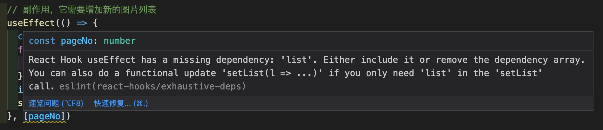

> 企业项目实战 > React 函数式编程 > React Hooks

# React 的新特性 Hook

### 什么是 Hook? 为什么要使用 Hook?

首先我们要理解**什么是 Hook**。Hook，中文意义是“钩子”的意思。在 React 中，Hook 是一个特殊的函数，它可以监视系统或进程中的各种状态，让我们在函数组件中也可以使用状态以及实现类似于 componentDidMount 与 componetDidUpdatet 等生命周期一样的方法；

**为什么要使用 Hook?** 一是因为类组件中仍然存在大量的 this 指向造成的困惑，使用内联函数又会造成过度地创建句柄；另一个原因是类组件中的生命周期函数本身的缺陷，造成我们在编写业务时需要将相干逻辑分散到不同的生命周期，同时，在同一个生命周期函数中又存在大量不相干逻辑，这让我们读代码时理解业务逻辑变得困难；然后最大的问题是，在组件之间复用状态逻辑变得越来越困难，特别在一些复杂的逻辑组件和高阶组件中，复用性变得越来越差。而 Hook 的优势恰恰在于它是基于函数组件开发的，完全没有 this 问题；每一个副作用只管理自己的业务逻辑同时自定义的 Hook 更加方便复用状态逻辑；然后自定义的 Hook 可以让我们非常方便地复用状态逻辑。

### React Hook 的使用规则

- 只在最顶层使用 Hook: 不允许在循环、条件判断或嵌套函数中调用 Hook，要确保总是在你的 React 函数的最顶层调用它们
- 只在自己的依赖更新时才执行 effect:
- .1 使用 useEffect 完成副作用操作，赋值给 useEffect 的函数会在组件渲染到屏幕之后执行；
- .2 不要忘记函数依赖，需要把 useEffect 内部引用到的方式，声明为当前 effect 的依赖；
- 理解每一次的 rendering

### React Hook 有哪些特性

#### useState

我们可以把 useState 理解为类组件中的 this.setState。useState 是允许我们在 React 函数组件中添加状态的 Hook。

```javascript
// 常用的写法，我们是用es6的方法将useState返回的数组解构了
const [inputValue, setInputValue] = useState('请输入');
```

useState 方法接受一个默认值作为参数，返回一个数组：数组的第一个成员是我们刚刚传入的默认值，第二个成员是一个用于改变我们定义的默认值的匿名函数，我们可以把第二个成员当成我们在 class 组件中的 this.setState()，只不过这里这个匿名函数只能改变当前状态的值。

##### 隋性的 useState

与 setState 一样，如果初始 state 需要通过复杂计算获得，则可以传入一个函数，在函数中计算并返回初始的 state，当然，此函数只在初始渲染时被调用

```javascript
const TestInput = props => {
  // useState在首次渲染时使用useState中传入的函数来初始化inputValue, 二次渲染时则直接读取inputValue这个变量的值
  const [inputValue, setInputValue] = useState(() => props.value || '请输入');
  return (
    <div>
      <input value={inputValue} onChange={e => setInputValue(e.target.value)} />
      {inputValue}
    </div>
  );
};
```

##### 函数式更新

如果新的 state 需要通过使用先前的 state 计算得出，那么可以将函数传递给 setState。这个函数将接收先前的 state，然后返回一个更新后的值

```javascript
function TestCount({ initialCount }) {
  const [count, setCount] = useState(initialCount);
  return (
    <>
      数量: {count}
      <button onClick={() => setCount(initialCount)}>重置</button>
      <button onClick={() => setCount(prevCount => prevCount + 1)}>+</button>
      <button onClick={() => setCount(prevCount => prevCount - 1)}>-</button>
    </>
  );
}
```

##### 对象更新

需要注意的是，与 class 组件中的 setState 方法不同，useState 不会自动合并更新对象。我们需要用函数式的 setState 结合展开运算符来达到合并更新对象的效果

```javascript
const defaultObj = {
  a: 1,
  b: 2,
};
function TestObject() {
  const [obj, setObj] = useState(() => {
    return {
      ...defaultObj,
      c: 3,
    };
  });

  return (
    <>
      obj.a: {obj.a}
      obj.b: {obj.b}
      obj.c: {obj.c}
      <button
        onClick={() =>
          setObj({
            ...obj,
            c: 5,
          })
        }
      >
        改写
      </button>
    </>
  );
}
```

#### useEffect

useEffect，这个词中文官网或者说一些中文翻译网站，将它译为副作用。为了更好地理解副作用，我们需要重温一下什么是纯函数

##### 纯函数

> 当一个函数的返回结果只依赖于它的参数，并且没有副作用，我们就可以将这个函数称之为一个纯函数。
>
> 1. 函数的返回结果只依赖于它的参数
> 2. 函数的执行过程里面没有副作用

```javascript
const arr = [1, 2, 3, 4, 5];
// 纯的函数
function pureFun(arr, start, end) {
  return arr.slice(start, end);
}
// 非纯函数
function fun(arr, start, end) {
  return arr.splice(start, end);
}
pureFun(arr, 0, 2); // 无论调用多少次，都是[1,2]
fun(arr, 1, 3); // 第一次是[1,2],第二次是[3,4],第三次是[5],然后是[],它甚至还强行改变了外部的arr
```

##### 副作用

通过上面的两个函数，我们可以得知，所谓的副作用就是指一个函数做了和本身运算返回值无关的事情，比如：修改了全局变量、修改了传入的参数、甚至是 console.log()，所以 ajax 与获取 dom 的操作都算是副作用的。

##### 怎样使用 useEffect

```javascript
const TestInput = props => {
  // useState在首次渲染时使用useState中传入的函数来初始化inputValue, 二次渲染时则直接读取inputValue这个变量的值
  const [inputValue, setInputValue] = useState(() => props.value || '请输入');
  return (
    <div>
      <input value={inputValue} onChange={e => setInputValue(e.target.value)} />
      {inputValue}
    </div>
  );
};
```

##### useEffect 带来的一些问题

在我们之前的课程里，经常会发现，有一些稍复杂的组件逻辑中，副作用的依赖项经常会提示警告，比如下面这段代码：



```javascript
useEffect(() => {
  const arr = [];
  for (let i = 0; i < 10; i++) {
    arr.push(pageNo + i);
  }
  loading = false;
  setList([...list, ...arr]);
  // 下面这行的意思是，不允许eslint检查下一行代码是否符合hooks的依赖规则
  // eslint-disable-next-line react-hooks/exhaustive-deps
}, [pageNo]);
```

#### useLayoutEffect

useLayoutEffect 的使用场景并不是很多，但在一些需要在渲染之后对一些大的模块做调整，会影响到页面的整体布局时，它会在 Dom 变更之后同步调用 effect:

```javascript
import React, { useEffect, useLayoutEffect, useRef } from 'react';
import './style.less';

const TestLayoutEffect = () => {
  const moveDiv = useRef();
  // 渲染完成后将div往右移动600像素
  useEffect(() => {
    moveDiv.current.style = 'margin-left: 600px';
  }, []);
  return (
    <div className="layout">
      <div ref={moveDiv} className="square">
        square
      </div>
    </div>
  );
};
export default TestLayoutEffect;
```

通过上面的 demo 我们可以看到，使用 effect 来调整模块位置总是会伴随着闪屏，而使用 layoutEffect 就没有了这个问题，因为它会阻塞浏览器的绘制，将自己的工作插入在 Dom 更新完之后渲染之前。我们可以看到，使用 layoutEffect 时，无论怎么刷新页面，几乎都是看不见任何页面变化的。

#### useContext

React Hook 里的 context 与 class 组件里的 context 是一样的效果，在上个月的 context 中我们知道了，context 能够允许数据跨越组件层级直接传递到任何的子组件上。我们今天再次重复一遍以加深记忆

```javascript
//Page.js
// Context 可以让我们无须明确地传遍每一个组件，就能将值深入传递进组件树。
import React, { Component } from 'react';
import List from './List';
//导出ThemeContext，让后面的Item组件可以拿到
export const ThemeContext = React.createContext();
export default class Page extends Component {
  constructor(props) {
    super(props);
    this.state = { theme: 'red' };
  }
  onChangeTheme = color => {
    this.setState({ theme: color });
  };
  render() {
    const data = [
      { id: 1, text: '随随便便输入', color: 'yellow' },
      { id: 2, text: '随便输入', color: 'blue' },
    ];
    // 使用一个 Provider 来将当前的 theme 传递给以下的组件树。
    // 无论多深，任何组件都能读取这个value值。
    return (
      <div>
        <ThemeContext.Provider
          value={{ theme: this.state.theme, onChangeTheme: this.onChangeTheme }}
        >
          <List data={data} />
        </ThemeContext.Provider>
      </div>
    );
  }
}
// List.js
import React from 'react';
import Item from './Item';
export default function List(props) {
  return (
    <div>
      {props.data.map(i => (
        <Item key={i.id} color={i.color}>
          {i.text}
        </Item>
      ))}
    </div>
  );
}
//Item.js
import React, { useContext } from 'react';
//引入useContext
///导入Page中的ThemeContext对象
import { ThemeContext } from './Page';
export default function Item(props) {
  //拿到context数据
  const context = useContext(ThemeContext);
  return (
    <div>
      <p style={{ color: context.theme }}>
        {props.children}
        <button onClick={() => context.onChangeTheme(props.color)}>
          {' '}
          点击变色{' '}
        </button>
      </p>
      <ThemeContext.Consumer>
        {value => {
          console.log(value, 'render');
        }}
      </ThemeContext.Consumer>
    </div>
  );
}
```

#### useRef

useRef 的功能与 class 中的 ref 功能基本类似，但多了很多扩展用法：

- 基本用法：获取子组件或者 Dom 节点的句柄
  > 句柄的名词解释：
  > 句柄的英文是 handle。在英文中，有操作、处理、控制之类的意义。作为一个名词时，是指某个中间媒介，通过这个中间媒介可控制、操作某样东西。以我们前端的理解来说，就是一个 ID，可以通过这个 ID 来访问 Dom 节点对象。

```javascript
import React, { useState, useEffect, useRef } from 'react';
export default TestInput = props => {
  const [inputValue, setInputValue] = useState('');
  const inputEl = useRef(null);
  useEffect(() => {
    // `current` 指向已挂载到 DOM 上的文本输入元素
    inputEl.current.focus();
  });
  return (
    <div>
      <input
        ref={inputEl}
        value={inputValue}
        onChange={e => setInputValue(e.target.value)}
      />{' '}
      {inputValue}
      <p>{props.visible}</p>
    </div>
  );
};
```

如上面的例子，首先我们通过 useRef 创建一个变量 inputEl，页面渲染时将获取到的 input 真实 DOM 存储到 inputEl.current 中，页面渲染完成后执行 useEffect，利用真实 DOM 让 input 输入框获取焦点。

- 渲染周期之间共享数据的存储

```javascript
function Timer() {
  const intervalRef = useRef();

  useEffect(() => {
    intervalRef.current = setInterval(() => {
      // ...
    });
    return () => {
      clearInterval(intervalRef.current);
    };
  });
}
```

useRef() Hook 不仅仅可以用于储存 Dom 节点，还可以用来储存任意的属性。useRef 返回的 ref 对象是一个 current 属性可变且可以容纳任意值的通用容器，类似于一个 class 的实例属性。像上面这段代码一样，我们可以把一个定时器 ID 存入到 useRef 中，这样这个定时器 ID 不仅仅在 useEffect 中可以拿到，而且在整个组件函数的任意位置都可以获取到。

- 利用 useRef 获取上一轮的 props 或 state

```javascript
function Counter() {
  const [count, setCount] = useState(0);
  const prevCountRef = useRef();
  useEffect(() => {
    prevCountRef.current = count;
  });
  const prevCount = prevCountRef.current;

  return (
    <>
      <h1>
        新的：{count}; 旧的：{prevCount}
      </h1>
      <button onClick={() => setCount(count => count + 1)}>加个数</button>
    </>
  );
}
```

在上面的例子中我们可以看到，首先利用页面渲染拿到了 count 的值为 0，然后此时的 prevCount 刚刚创建，所以它的值是个 undefined，当页面渲染完成后进入副作用 useEffect 中，进行赋值操作。这个时候 count 的值就保存到了 current 中了。

> 当然，这个时候页面并不会重新渲染，因为我们的 prevCount 并不是通过 setState 方法写入的，所以 react 认为这个变量的变化并不需要渲染到页面中。
> 当点击按钮后，因为 count 的变化导致 react 接受到了渲染 DOM 的命令，于是页面开始重新渲染，所以这个时候 prevCount 的值变化为 0，并在本次渲染完成后因为副作用 useEffect 中的重新赋值为 1。

上面的这段代码我们也可以抽取成一个自定义的 hook

```javascript
function usePrevCount(val) {
  const ref = useRef();
  useEffect(() => {
    ref.current = val;
  });
  return ref.current;
}
function Counter() {
  const [count, setCount] = useState(0);
  const prevCount = usePrevCount(count);
  return (
    <>
      <h1>
        新的：{count}; 旧的：{prevCount}
      </h1>
      <button onClick={() => setCount(count => count + 1)}>加个数</button>
    </>
  );
}
```

#### useMemo

memo，在 class 组件中，我们使用 shouldComponentUpdate 方法或者通过继承 PureComponent 类来减少因为父组件的状态变化导致子组件的重复渲染：

```javascript
// 使用shouldComponentUpdate来优化
import React, { Component } from 'react';

class TestButton extends Component {
  // shouldComponentUpdate(prevProps) {
  //   return prevProps.num !== this.props.num
  // }
  render() {
    console.log('我们来看看父组件的state变化是否会造成子组件的重新渲染');
    return (
      <div>
        <h1>props中的内容：{this.props.num}</h1>
        <button>click me</button>
      </div>
    );
  }
}

class TestShouldUpdate extends Component {
  state = {
    inputVal: '',
    num: 1,
  };
  render() {
    return (
      <div>
        <input
          value={this.state.inputVal}
          onChange={e => this.setState({ inputVal: e.target.value })}
        />
        <TestButton num={this.state.num} />
      </div>
    );
  }
}
```

#### useCallback

#### useReducer
