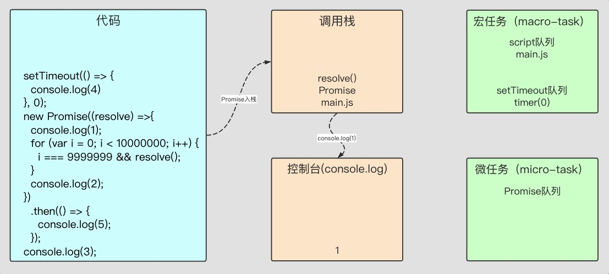

> 企业项目实战 > JavaScript 进阶 > JavaScript 的事件机制

### 面试题

#### 为什么 JavaScript 是单线程的

> JavaScript 语言的最大特点就是单线程，也就是说，同一个时间只能做一件事。这样设计的方案主要源于其语言特性，因为 JavaScript 是浏览器脚本语言，它可以操纵 DOM ，可以渲染动画，可以与用户进行互动，如果是多线程的话，执行顺序无法预知，而且操作以哪个线程为准也是个难题。所以，为了避免复杂性，从一诞生，JavaScript 就是单线程，这已经成了这门语言的核心特征，将来也不会改变。
> 在 HTML5 时代，浏览器为了充分发挥 CPU 性能优势，允许 JavaScript 创建多个线程，但是即使能额外创建线程，这些子线程仍然是受到主线程控制，而且不得操作 DOM，类似于开辟一个线程来运算复杂性任务，运算好了通知主线程运算完毕，结果给你，这类似于异步的处理方式，所以本质上并没有改变 JavaScript 单线程的本质。

#### 如果 JavaScript 是单线程的，为什么它可以执行多线程操作（异步操作）

> JS 是单线程的，只有一个主线程
> 函数内的代码从上到下顺序执行，遇到被调用的函数先进入被调用函数执行，待完成后继续执行
> 遇到异步事件，浏览器另开一个线程，主线程继续执行，待结果返回后，执行回调函数

因为 JS 这个语言是运行在宿主环境中，比如 浏览器环境，nodeJs 环境; 在浏览器中，浏览器负责提供这个额外的线程; 在 Node 中，Node.js 借助 libuv 来作为抽象封装层， 从而屏蔽不同操作系统的差异，Node 可以借助 libuv 来实现多线程。而这个异步线程又分为 微任务 和 宏任务，我们就用两天的时间来研究 JS 的异步原理以及其事件循环机制。

#### 函数调用栈

函数调用栈，从名字可以看出来，它是一个栈，栈的特性就是先进后出，传统语言中还有一个堆的概念，堆的概念是先进先出。


上图就是一个简单的调用栈，在调用栈中，前一个函数在执行的时候，下面的函数全部需要等待前一个任务执行完毕，才能执行。

但是，有很多任务需要很长时间才能完成，如果一直都在等待的话，调用栈的效率极其低下，这时，JavaScript 语言设计者意识到，这些任务主线程根本不需要等待，只要将这些任务挂起，先运算后面的任务，等到执行完毕了，再回头将此任务进行下去，于是就有了 任务队列 的概念。

#### 任务队列

所有任务可以分成两种，一种是 同步任务（synchronous），另一种是 异步任务（asynchronous） 。

同步任务指的是，在主线程上排队执行的任务，只有前一个任务执行完毕，才能执行后一个任务。

异步任务指的是，不进入主线程、而进入"任务队列"（task queue）的任务，只有 "任务队列"通知主线程，某个异步任务可以执行了，该任务才会进入主线程执行。

所以，当在执行过程中遇到一些类似于 setTimeout 等异步操作的时候，会交给浏览器的其他模块进行处理，当到达 setTimeout 指定的延时执行的时间之后，回调函数会放入到任务队列之中。

当然，一般不同的异步任务的回调函数会放入不同的任务队列之中。等到调用栈中所有任务执行完毕之后，接着去执行任务队列之中的回调函数。

用一张图来表示就是：


上面的图中，调用栈先进行顺序调用，一旦发现异步操作的时候就会交给浏览器内核的其他模块进行处理，对于 Chrome 浏览器来说，这个模块就是 webcore 模块，上面提到的异步 API，webcore 分别提供了 DOM Binding、network、timer 模块进行处理。等到这些模块处理完这些操作的时候将回调函数放入任务队列中，之后等栈中的任务执行完之后再去执行任务队列之中的回调函数。

我们先来看一个有意思的现象，我运行一段代码，大家觉得输出的顺序是什么：

```javascript
setTimeout(() => {
  console.log('setTimeout');
}, 22);
for (let i = 0; i++ < 2; ) {
  i === 1 && console.log('1');
}
setTimeout(() => {
  console.log('set2');
}, 20);
for (let i = 0; i++ < 100000000; ) {
  i === 99999999 && console.log('2');
}
```

ok 我们现在拿这个代码执行过程来解析一下

第一步，文件入栈：


第二步，执行文件，读取第一段代码入栈，所以，这里将 setTimeout 入栈：


第三步，调用栈发现 setTimeout 是一个 webapis 的 API(上面说的，异步 API 的一种)，于是把它丢给了浏览器的 timer 模块进行处理了，调用栈则继续处理下一段代码：


第四步，log 任务没有涉及其它代码段，所以它会立即执行，在控制台打印文字。然后调用栈再次处理下一段代码，所以，setTimeout(20)入栈：


第五步，参考第三步，setTimeout 被判定为异步 API，交由 timer 模块进行处理，调用栈继续处理下一段代码：


第六步，与第四步一样，log 任务被立即执行，在控制台打印文字。然后，main.js 执行完成，被弹出调用栈。因调用栈已被清空，所以转换关注点到异步 API，当异步 API 被执行完成后会把回调函数放入任务队列：


第七步，任务队列在接收到回调函数后，通知调用栈，还有待处理的任务，然后将刚第一个加入队列中的回调函数加入到调用栈中，然后调用栈立即执行这个 log 任务：


第八步，任务队列接收到另一个回调函数，将新的回调函数加入调用栈后被执行，然后调用栈再次被清空，等待执行其它任务。


##### 小结 上面的流程解释了浏览器遇到 setTimeout 之后究竟如何执行的，其实总结下来就是以下几点：

> 调用栈顺序调用任务
> 当调用栈发现异步任务时，将异步任务交给其他模块处理，自己继续进行下面的调用
> 异步执行完毕，异步模块将任务推入任务队列，并通知调用栈
> 调用栈在执行完当前任务后，将执行任务队列里的任务
> 调用栈执行完任务队列里的任务之后，继续执行其他任务

上面这一整个流程就叫做 事件循环（Event Loop）。

小结练习，一个常见的面试题：

```javascript
for (var i = 0; i < 10; i++) {
  setTimeout(() => {
    console.log(i);
  }, 1000);
}
console.log(i);
```

执行解析：

首先由于 var 的变量提升，i 在全局作用域都有效
再次，代码遇到 setTimeout 之后，将该函数交给其他模块处理，自己继续执行 console.log(i) ，由于变量提升，i 已经循环 10 次，此时 i 的值为 10 ，即，输出 10
之后，异步模块处理好函数之后，将回调推入任务队列，并通知调用栈
1 秒之后，调用栈顺序执行回调函数，由于此时 i 已经变成 10 ，即输出 10 次 10

另一个练习：

```javascript
setTimeout(() => {
  console.log(4);
}, 0);
new Promise(resolve => {
  console.log(1);
  for (var i = 0; i < 10000000; i++) {
    i === 9999999 && resolve();
  }
  console.log(2);
}).then(() => {
  console.log(5);
});
console.log(3);
```

#### 宏任务与微任务

上一个练习的输出结果是 1,2,3,5,4，因为这涉及到任务队列的内部，宏任务和微任务。

##### 什么是宏任务和微任务

任务队列又分为 macro-task（宏任务） 与 micro-task（微任务） ，在最新标准中，它们被分别称为 task 与 jobs 。

**macro-task（宏任务）** 大概包括：script(整体代码), setTimeout, setInterval, setImmediate（NodeJs）, I/O, UI rendering。
**micro-task（微任务）** 大概包括: process.nextTick（NodeJs）, Promise, MutationObserver(html5 新特性)

来自不同任务源的任务会进入到不同的任务队列。其中 setTimeout 与 setInterval 是同源的。
事实上，事件循环决定了代码的执行顺序，从全局上下文进入函数调用栈开始，直到调用栈清空，然后执行所有的 micro-task（微任务），当所有的 micro-task（微任务）执行完毕之后，再执行 macro-task（宏任务），其中一个 macro-task（宏任务）的任务队列执行完毕（例如 setTimeout 队列），再次执行所有的 micro-task（微任务），一直循环直至执行完毕。

然后，我们在这里使用新的流程图来解析上面的代码：

第一步：文件入栈，然后 setTimeout 入栈，被转入宏任务队列中，再然后 Promise 被压入栈中


第二步：调用栈中执行 Promise 实例，然后它接受的参数 resolve 方法，是在 new 的时候被执行，因此不会进入任何其他的队列，而是直接在当前任务直接执行了，而后续的.then 则会被分发到 micro-task 的 Promise 队列中去：




第三步：调用栈继续执行宏任务 main.js，输出 3 并弹出调用栈，main.js 执行完毕弹出调用栈，调用栈被清空


第四步：这时，macro-task(宏任务)中的 script 队列执行完毕，事件循环开始执行所有的 micro-task(微任务)


第五步：输出 5 后，调用栈发现所有的 micro-task(微任务) 都已经执行完毕，于是转换到 macro-task(宏任务)中调用 setTimeout 队列


第六步：macro-task(宏任务) setTimeout 队列执行完毕，调用栈再次接入微任务进行查找是否有未执行的微任务，发现没有就继续宏任务执行下一个队列，再次发现宏任务也没有队列执行，调用结束。

##### 总结：

1 不同的任务会放进不同的任务队列之中。
2 先执行 macro-task，等到函数调用栈清空之后再执行所有在队列之中的 micro-task。
3 等到所有 micro-task 执行完之后再从 macro-task 中的一个任务队列开始执行，就这样一直循环。
4 宏任务和微任务的队列执行顺序排列如下：
5 macro-task（宏任务）：script(整体代码), setTimeout, setInterval, setImmediate（NodeJs）, I/O, UI rendering。
6 micro-task（微任务）: process.nextTick（NodeJs）, Promise, MutationObserver(html5 新特性)

总结练习：

```javascript
<script>
  setTimeout(() => {
    console.log(4)
  }, 0);
  new Promise((resolve) => {
    console.log(1);
    for (var i = 0; i < 10000000; i++) {
      i === 9999999 && resolve();
    }
    console.log(2);
  }).then(() => {
    console.log(5);
  });
  console.log(3);
</script>
<script>
  console.log(6)
  new Promise((resolve) => {
    resolve()
  }).then(() => {
    console.log(7);
  });
</script>
```

解析：

第一步：第一个整体任务 script1 进入宏任务队列
第二步：script1 进行调用，将 setTimeout 分发至宏任务的 setTimeout 队列，实例化 promise 方法并打印第一行 log(1)，再打印 log2，将 then 方法分发至微任务的 promise 队列。最后打印 log(3)并弹出调用栈
第三步：script1 执行完毕，调用栈清空后，直接调取所有微任务，打印 log(5)
第四步：script1 被弹出后继续将第二个整体任务 script2 压入任务队列
第五步：script2 被调用，打印 log(6)，实例化 promise 方法并将 then 方法分发至微任务的 promise 队列。然后弹出 script2
第六步：script2 被弹出调用栈清空后，再次调取所有微任务，打印 log(7)
第七步：现在所有微任务被执行完毕，于是调用栈切换到宏任务检查，发现还有一个 setTimeout 任务没有执行，于是打印 log(4)
第八步：执行完所有宏任务后又再次接入微任务，发现没有了微任务后，调用结束。

总结练习 2

```javascript
setImmediate(() => {
  console.log(1);
}, 0);
setTimeout(() => {
  console.log(2);
}, 0);
new Promise(resolve => {
  console.log(3);
  resolve();
  console.log(4);
}).then(() => {
  console.log(5);
});
console.log(6);
process.nextTick(() => {
  console.log(7);
});
console.log(8);
```

总结练习 3

```javascript
setTimeout(() => {
  console.log('to1');
  new Promise(resolve => {
    console.log('to1_p');
    setTimeout(() => {
      console.log('to1_p_to');
    });
    resolve();
  }).then(() => {
    console.log('to1_then');
  });
});

new Promise(resolve => {
  console.log('p1');
  resolve();
}).then(() => {
  console.log('then1');
});

setTimeout(() => {
  console.log('to2');
  new Promise(resolve => {
    console.log('to2_p');
    resolve();
  }).then(() => {
    console.log('to2_then');
  });
});

new Promise(resolve => {
  console.log('p2');
  resolve();
}).then(() => {
  console.log('then2');
});
```
