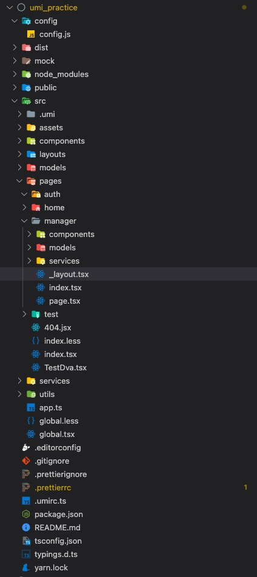

# lessons_04. umi 项目实战

## 目录结构



#### 结构说明

```javascript
├── config/
    ├── config.js                  // umi 配置，同 .umirc.js，二选一
├── dist/                          // 默认的打包输出目录
├── mock/                          // mock 文件所在目录，基于 express
├── public/                        // 全局相对路径文件
└── src/                           // 开发目录
    ├── .umi/                      // dev 临时目录，需添加到 .gitignore 不允许提交
    ├── .umi-production/           // build 临时目录，会自动删除
    ├── assets/                    // 静态文件
    ├── components/                // 全局共用组件
    ├── layouts/index.js           // 全局入口文件
    ├── models/                    // 全局models文件，存放全局共用数据store
    ├── pages/                     // 页面目录，业务组件
        ├── index/                 // 首页模块
        ├── userManager/           // 假装有个用户管理模块
            ├── components/        // 用户管理-局部公共组件
            ├── models/            // 用户管理-局部models，存放manager的store
            ├── services/          // 用户管理-局部services，存放manager的接口
            ├── index.js           // 用户管理 index
            ├── page.js            // 用户管理 page
            ├── _layout.js         // 嵌套路由，约定目录中有这个文件就会以这个文件为当前目录的layout，假装用户管理的layout与众不同
        ├── 404.js                 // 404 页面
    ├── services/                  // 全局services文件，存放全局公共接口
    ├── utils/                     // 全局工具类
    ├── global.css                 // 约定的全局样式文件，自动引入。 约定表示必须是这个名字
    ├── global.js                  // 约定的全局Js文件，自动引入，可以在这里加入 polyfill
    ├── app.js                     // 运行时配置文件
├── .umirc.js                      // umi 配置，与上面的 config/config.js 一样，二选一
├── .env                           // 环境变量
└── package.json
```

#### 配置文件 config.js

umi 允许在 .umirc.js 或 config/config.js （二选一，如果两个文件都存在，.umirc.js 优先）中进行配置，支持 ES6 语法。我们暂时先使用.umirc.ts，等后面看起来配置太多时再想办法迁到 config 里去

```javascript
import { defineConfig } from 'umi';

export default defineConfig({
  // 这里的意思是，假如我们需要配置到二级路由www，那每一次访问就必须给路由加上/www/
  base: '/', // 部署到非根目录时可以修改为对应的目录名
  hash: true, // 开启打包文件的hash值后缀，这个之前在实训一讲webpack时讲过，可以有效地避免cdn缓存和浏览器缓存
  devtool: 'source-map', // 是否生成map文件
  history: {
    // 指定history类型，可选 hash, browser, memory
    type: 'browser',
  },
  nodeModulesTransform: {
    // 依赖文件的编译模式，默认为all，全编译，但比较慢。。none比较快
    type: 'none',
  },
  mfsu: {}, // 预编译文件，当项目慢慢变大时热更新会变得很慢，所以需要这个加快编译速度
  fastRefresh: {}, // 快速刷新
  dynamicImport: false, // 按需加载，官网没有太详细的配置，后续再说
  plugins: [], // 插件，还没找到具体怎么加
  // 配置式路由时，路由文件由此引用
  // routes: routes,
  // 代理配置
  proxy: {
    '/api': {
      target: 'http://47.93.101.203',
      changeOrigin: true,
      pathRewrite: { '^/api': '' },
    },
  },
});
```

#### 路由配置

 这里我们主要学习约定式路由，
