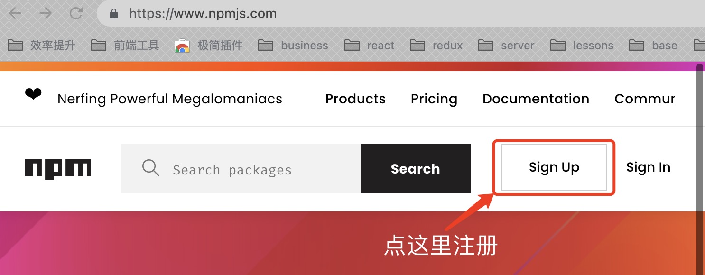
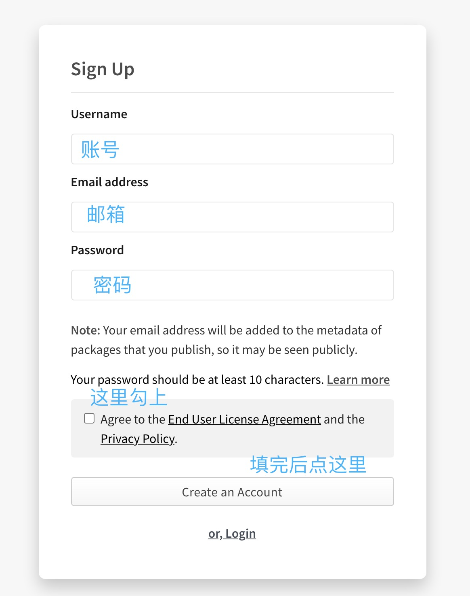
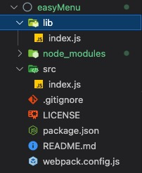

> Marion 的 react 实战课程 > 第十一部分 > 在 npm 发布自己的插件

## 注册自己的 npm 账号

首先需要进入 npm 官网注册账号：https://www.npmjs.com



点击红色框区域按钮后输入用户信息



输入完成后点击创建账户

## 创建自己的插件或项目

在你的开发目录中新建一个项目目录，比如 test-npm

注意：目录名只允许以小写字母开头，包含小写字母、数字及-号

```javascript
mkdir test-npm
```

目录创建完成后，进入

```javascript
cd test-npm
```

执行 npm 项目初始化命令

```javascript
npm init
// 或者输入npm init -y，可以避免在接下来的创建过程中敲击无数次回车
```

在接下来的命令窗口中输入项目名称、项目描述等，或者可以不输入，稍后创建完成后在 package.json 中手动修改

## 编辑目录



```javascript
├── dist/                          // 输入文件夹，所以需要用到的文件都在这
    ├── index.js                   // 入口文件
└── src/                           // 开发文件夹
    ├── index.js                   // 写什么都可以，可以是一整套的项目，也可以是单文件
├── webpack.config.js              // 简单地webpack配置，我这边因为插件本身不复杂，所以这块设定很简单
├── .gitignore                     // git排除文件，这里面的文件在使用git上传时都不会上传到服务器
└── package.json                   // 项目配置文件，参考下面的教程
```

## 编辑项目

简单的内容过掉了，接下来相对就稍有点复杂，我们需要判断自己的插件有什么功能，需要什么依赖。这里我们以一个 react ui 插件为例：

1. package.json

```javascript
{
  "name": "mui-menu", //这里写你的项目名字,
  "version": "0.1.0", // 版本号，建议以0.1.0开始，自行验证没有问题后，以1.0.0版本发布
  "description": "这是用于描述你的项目的，比如我这个是根据业务对antd菜单组件的二次封装", // 项目描述
  "main": "lib/index.js", // 这个是向外暴露的入口文件，必须有这个路径才能访问
  "scripts": {
    "build": "webpack --config webpack.config.js --progress --colors",
    "test": "echo \"Error: no test specified\" && exit 1"
  },
  // 项目依赖，因为我打算最终使用typescript来完成这个插件，所以这里安装了一些声明文件
  "devDependencies": {
    "@babel/core": "^7.1.6", // 必需
    "@babel/preset-env": "^7.1.6",  // 必需
    "@babel/preset-react": "^7.0.0", // 必需
    "@types/react": "^16.7.18", // 必需
    "@types/react-dom": "^16.0.11", // 必需
    "antd": "^4.16.13", // 看你的插件是否依赖
    "babel-loader": "^8.0.4", // 必需
    "css-loader": "^1.0.1", // 看你插件是否依赖
    "react": "^16.7.0", // 必需
    "react-dom": "^16.7.0", // 必需
    "style-loader": "^0.23.1", // 必需
    "ts-loader": "^5.3.2", // 看你是否需要了
    "typescript": "^3.2.2", // 看你是否需要了
    "webpack": "^4.25.1",  // 必需，
    // 这块我选了^4.25 意思是说4.xx最新版本;结合我们下面的版本号解释，它的意思是更新到主版本号为4的最新版本；
    // 另一种使用方式就是~4.25.1 意思是4.25.x最新版本；这里只约束Y位置，也就是次版本号为25的最新版本；
    "webpack-cli": "^3.1.2" // 必需
  },
  // 主要就是上面的内容，下面的内容是告诉用户上哪里看源码和帮助文档
  "repository": {
    "type": "git",
    "url": "git+https://github.com/uncle-marion/easyMenu.git"
  },
  "author": "",
  "license": "ISC",
  "bugs": {
    "url": "https://github.com/uncle-marion/easyMenu/issues"
  },
  "homepage": "https://github.com/uncle-marion/easyMenu#readme",
  "dependencies": {
    "easymenu": "file:.yalc/easymenu"
  }
}
```

注： 关于版本号，npm 库版本号采用 SemVer 2.0 规范，以 X.Y.Z 的格式表示，且都必须为非负的正整数，依次为主版本号、次版本号，修订版本号。

> 当我们每一次对项目做出更新时，必须修改版本号，否则用户无法正常更新。  
> X 位是主版本号，当整个项目更新比较大或完全重构时，为这个版本号+1；当主版本号为 0 时，表示这个插件还没有通过验证，不稳定；当主版本号进行递增时，Y 与 Z 位的版本号必须归零；  
> Y 位是次版本号，当项目增加了一些新的功能或优化时，同时插件仍然可以向下兼容时，为这个版本号+1；当这个版本号递增时，Z 位的版本号必须归零；  
> Z 位是修改版本号，当解除了项目存在的某些 bug 时，此版本号递增

版本的优先级就是各个版本的排序规则，判断版本优先级时，必须把版本号从左至右分为主版本号、次版本号、修订版本号来进行比较；

2. webpack.config.js

```javascript
const path = require('path');

module.exports = {
  mode: 'production', // 模式，表示生产环境，基本上大多数的插件开发都不需要不考虑开发环境
  entry: {
    index: path.resolve(__dirname, './src/index.js'), // 打包入口
  },
  output: {
    // 打包出口，注意，这里的主文件一定要与package.json中的main属性一致，否则会找不到模块
    path: path.resolve(__dirname, './lib'),
    filename: '[name].js',
    publicPath: './lib/',
    libraryTarget: 'commonjs2',
  },
  module: {
    // 模块加载，因为我的插件里使用了react，为了解析jsx文件，这里必须要对js文件重新编译
    rules: [
      {
        test: /\.js?$/,
        use: [
          {
            // 使用babel-loader模块来读取js文件
            loader: 'babel-loader',
            options: {
              // 编译用到的资源
              presets: ['@babel/preset-env', '@babel/preset-react'],
            },
          },
        ],
        // 只编译src目录下的文件
        include: path.resolve(__dirname, './src/'),
      },
      // 将来可能需要用到css，这块我就从其它项目直接复制过来，但没有改动
      {
        test: /\.css$/,
        loader: 'style-loader!css-loader?modules&localIdentName=[hash:8]',
        include: path.resolve(__dirname, './src/'),
      },
    ],
  },
  // 寻找依赖模块的配置
  resolve: {
    // 当文件中写的文件名没有带后缀时，使用下面这些后缀去找
    // 比如 我们import aaa from './src/aaa'
    // aaa这种文件肯定是在目录中找不着的，系统就会用下面这些后缀一个个匹配过去，直到找到对应的文件
    extensions: ['.ts', '.tsx', '.js', '.jsx'],
  },
  // 不允许加入到包中的内容
  // 因为我们的插件一般来说都是提供给有使用环境的项目使用。那么这里打包时就可以忽略掉react和antd
  // 当然。要是我们的用户没有安装antd...肯定会报错...
  externals: {
    react: 'react',
    antd: 'antd',
  },
};
```

3. index.js

```javascript
随便写点东西吧。。如果是用的跟我一样的webpack...那么写个react组件，试试在你的项目中引用进去看看
```

## 使用 yalc 来进行本地发布

```javascript
npm i -g yalc
```

进入你的插件目录，然后在插件的根目录下发布它

```javascript
yalc publish
```

这样，你的插件就发布到了 yalc 的本地库里，我们可以在使用它的项目中通过 yalc add 命令来导入它

```javascript
yalc add mui-menu
```

经过一些必要的调试以后，我们就可以将它发布到 npm 上去了；这个时候，我们要检查是否有.gitgnore 文件，文件中是否排除了不需要上传的文件，比如 yalc 的临时文件、lock 文件等；

```javascript
// .gitgnore文件内容

# 不需要上传的文件夹
/node_modules
/.yalc

# 不需要上传的文件后缀
.lock

# 这些不动它
.DS_Store
.env.local
.env.development.local
.env.test.local
.env.production.local

npm-debug.log*
yarn-debug.log*
yarn-error.log*
```

最后执行 npm publish 命令，将这个项目发布到 npmjs 服务器上，这样外部用户就可以直接使用你的插件了。

```javascript
npm publish
```
