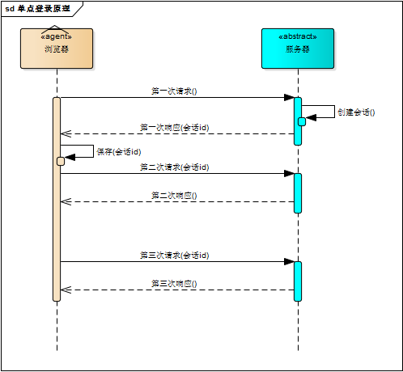

> Marion 的 react 实战课程 > 第十部分 > 单点登陆（原理与实战）

## 单系统登陆机制

### 1. http 协议

web 应用采用 browser/server 架构，http 作为通信协议。**http 是一个超文本传输协议，是一个基于请求与响应，无状态的，应用层的协议**，浏览器的每一次请求，服务器会独立处理，不与之前或之后的请求产生关联，这个过程用下图说明，三次请求/响应对之间没有任何联系


但这也同时意味着，任何用户都能通过浏览器访问服务器资源，如果想保护服务器的某些资源，必须限制浏览器请求；要限制浏览器请求，必须鉴别浏览器请求，响应合法请求，忽略非法请求；要鉴别浏览器请求，必须清楚浏览器请求状态。既然 http 协议无状态，那就让服务器和浏览器共同维护一个状态吧！这就是会话机制

#### 注意，这里的三次请求与三次握手不是同一个概念

题外：理解 Tcp 的三次握手

> 1. 客户端向服务器发送请求建立新连接，并发送一些消息，消息中包含一些标记。发送完成后进行等待状态
> 2. 服务器接收到请求后，返回一段报文，表示确认客户端标记有效，服务器能接收客户端的数据并同意建立新连接
> 3. 客户端接收到服务端返回数据后，确认从客户端到服务端的数据连接是有效的，返回最后一段数据，表示确认收到服务端同意连接的信号，发送完成后保持连接状态
> 4. 服务端接收到客户端再次返回的数据后，确认从服务端到客户端的数据连接是有效的，于是也进入了连接状态。
> 5. 双方保持通讯直到通讯正常结束。

这里的三次握手指的是客户端与服务端建立连接之前的三次数据传递。为什么这么复杂呢？这是为了防止服务器端开启一些无用的连接增加服务器开销以及防止已失效的连接请求报文段突然又传送到了服务端，因而产生错误。

题外：理解 Tcp 的四次挥手

> 1. 客户端在获取到需要的数据后，需要发送一个请求关闭连接的消息给服务端
> 2. 服务端在接收到这个消息后，确认客户端关闭连接的需求，返回一个消息给客户端，表示已经收到了关闭连接的请求
> 3. 服务端在发送完上一个消息后进入一个半关闭状态，并发送一个消息给客户端，表示已经在准备关闭连接了
> 4. 客户端在接收到服务端的第一个消息后，确认了服务端已经知道客户端收到关闭连接的请求，再次发送一条消息给服务端，表示已经知道了服务端准备关闭连接了，然后关闭连接
> 5. 服务端接收到客户端的消息确认客户端已经关闭连接了，于是关闭连接。

这里的四次挥手也是为了避免某一端因为没有接收到消息导致端口一直开放浪费资源。所以必须对方返回确认消息后才会关闭自身连接，这中间任意一条消息接收(发送)失败都会中断关闭连接的请求。

### 2. http 会话机制

浏览器第一次请求服务器，服务器创建一个会话，并将会话的 id 作为响应的一部分发送给浏览器，浏览器存储会话 id，并在后续第二次和第三次请求中带上会话 id，服务器取得请求中的会话 id 就知道是不是同一个用户了，这个过程用下图说明，后续请求与第一次请求产生了关联



服务器在内存中保存会话对象，浏览器怎么保存会话 id 呢？有两种方式

- 1. 请求参数
- 2. cookie

将会话 id 作为每一个请求的参数，服务器接收请求自然能解析参数获得会话 id，并借此判断是否来自同一会话，很明显，这种方式不靠谱。那就浏览器自己来维护这个会话 id 吧，每次发送 http 请求时浏览器自动发送会话 id，cookie 机制正好用来做这件事。cookie 是浏览器用来存储少量数据的一种机制，数据以”key/value“形式存储，浏览器发送 http 请求时自动附带 cookie 信息

### 3. 登陆状态

理解了会话机制，登陆状态就好理解了。我们假设浏览器第一次请求服务器需要输入用户名与密码验证身份，服务器拿到用户名密码去数据库比对，正确的话说明当前持有这个会话的用户是合法用户，应该将这个会话标记为“已授权”或者“已登录”等等之类的状态，既然是会话的状态，自然要保存在会话对象中，服务器在会话对象中设置登录状态如下

```javascript
// 从http请求头中获取cookie信息
HttpSession session = request.getSession();
// 为这个信息添加上已经登陆的标记
session.setAttribute("isLogin", true);
```

用户再次访问时，服务器在会话对象中查看登录状态

```javascript
// 从http请求头中获取cookie信息
HttpSession session = request.getSession();
// 读取这个信息上登陆的标记来判断是否登陆
session.getAttribute("isLogin");
```

这样，每次请求资源都会检查 session 中的登陆状态，只有 isLogin === true 的会话才能访问，达到了保护信息资源的目的

## 二、单点登陆

什么是单点登录？单点登录全称 Single Sign On（以下简称 SSO），是指在多系统应用群中登录一个系统，便可在其他所有系统中得到授权而无需再次登录，包括单点登录与单点注销两部分

### 1. 登陆

### 2. 注销

## 题外：http 的一些其它知识点

### http 的特点

> 无状态：协议对客户端没有状态存储，对事物处理没有“记忆”能力，比如访问一个网站需要反复进行登录操作

> 无连接：HTTP/1.1 之前，由于无状态特点，每次请求需要通过 TCP 三次握手四次挥手，和服务器重新建立连接。比如某个客户机在短时间多次请求同一个资源，服务器并不能区别是否已经响应过用户的请求，所以每次需要重新响应请求，需要耗费不必要的时间和流量。

> 基于请求和响应：基本的特性，由客户端发起请求，服务端响应

> 简单快速、灵活

> 通信使用明文、请求和响应不会对通信方进行确认、无法保护数据的完整性

- 场景：逛电商商场用户需要使用的时间比较长，需要对用户一段时间的 HTTP 通信状态进行保存，比如执行一次登陆操作，在 30 分钟内所有的请求都不需要再次登陆。

> 通过 Cookie/Session 技术

> HTTP/1.1 持久连接（HTTP keep-alive）方法，只要任意一端没有明确提出断开连接，则保持 TCP 连接状态，在请求首部字段中的 Connection: keep-alive 即为表明使用了持久连接

### 什么是 https

https 是身披 SSL 外壳的 HTTP。https 是一种通过计算机网络进行安全通信的传输协议，经由 http 进行通信，利用 SSL/TLS 建立全信道，加密数据包。https 使用的主要目的是提供对网站服务器的身份认证，同时保护交换数据的隐私与完整性。

### 为什么要使用 https 呢？

2017 年 1 月发布的 Chrome 56 浏览器开始把收集密码或信用卡数据的 http 页面标记为“不安全”，若用户使用 2017 年 10 月推出的 Chrome 62，带有输入数据的 http 页面和所有以无痕模式浏览的 http 页面都会被标记为“不安全”，此外，苹果公司强制所有 iOS App 在 2017 年 1 月 1 日前使用 https 加密。此后市面上绝大多数的浏览器都开始使用 https 加密。

### https 的特点

基于 HTTP 协议，通过 SSL 或 TLS 提供加密处理数据、验证对方身份以及数据完整性保护

1. 内容加密：采用混合加密技术，中间者无法直接查看明文内容;
2. 验证身份：通过证书认证客户端访问的是自己的服务器;
3. 保护数据完整性：防止传输的内容被中间人冒充或者篡改;

> **混合加密：**结合非对称加密和对称加密技术。客户端使用对称加密生成密钥对传输数据进行加密，然后使用非对称加密的公钥再对秘钥进行加密，所以网络上传输的数据是被秘钥加密的密文和用公钥加密后的秘密秘钥，因此即使被黑客截取，由于没有私钥，无法获取到加密明文的秘钥，便无法获取到明文数据。  
> **数字摘要：**通过单向 hash 函数对原文进行哈希，将需加密的明文“摘要”成一串固定长度(如 128bit)的密文，不同的明文摘要成的密文其结果总是不相同，同样的明文其摘要必定一致，并且即使知道了摘要也不能反推出明文。  
> **数字签名技术：**数字签名建立在公钥加密体制基础上，是公钥加密技术的另一类应用。它把公钥加密技术和数字摘要结合起来，形成了实用的数字签名技术。

4. 收方能够证实发送方的真实身份；
5. 发送方事后不能否认所发送过的报文；
6. 收方或非法者不能伪造、篡改报文。
